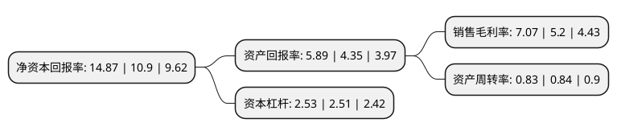

> 本页面由自动化程序生成于 2022年5月20日 01:31
> 内容可能存在错误，如有bug请提交issue至：https://github.com/Eroleice/doc-pi/issues
{.is-warning}

# 上市公司基本情况

## 基本资料

郑州煤矿机械集团股份有限公司（以下简称“郑煤机”）成立于2002年11月06日，郑州市。于2010年08月03日在上交所主板上市。

郑煤机注册资本177,949.367万元，公司的主营业务为煤炭综合采掘设备之一——综采液压支架及其零部件的生产，销售和服务。主要产品为煤炭综合采掘设备之一——综采液压支架。以下是详细信息：

- 公司名称: 郑州煤矿机械集团股份有限公司
- 股票代码: 601717.SH
- 所在地: 河南 - 郑州市
- 成立日期: 2002年11月06日
- 注册资本: 177,949.367万元
- 法定代表人: 焦承尧
- 主营业务: 公司的主营业务为煤炭综合采掘设备之一——综采液压支架及其零部件的生产，销售和服务主要产品为煤炭综合采掘设备之一——综采液压支架
- 公司官网: www.zmj.com
- 公司介绍: 公司始建于1958年，经过多年发展，公司已经成长为一家煤机研发制造和汽车零部件制造双主业融合发展的国际化企业，同时涉足装备制造、服务、金融、商贸等领域。公司产品遍布全国各大煤业集团，先后出口到俄罗斯、美国、澳大利亚、土耳其、印度、越南等国家。2017年郑煤机高起点迈入万亿级的汽车零部件产业，产品增加了汽车发动机核心零部件、减振与制动、起动机及发电机等。郑煤机拥有国家认定企业技术中心、博士后科研工作站、院士工作站等科研机构，先后承担了国家多项煤矿综采装备重点项目的研制开发，引领了中国煤矿装备的发展方向。郑煤机综合实力稳居中国煤炭机械工业50强，入选中国煤炭工业100强、全国机械工业企业500强。先后荣获“中国煤炭工业优秀企业”、“中国煤炭机械工业优秀企业”、“煤炭工业科技创新优秀企业”、“全国煤炭工业企业信息化管理示范企业”等荣誉称号。

## 股东及高管情况

上市公司第一大股东为泓羿投资管理(河南)合伙企业(有限合伙)，持股277,195,419股，占比15.58%，**疑似为**上市公司实际控制人。

截至2022年03月31日，上市公司的前十大股东中，共有2名自然人股东，3名机构股东，2个产品账户，3个海外主体，其中5%以上大股东共有3名。上市公司前十大股东明细如下：

> 未能通过持股比例判定出上市公司实际控制人（持股30%以上）
> 可能存在通过间接持股、联合持股、协议控制等方式拥有实际控制权的主体，具体请参考上市公司定期公告！
{.is-warning}

> 截至2022年03月31日，上市公司前十大股东信息如下：

| 股东名称 | 持股数量（股） | 持股比例 |
| --- | --- | --- |
| 泓羿投资管理(河南)合伙企业(有限合伙) | 277,195,419 | 15.58% |
| 河南机械装备投资集团有限责任公司 | 243,214,181 | 13.67% |
| 香港中央结算(代理人)有限公司 | 220,755,790 | 12.41% |
| 河南资产管理有限公司 | 69,209,157 | 3.89% |
| 中国工商银行股份有限公司-富国天惠精选成长混合型证券投资基金(LOF) | 41,307,639 | 2.32% |
| 香港中央结算有限公司(陆股通) | 33,516,860 | 1.88% |
| YITAI GROUP (HONG KONG) CO LIMITED | 22,399,200 | 1.26% |
| 中国工商银行股份有限公司-交银施罗德趋势优先混合型证券投资基金 | 19,439,080 | 1.09% |
| 蒋仕波 | 19,376,080 | 1.09% |
| 李俊 | 19,000,000 | 1.07% |

## 利润表分析

上市公司2021年总收入为292.93亿元，净利润为20.69亿元，实现盈利。

## 杜邦分析

> 数据列示周期：2021年 | 2020年 | 2019年
{.is-info}

上市公司的净资产收益率在近一年有所上升，上升幅度为36.42%，其变化情况分解如下：
- 上市公司的销售毛利率在近一年上升了35.96%，可能是生产效率的提升、商品原材料价格下跌或商品价格的上涨所致。
- 上市公司的资产周转率在近一年下降了-1.19%，可能是源自于更慢的销售回款或库存管理效果下降。
- 上市公司的财务杠杆比率在近一年上升了0.8%，可能是增加负债扩大生产规模。

