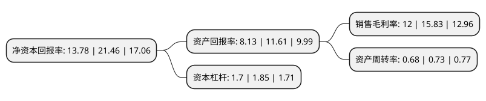

> 本页面由自动化程序生成于 2022年5月20日 01:31
> 内容可能存在错误，如有bug请提交issue至：https://github.com/Eroleice/doc-pi/issues
{.is-warning}

# 上市公司基本情况

## 基本资料

常州星宇车灯股份有限公司（以下简称“星宇股份”）成立于2000年05月18日，常州市。于2011年02月01日在上交所主板上市。

星宇股份注册资本28,567.942万元，主营业务为汽车(主要是乘用车)灯具的研发，设计，制造和销售。主要产品包括:汽车前照灯，后组合灯，雾灯及其他汽车灯具等。以下是详细信息：

- 公司名称: 常州星宇车灯股份有限公司
- 股票代码: 601799.SH
- 所在地: 江苏 - 常州市
- 成立日期: 2000年05月18日
- 注册资本: 28,567.942万元
- 法定代表人: 周晓萍
- 主营业务: 主营业务为汽车(主要是乘用车)灯具的研发，设计，制造和销售主要产品包括:汽车前照灯，后组合灯，雾灯及其他汽车灯具等
- 公司官网: www.xyl.cn
- 公司介绍: 公司主要经营汽车灯具的研发、设计、制造和销售，是我国较大的内资车灯总成制造商和设计方案提供商。公司产品覆盖德系、日系、美系、法系和中国多家自主品牌整车企业，客户涵盖欧系、日系、美系和中国多家自主品牌整车企业，主要包括一汽集团(一汽大众、一汽丰田、一汽轿车、一汽解放、一汽丰越、一汽吉林)、上汽大众、上汽通用、上汽通用五菱、广汽乘用车、广汽丰田、广州本田、东风日产、东风本田、长安福特、长安马自达、北京宝沃、奇瑞汽车、吉利汽车、蔚来汽车、众泰汽车、神龙汽车、德国宝马、沃尔沃、捷豹路虎等主要整车制造企业。公司通过TS16949国际质量标准体系认证、ISO14001环境管理体系认证，通过QS9000和VDA6.1质量标准体系认证，并于2007年6月份通过了ISO17025国家实验室认可，是全国汽车标委会汽车灯具分标委委员。

## 股东及高管情况

上市公司第一大股东为周晓萍，持股102,520,320股，占比35.89%，为上市公司实际控制人。

截至2022年03月31日，上市公司的前十大股东中，共有2名自然人股东，1名机构股东，5个产品账户，1个海外主体，1名其他股东，其中5%以上大股东共有4名。上市公司前十大股东明细如下：

> 截至2022年03月31日，上市公司前十大股东信息如下：

| 股东名称 | 持股数量（股） | 持股比例 |
| --- | --- | --- |
| 周晓萍 | 102,520,320 | 35.89% |
| 周八斤 | 34,915,307 | 12.22% |
| 常州星宇投资管理有限公司 | 17,676,000 | 6.19% |
| 香港中央结算有限公司(陆股通) | 14,786,007 | 5.18% |
| 全国社保基金四零六组合 | 4,532,899 | 1.59% |
| 澳门金融管理局-自有资金 | 3,676,111 | 1.29% |
| 上海浦东发展银行股份有限公司-易方达裕祥回报债券型证券投资基金 | 3,444,852 | 1.21% |
| 全国社保基金一零六组合 | 2,985,154 | 1.04% |
| 中国银行-易方达稳健收益债券型证券投资基金 | 2,724,471 | 0.95% |
| 中国建设银行股份有限公司-东方红启东三年持有期混合型证券投资基金 | 2,713,934 | 0.95% |

## 利润表分析

上市公司2021年总收入为79.09亿元，净利润为9.49亿元，实现盈利。

## 杜邦分析

> 数据列示周期：2021年 | 2020年 | 2019年
{.is-info}

上市公司的净资产收益率在近一年有所下降，下降幅度为-35.79%，其变化情况分解如下：
- 上市公司的销售毛利率在近一年下降了-24.19%，可能是生产效率的下降、商品原材料价格上涨或商品价格的下跌所致。
- 上市公司的资产周转率在近一年下降了-6.85%，可能是源自于更慢的销售回款或库存管理效果下降。
- 上市公司的财务杠杆比率在近一年下降了-8.11%，可能是减少负债降低财务费用。

