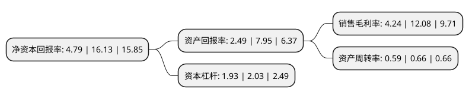

> 本页面由自动化程序生成于 2022年5月20日 01:32
> 内容可能存在错误，如有bug请提交issue至：https://github.com/Eroleice/doc-pi/issues
{.is-warning}

# 上市公司基本情况

## 基本资料

山东玲珑轮胎股份有限公司（以下简称“玲珑轮胎”）成立于1994年06月06日，烟台市。于2016年07月06日在上交所主板上市。

玲珑轮胎注册资本137,212.57万元，公司主营业务:为汽车轮胎设计，开发，制造和销售。主要产品:为全钢子午线轮胎，半钢子午线轮胎及特种轮胎等3，000多个规格品种，广泛应用于乘用车，商用车，工程机械等。以下是详细信息：

- 公司名称: 山东玲珑轮胎股份有限公司
- 股票代码: 601966.SH
- 所在地: 山东 - 烟台市
- 成立日期: 1994年06月06日
- 注册资本: 137,212.57万元
- 法定代表人: 王锋
- 主营业务: 公司主营业务:为汽车轮胎设计，开发，制造和销售主要产品:为全钢子午线轮胎，半钢子午线轮胎及特种轮胎等3，000多个规格品种，广泛应用于乘用车，商用车，工程机械等
- 公司官网: www.linglong.cn
- 公司介绍: 公司是国内规模最大、效益最好的轮胎专业生产企业之一。公司主营业务为汽车轮胎的设计、开发、制造与销售，主要产品分为全钢子午线轮胎、半钢子午线轮胎和斜交胎，广泛应用于乘用车、商用车、卡客车以及工程机械车辆等。公司目前在全球拥有研发中心，生产基地，产品遍布全球多个国家，广泛应用于商用车、乘用车、工程机械等，成功进入大众、通用、福特、印度塔塔、俄罗斯雷诺日产、菲亚特、巴西现代等全球知名汽车品牌的全球配套体系，并成为中国一汽、陕西重汽、东风汽车、北汽福田、重庆红岩、上汽通用五菱、济南重汽、厦门金龙等国内外多家汽车厂的主要供应商和优秀供应商。在采购、金融、管理等合作领域上，公司建立了与德国朗盛、费舍尔，荷兰VMI，比利时贝卡尔特、泰国诗董国际等全球知名供应商之间的合作关系，打造具有玲珑特色的、优质的、高效的、信誉有保障的全球高端采购供应平台。

## 股东及高管情况

上市公司第一大股东为玲珑集团有限公司，持股588,078,991股，占比39.6214%，为上市公司实际控制人。

截至2022年05月09日，上市公司的前十大股东中，共有7名机构股东，1个产品账户，1个海外主体，1名其他股东，其中5%以上大股东共有7名。上市公司前十大股东明细如下：

> 截至2022年05月09日，上市公司前十大股东信息如下：

| 股东名称 | 持股数量（股） | 持股比例 |
| --- | --- | --- |
| 玲珑集团有限公司 | 588,078,991 | 39.6214% |
| 玲珑集团有限公司 | 587,507,091 | 39.58% |
| 玲珑集团有限公司 | 586,884,791 | 39.54% |
| 玲珑集团有限公司 | 586,884,791 | 42.77% |
| 英诚贸易有限公司 | 201,400,000 | 13.57% |
| 英诚贸易有限公司 | 201,400,000 | 13.57% |
| 英诚贸易有限公司 | 201,400,000 | 13.57% |
| 香港中央结算有限公司(陆股通) | 60,642,398 | 4.42% |
| 中国银行股份有限公司-富兰克林国海中小盘股票型证券投资基金 | 9,582,288 | 0.7% |
| 科威特政府投资局-自有资金 | 8,996,274 | 0.66% |

## 利润表分析

上市公司2021年总收入为185.79亿元，净利润为7.88亿元，实现盈利。

## 杜邦分析

> 数据列示周期：2021年 | 2020年 | 2019年
{.is-info}

上市公司的净资产收益率在近一年有所下降，下降幅度为-70.3%，其变化情况分解如下：
- 上市公司的销售毛利率在近一年下降了-64.9%，可能是生产效率的下降、商品原材料价格上涨或商品价格的下跌所致。
- 上市公司的资产周转率在近一年下降了-10.61%，可能是源自于更慢的销售回款或库存管理效果下降。
- 上市公司的财务杠杆比率在近一年下降了-4.93%，可能是减少负债降低财务费用。

