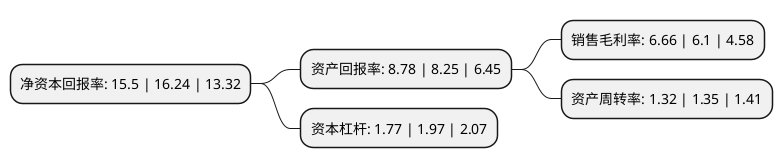

> 本页面由自动化程序生成于 2022年5月20日 01:32
> 内容可能存在错误，如有bug请提交issue至：https://github.com/Eroleice/doc-pi/issues
{.is-warning}

# 上市公司基本情况

## 基本资料

亚普汽车部件股份有限公司（以下简称“亚普股份”）成立于1993年07月04日，扬州市。于2018年05月09日在上交所主板上市。

亚普股份注册资本51,410.483万元，主要产品:产品主要是乘用车用塑料燃油箱及加油管(注油管)。主营业务:本公司是专业从事(主要是乘用车)汽车燃油系统的开发，制造和销售的汽车零部件企业，以下是详细信息：

- 公司名称: 亚普汽车部件股份有限公司
- 股票代码: 603013.SH
- 所在地: 江苏 - 扬州市
- 成立日期: 1993年07月04日
- 注册资本: 51,410.483万元
- 法定代表人: 姜林
- 主营业务: 主要产品:产品主要是乘用车用塑料燃油箱及加油管(注油管)主营业务:本公司是专业从事(主要是乘用车)汽车燃油系统的开发，制造和销售的汽车零部件企业，
- 公司官网: www.yapp.com
- 公司介绍: 公司是国家高新技术企业，专业从事汽车燃料系统的研发、制造和销售的全球燃料系统供应商,产品主要是乘用车用塑料燃油箱及加油管(注油管)。目前，公司在国内拥有7家分厂、5家控股子公司、1家参股公司，海外拥有9家全资子公司，分别位于印度、俄罗斯、澳大利亚、捷克、德国、美国、巴西和墨西哥。亚普主要客户包括大众、通用、福特、丰田、日产、标致雪铁龙、奔驰、上汽、东风、一汽等国内外汽车巨头。自成立以来，公司一直位居我国塑料油箱生产企业领先地位。

## 股东及高管情况

上市公司第一大股东为国投高科技投资有限公司，持股252,450,000股，占比49.1%，为上市公司实际控制人。

截至2022年03月31日，上市公司的前十大股东中，共有6名自然人股东，3名机构股东，1个产品账户，其中5%以上大股东共有2名。上市公司前十大股东明细如下：

> 截至2022年03月31日，上市公司前十大股东信息如下：

| 股东名称 | 持股数量（股） | 持股比例 |
| --- | --- | --- |
| 国投高科技投资有限公司 | 252,450,000 | 49.1% |
| 华域汽车系统股份有限公司 | 152,550,000 | 29.67% |
| 毛顺华 | 5,150,212 | 1% |
| 严延芳 | 1,010,700 | 0.2% |
| 中信证券股份有限公司 | 1,008,454 | 0.2% |
| 杨世鹏 | 736,500 | 0.14% |
| 周伟芳 | 673,500 | 0.13% |
| 北京遵道资产管理有限公司-遵道红橡神农稳健价值8号私募证券投资基金 | 542,500 | 0.11% |
| 罗玉芳 | 531,000 | 0.1% |
| 谢海利 | 527,300 | 0.1% |

## 利润表分析

上市公司2021年总收入为80.57亿元，净利润为5.36亿元，实现盈利。

## 杜邦分析

> 数据列示周期：2021年 | 2020年 | 2019年
{.is-info}

上市公司的净资产收益率在近一年有所下降，下降幅度为-4.56%，其变化情况分解如下：
- 上市公司的销售毛利率在近一年上升了9.18%，可能是生产效率的提升、商品原材料价格下跌或商品价格的上涨所致。
- 上市公司的资产周转率在近一年下降了-2.22%，可能是源自于更慢的销售回款或库存管理效果下降。
- 上市公司的财务杠杆比率在近一年下降了-10.15%，可能是减少负债降低财务费用。

