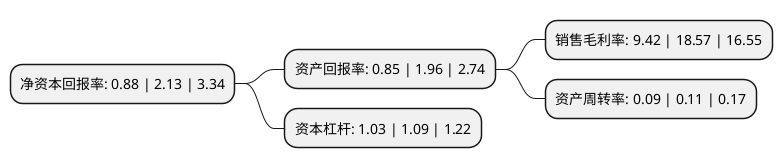

> 本页面由自动化程序生成于 2022年5月20日 01:32
> 内容可能存在错误，如有bug请提交issue至：https://github.com/Eroleice/doc-pi/issues
{.is-warning}

# 上市公司基本情况

## 基本资料

哈尔滨威帝电子股份有限公司（以下简称“威帝股份”）成立于2000年07月28日，哈尔滨市。于2015年05月27日在上交所主板上市。

威帝股份注册资本56,207.981万元，公司是国内领先的客车车身电子控制产品提供商，自成立以来一直致力于汽车电子产品的研发，设计，制造与销售，公司主营产品包括CAN总线控制系统，总线控制单元，ECU控制单元，组合仪表，传感器等系列产品。以下是详细信息：

- 公司名称: 哈尔滨威帝电子股份有限公司
- 股票代码: 603023.SH
- 所在地: 黑龙江 - 哈尔滨市
- 成立日期: 2000年07月28日
- 注册资本: 56,207.981万元
- 法定代表人: 刘高深
- 主营业务: 公司是国内领先的客车车身电子控制产品提供商，自成立以来一直致力于汽车电子产品的研发，设计，制造与销售，公司主营产品包括CAN总线控制系统，总线控制单元，ECU控制单元，组合仪表，传感器等系列产品
- 公司官网: www.viti.net.cn
- 公司介绍: 公司是国内领先的客车车身电子控制产品提供商，致力于汽车电子产品的研发、设计、制造与销售，主营产品包括CAN总线控制系统、总线控制单元、ECU控制单元、组合仪表、传感器等。公司拥有多专利，基于柔性配置的汽车CAN总线控制系统、汽车轮胎压力温度无线监测系统产品达国际先进水平，彩色液晶仪表产品达到国内领先水平。公司自主开发的客车用中央处理器在国内率先实现客车电器智能化控制，自主开发的汽车行驶记录仪，率先在国内产业化推广，使我国汽车拥有了自己的“黑匣子”，公司行车记录仪开发项目被列为国家级星火计划项目。公司是国家高新技术企业和软件企业，连续多年获得宇通客车、厦门金旅等授予的质量贡献奖。

## 股东及高管情况

上市公司第一大股东为陈振华，持股164,364,155股，占比29.24%，**疑似为**上市公司实际控制人。

截至2022年03月31日，上市公司的前十大股东中，共有9名自然人股东，1个产品账户，其中5%以上大股东共有2名。上市公司前十大股东明细如下：

> 未能通过持股比例判定出上市公司实际控制人（持股30%以上）
> 可能存在通过间接持股、联合持股、协议控制等方式拥有实际控制权的主体，具体请参考上市公司定期公告！
{.is-warning}

> 截至2022年03月31日，上市公司前十大股东信息如下：

| 股东名称 | 持股数量（股） | 持股比例 |
| --- | --- | --- |
| 陈振华 | 164,364,155 | 29.24% |
| 丽水久有股权投资基金合伙企业(有限合伙) | 120,445,673 | 21.43% |
| 陈庆华 | 19,221,652 | 3.42% |
| 宿凤琴 | 16,260,408 | 2.89% |
| 白哲松 | 5,715,808 | 1.02% |
| 王彦文 | 5,473,408 | 0.97% |
| 刘强 | 4,417,138 | 0.79% |
| 冯鹰 | 4,212,840 | 0.75% |
| 行秀芬 | 3,000,000 | 0.53% |
| 杨其 | 2,388,382 | 0.42% |

## 利润表分析

上市公司2021年总收入为0.7亿元，净利润为0.06亿元，实现盈利。

## 杜邦分析

> 数据列示周期：2021年 | 2020年 | 2019年
{.is-info}

上市公司的净资产收益率在近一年有所下降，下降幅度为-58.69%，其变化情况分解如下：
- 上市公司的销售毛利率在近一年下降了-49.27%，可能是生产效率的下降、商品原材料价格上涨或商品价格的下跌所致。
- 上市公司的资产周转率在近一年下降了-18.18%，可能是源自于更慢的销售回款或库存管理效果下降。
- 上市公司的财务杠杆比率在近一年下降了-5.5%，可能是减少负债降低财务费用。

