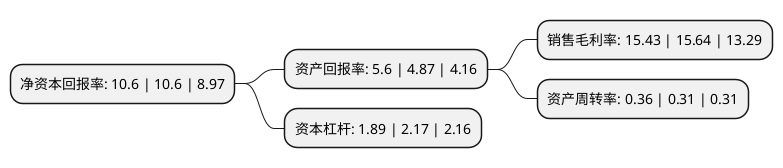

> 本页面由自动化程序生成于 2022年5月20日 01:32
> 内容可能存在错误，如有bug请提交issue至：https://github.com/Eroleice/doc-pi/issues
{.is-warning}

# 上市公司基本情况

## 基本资料

江苏常熟汽饰集团股份有限公司（以下简称“常熟汽饰”）成立于1996年07月25日，苏州市。于2017年01月05日在上交所主板上市。

常熟汽饰注册资本36,074.911万元，主营业务:主要从事研发，生产和销售乘用车内饰件业务。产品主要集中于汽车非金属内饰零部件，主要有门内护板，仪表板/副仪表板，天窗遮阳板，衣帽架，门柱，行李厢内饰，储物盒，备胎盖，地毯和隔音垫等内饰产品。以下是详细信息：

- 公司名称: 江苏常熟汽饰集团股份有限公司
- 股票代码: 603035.SH
- 所在地: 江苏 - 苏州市
- 成立日期: 1996年07月25日
- 注册资本: 36,074.911万元
- 法定代表人: 罗小春
- 主营业务: 主营业务:主要从事研发，生产和销售乘用车内饰件业务产品主要集中于汽车非金属内饰零部件，主要有门内护板，仪表板/副仪表板，天窗遮阳板，衣帽架，门柱，行李厢内饰，储物盒，备胎盖，地毯和隔音垫等内饰产品
- 公司官网: www.caip.com.cn
- 公司介绍: 公司(CAIP)是国内发展最快的民营的汽车内饰集成制造企业之一。主要为一汽大众、上海通用、奇瑞汽车、北京奔驰、东风神龙、上汽汽车和上海大众等汽车制造厂配套门内护板总成、仪表板/副仪表板总成、行李箱内饰总成、衣帽架总成和天窗遮阳板等汽车零部件。公司在产品研发、生产工艺、质量体系和企业管理等方面实行科学管理，先后通过了德国莱茵公司ISO9002、QS9000、VDA6.1、ISO/TS16949、ISO14001、OHSAS18001等质量体系认证，旨在建设一个愉悦、健康、高效的汽车零部件企业。CAIP集团先后被授予“江苏省重点培育发展企业”、“国家级重合同守信用企业”和“国家火炬计划重点高新技术企业”等荣誉称号。

## 股东及高管情况

上市公司第一大股东为罗小春，持股108,793,719股，占比29.91%，**疑似为**上市公司实际控制人。

截至2022年03月31日，上市公司的前十大股东中，共有5名自然人股东，5个产品账户，其中5%以上大股东共有1名。上市公司前十大股东明细如下：

> 未能通过持股比例判定出上市公司实际控制人（持股30%以上）
> 可能存在通过间接持股、联合持股、协议控制等方式拥有实际控制权的主体，具体请参考上市公司定期公告！
{.is-warning}

> 截至2022年03月31日，上市公司前十大股东信息如下：

| 股东名称 | 持股数量（股） | 持股比例 |
| --- | --- | --- |
| 罗小春 | 108,793,719 | 29.91% |
| 中国邮政储蓄银行有限责任公司-东方增长中小盘混合型开放式证券投资基金 | 8,416,631 | 2.31% |
| 中国工商银行股份有限公司-海富通改革驱动灵活配置混合型证券投资基金 | 7,537,117 | 2.07% |
| 建信基金-罗小春-建信鑫享6号单一资产管理计划 | 5,800,000 | 1.59% |
| 中国建设银行股份有限公司-广发科技创新混合型证券投资基金 | 5,752,400 | 1.58% |
| 中国农业银行股份有限公司-中邮核心成长混合型证券投资基金 | 5,099,907 | 1.4% |
| 王卫清 | 3,503,163 | 0.96% |
| 吴海江 | 3,483,163 | 0.96% |
| 陶建兵 | 3,475,363 | 0.96% |
| 汤文华 | 3,438,163 | 0.95% |

## 利润表分析

上市公司2021年总收入为26.62亿元，净利润为4.1亿元，实现盈利。

## 杜邦分析

> 数据列示周期：2021年 | 2020年 | 2019年
{.is-info}

上市公司的净资产收益率在近一年有所下降，下降幅度为0%，其变化情况分解如下：
- 上市公司的销售毛利率在近一年下降了-1.34%，可能是生产效率的下降、商品原材料价格上涨或商品价格的下跌所致。
- 上市公司的资产周转率在近一年上升了16.13%，可能是源自于更快的销售回款或库存管理效果提升。
- 上市公司的财务杠杆比率在近一年下降了-12.9%，可能是减少负债降低财务费用。

