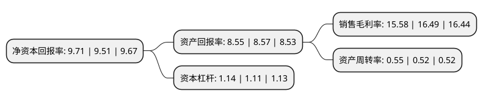

> 本页面由自动化程序生成于 2022年5月20日 01:32
> 内容可能存在错误，如有bug请提交issue至：https://github.com/Eroleice/doc-pi/issues
{.is-warning}

# 上市公司基本情况

## 基本资料

上海凯众材料科技股份有限公司（以下简称“凯众股份”）成立于2000年07月31日，上海市。于2017年01月20日在上交所主板上市。

凯众股份注册资本10,490.135万元，主营业务为悬架系统内减震元件，踏板总成和胶轮的设计，研发，生产和销售，公司减震元件主要包括缓冲块，弹簧垫，减震支撑以及防尘罩等。主要产品为乘用车悬挂系统内的减震元件和踏板总成。以下是详细信息：

- 公司名称: 上海凯众材料科技股份有限公司
- 股票代码: 603037.SH
- 所在地: 上海 - 上海市
- 成立日期: 2000年07月31日
- 注册资本: 10,490.135万元
- 法定代表人: 杨建刚
- 主营业务: 主营业务为悬架系统内减震元件，踏板总成和胶轮的设计，研发，生产和销售，公司减震元件主要包括缓冲块，弹簧垫，减震支撑以及防尘罩等主要产品为乘用车悬挂系统内的减震元件和踏板总成
- 公司官网: www.carthane.com
- 公司介绍: 公司是一家拥有自主创新能力，掌握先进的减震系统材料配方和产品设计开发核心技术、专业化制造汽车悬架系统减震元件、踏板总成及高性能聚氨酯承载轮的高新技术企业。主要客户包括上汽大众、一汽大众、上汽通用等国内主要轿车生产厂和通用全球、福特、大众欧洲、保时捷、马自达、铃木等国外主流汽车厂。公司自主开发的轿车塑料踏板总成产品，成功实现了以塑代钢和轻量化的设计理念，能有效的降低汽车重量，达到轻量化和节油的目的。该产品目前已广泛用于上汽乘用车和吉利汽车，并进入上汽通用五菱、奇瑞汽车、北汽和南京依维柯等，市场前景广阔。公司拥有一支经验丰富、高素质的研发队伍，涉及材料研发、产品设计与开发、工艺开发与模具设计、新技术开发、产品应用及延伸研究等多个专业，在材料技术、产品设计与制造技术、产品开发管理以及产品应用延伸研究等方面具备明显优势。

## 股东及高管情况

上市公司第一大股东为杨颖韬，持股22,097,891股，占比21.07%，**疑似为**上市公司实际控制人。

截至2022年03月31日，上市公司的前十大股东中，共有9名自然人股东，1名机构股东，其中5%以上大股东共有2名。上市公司前十大股东明细如下：

> 未能通过持股比例判定出上市公司实际控制人（持股30%以上）
> 可能存在通过间接持股、联合持股、协议控制等方式拥有实际控制权的主体，具体请参考上市公司定期公告！
{.is-warning}

> 截至2022年03月31日，上市公司前十大股东信息如下：

| 股东名称 | 持股数量（股） | 持股比例 |
| --- | --- | --- |
| 杨颖韬 | 22,097,891 | 21.07% |
| 黎明化工研究设计院有限责任公司 | 10,247,364 | 9.77% |
| 杨建刚 | 2,984,405 | 2.84% |
| 李建星 | 2,724,891 | 2.6% |
| 刘仁山 | 2,724,891 | 2.6% |
| 侯瑞宏 | 2,595,134 | 2.47% |
| 黄月姣 | 2,530,255 | 2.41% |
| 王亚萌 | 2,030,000 | 1.94% |
| 高丽 | 1,946,351 | 1.86% |
| 何建国 | 1,530,250 | 1.46% |

## 利润表分析

上市公司2021年总收入为5.48亿元，净利润为0.85亿元，实现盈利。

## 杜邦分析

> 数据列示周期：2021年 | 2020年 | 2019年
{.is-info}

上市公司的净资产收益率在近一年有所上升，上升幅度为2.1%，其变化情况分解如下：
- 上市公司的销售毛利率在近一年下降了-5.52%，可能是生产效率的下降、商品原材料价格上涨或商品价格的下跌所致。
- 上市公司的资产周转率在近一年上升了5.77%，可能是源自于更快的销售回款或库存管理效果提升。
- 上市公司的财务杠杆比率在近一年上升了2.7%，可能是增加负债扩大生产规模。

