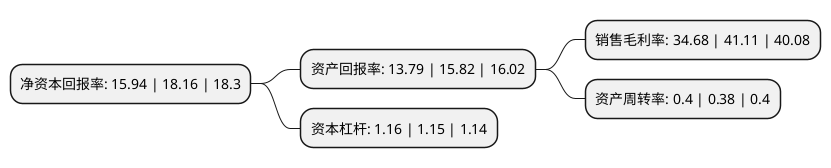

> 本页面由自动化程序生成于 2022年5月20日 01:32
> 内容可能存在错误，如有bug请提交issue至：https://github.com/Eroleice/doc-pi/issues
{.is-warning}

# 上市公司基本情况

## 基本资料

杭州新坐标科技股份有限公司（以下简称“新坐标”）成立于2002年07月31日，杭州市。于2017年02月09日在上交所主板上市。

新坐标注册资本13,398.911万元，主营业务为精密冷锻件的研发，生产和销售。主要产品包括气门组精密冷锻件，气门传动组精密冷锻件以及其他精密冷锻件等。以下是详细信息：

- 公司名称: 杭州新坐标科技股份有限公司
- 股票代码: 603040.SH
- 所在地: 浙江 - 杭州市
- 成立日期: 2002年07月31日
- 注册资本: 13,398.911万元
- 法定代表人: 徐纳
- 主营业务: 主营业务为精密冷锻件的研发，生产和销售主要产品包括气门组精密冷锻件，气门传动组精密冷锻件以及其他精密冷锻件等
- 公司官网: www.xzbco.com
- 公司介绍: 公司主营业务为精密冷锻件的研发、生产和销售，主要产品包括气门组精密冷锻件、气门传动组精密冷锻件以及其他精密冷锻件等，主要应用于汽车、摩托车发动机领域，属于国家重点鼓励和扶持的绿色先进制造业。未来公司将持续开发和扩大精密冷锻产品在电动工具、家用电器、航空航天等领域的应用。

## 股东及高管情况

上市公司第一大股东为杭州佐丰投资管理有限公司，持股69,205,500股，占比51.65%，为上市公司实际控制人。

截至2022年03月31日，上市公司的前十大股东中，共有6名自然人股东，2名机构股东，2个产品账户，其中5%以上大股东共有1名。上市公司前十大股东明细如下：

> 截至2022年03月31日，上市公司前十大股东信息如下：

| 股东名称 | 持股数量（股） | 持股比例 |
| --- | --- | --- |
| 杭州佐丰投资管理有限公司 | 69,205,500 | 51.65% |
| 胡欣 | 3,933,969 | 2.94% |
| 丰友生 | 3,600,000 | 2.69% |
| 姚国兴 | 1,410,175 | 1.05% |
| 徐芳 | 1,115,725 | 0.83% |
| 中国建设银行股份有限公司-信达澳银新能源产业股票型证券投资基金 | 963,666 | 0.72% |
| 上汽颀臻(上海)资产管理有限公司-上汽投资-颀瑞2号 | 929,738 | 0.69% |
| 广发证券股份有限公司-中庚小盘价值股票型证券投资基金 | 801,200 | 0.6% |
| 肖娟 | 759,200 | 0.57% |
| 李健 | 737,000 | 0.55% |

## 利润表分析

上市公司2021年总收入为4.32亿元，净利润为1.49亿元，实现盈利。

## 杜邦分析

> 数据列示周期：2021年 | 2020年 | 2019年
{.is-info}

上市公司的净资产收益率在近一年有所下降，下降幅度为-12.22%，其变化情况分解如下：
- 上市公司的销售毛利率在近一年下降了-15.64%，可能是生产效率的下降、商品原材料价格上涨或商品价格的下跌所致。
- 上市公司的资产周转率在近一年上升了5.26%，可能是源自于更快的销售回款或库存管理效果提升。
- 上市公司的财务杠杆比率在近一年上升了0.87%，可能是增加负债扩大生产规模。

