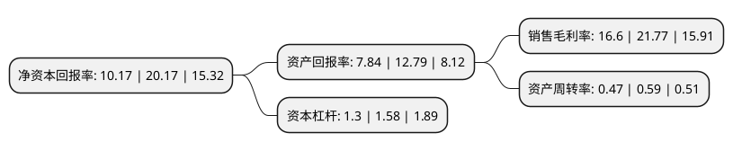

> 本页面由自动化程序生成于 2022年5月20日 01:32
> 内容可能存在错误，如有bug请提交issue至：https://github.com/Eroleice/doc-pi/issues
{.is-warning}

# 上市公司基本情况

## 基本资料

浙江黎明智造股份有限公司（以下简称“浙江黎明”）成立于1997年05月15日，舟山市。于2021年11月16日在上交所主板上市。

浙江黎明注册资本14,688万元，主要从事汽车零部件的研发，生产，销售。发行人产品种类众多，根据生产工艺的不同，可分为精锻件(包括气门桥，气门弹簧上座，摇臂球头/球窝，火花塞喷油器隔套等)，装配件(包括活塞冷却喷嘴等)和冲压件(包括气门锁片，曲轴传感器信号盘，碗形塞，气门弹簧下座等)等。以下是详细信息：

- 公司名称: 浙江黎明智造股份有限公司
- 股票代码: 603048.SH
- 所在地: 浙江 - 舟山市
- 成立日期: 1997年05月15日
- 注册资本: 14,688万元
- 法定代表人: 俞黎明
- 主营业务: 主要从事汽车零部件的研发，生产，销售发行人产品种类众多，根据生产工艺的不同，可分为精锻件(包括气门桥，气门弹簧上座，摇臂球头/球窝，火花塞喷油器隔套等)，装配件(包括活塞冷却喷嘴等)和冲压件(包括气门锁片，曲轴传感器信号盘，碗形塞，气门弹簧下座等)等
- 公司官网: www.zhejiangliming.com
- 公司介绍: 公司是气门锁片、气门弹簧座、气门弹簧底座、气门挺柱、气门推杆、气门桥、气门旋转器、活塞冷却喷嘴等发动机配气机构零件专业化生产厂，主要从事汽车零部件的研发、生产、销售。发行人产品种类众多，根据生产工艺的不同，可分为精锻件(包括气门桥、气门弹簧上座、摇臂球头/球窝、火花塞喷油器隔套等)、装配件(包括活塞冷却喷嘴等)和冲压件(包括气门锁片、曲轴传感器信号盘、碗形塞、气门弹簧下座等)等。公司主要客户包括潍柴动力、长城汽车、一汽解放锡柴、广西玉柴、上汽通用五菱、吉利集团、康明斯(Cummins)、东风本田汽车、长安汽车、东风本田发动机、一汽丰田、福田康明斯、上柴股份、东风康明斯、广汽丰田、上汽通用等国内外众多知名汽车整车厂或整机厂。公司先后一百五十多次荣获客户颁发的“优秀供应商”、“质量优胜奖”等荣誉奖项。公司十分重视国际业务拓展，积极开拓海外市场。目前已和美国康明斯(Cummins)达成全球战略合作关系，荣获其“战略核心供应商”称号，并且已成为德国的曼(MAN)、瑞典的斯堪尼亚(Scania)、美国的纳威司达(Navistar)等公司的定点供应商。

## 股东及高管情况

上市公司第一大股东为浙江自贸区黎明投资有限公司，持股62,500,000股，占比42.55%，为上市公司实际控制人。

截至2022年03月31日，上市公司的前十大股东中，共有5名自然人股东，4名机构股东，1个海外主体，其中5%以上大股东共有3名。上市公司前十大股东明细如下：

> 截至2022年03月31日，上市公司前十大股东信息如下：

| 股东名称 | 持股数量（股） | 持股比例 |
| --- | --- | --- |
| 浙江自贸区黎明投资有限公司 | 62,500,000 | 42.55% |
| 浙江自贸区佶恒投资有限公司 | 37,500,000 | 25.53% |
| 舟山市易凡股权投资合伙企业(有限合伙) | 9,160,000 | 6.24% |
| 西藏浙富源沣投资管理有限公司-宁波梅山保税港区浙富聚沣股权投资合伙企业(有限合伙) | 1,000,000 | 0.68% |
| 徐惠 | 298,600 | 0.2% |
| 矫凤丽 | 271,285 | 0.18% |
| 王成勇 | 236,754 | 0.16% |
| JPMORGAN CHASE BANK, NATIONAL ASSOCIATION | 220,251 | 0.15% |
| 陈悦信 | 174,545 | 0.12% |
| 刘琴妹 | 173,391 | 0.12% |

## 利润表分析

上市公司2021年总收入为5.95亿元，净利润为0.98亿元，实现盈利。

## 杜邦分析

> 数据列示周期：2021年 | 2020年 | 2019年
{.is-info}

上市公司的净资产收益率在近一年有所下降，下降幅度为-49.58%，其变化情况分解如下：
- 上市公司的销售毛利率在近一年下降了-23.75%，可能是生产效率的下降、商品原材料价格上涨或商品价格的下跌所致。
- 上市公司的资产周转率在近一年下降了-20.34%，可能是源自于更慢的销售回款或库存管理效果下降。
- 上市公司的财务杠杆比率在近一年下降了-17.72%，可能是减少负债降低财务费用。

