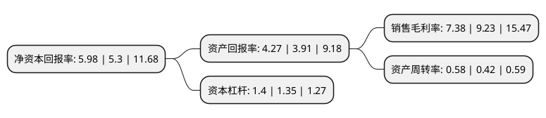

> 本页面由自动化程序生成于 2022年5月20日 01:32
> 内容可能存在错误，如有bug请提交issue至：https://github.com/Eroleice/doc-pi/issues
{.is-warning}

# 上市公司基本情况

## 基本资料

上海华培动力科技(集团)股份有限公司（以下简称“华培动力”）成立于2006年06月22日，上海市。于2019年01月11日在上交所主板上市。

华培动力注册资本26,455.1万元，公司一直致力于汽车零部件行业，主要从事涡轮增压器关键零部件的研发，生产及销售，主要产品为放气阀组件，涡轮壳和中间壳及其他零部件，其中，放气阀组件主要由盖板，连接板及衬套等组成。以下是详细信息：

- 公司名称: 上海华培动力科技(集团)股份有限公司
- 股票代码: 603121.SH
- 所在地: 上海 - 上海市
- 成立日期: 2006年06月22日
- 注册资本: 26,455.1万元
- 法定代表人: 吴怀磊
- 主营业务: 公司一直致力于汽车零部件行业，主要从事涡轮增压器关键零部件的研发，生产及销售，主要产品为放气阀组件，涡轮壳和中间壳及其他零部件，其中，放气阀组件主要由盖板，连接板及衬套等组成
- 公司官网: www.sinotec.cn
- 公司介绍: 公司成立于2006年6月22日，致力于汽车零部件行业，主要从事涡轮增压器关键零部件的研发、生产及销售，主要产品为放气阀组件、涡轮壳和中间壳及其他零部件等，其中，放气阀组件主要由盖板、连接板及衬套等组成，客户包含博格华纳、霍尼韦尔、三菱重工、石川岛播磨、博世马勒、德国大陆等全球知名涡轮增压器整机制造商及索尼玛、威斯卡特、美达工业等涡轮增压器零部件制造商，公司依赖多年积累的技术优势、管理优势和客户优势，建立了稳定的采购、生产及销售模式，尤其在涡轮增压器类零部件产品领域形成了较强的行业竞争力。目前，公司已成为全球涡轮增压器关键零部件的专业供应商之一。

## 股东及高管情况

上市公司第一大股东为上海华涧投资管理有限公司，持股112,608,000股，占比42.57%，为上市公司实际控制人。

截至2022年03月31日，上市公司的前十大股东中，共有6名自然人股东，2名机构股东，1个产品账户，1个海外主体，其中5%以上大股东共有2名。上市公司前十大股东明细如下：

> 截至2022年03月31日，上市公司前十大股东信息如下：

| 股东名称 | 持股数量（股） | 持股比例 |
| --- | --- | --- |
| 上海华涧投资管理有限公司 | 112,608,000 | 42.57% |
| 吴怀磊 | 18,994,320 | 7.18% |
| 吴佳 | 8,710,560 | 3.29% |
| 济南财金复星惟实股权投资基金合伙企业(有限合伙) | 7,775,908 | 2.94% |
| 唐全荣 | 4,777,000 | 1.81% |
| 闽侯磊佳咨询管理合伙企业(有限合伙) | 2,701,080 | 1.02% |
| 黄晓虹 | 2,416,000 | 0.91% |
| 王立普 | 1,139,020 | 0.43% |
| HUANG XIAODONG | 939,595 | 0.36% |
| 李燕 | 854,000 | 0.32% |

## 利润表分析

上市公司2021年总收入为9.21亿元，净利润为0.68亿元，实现盈利。

## 杜邦分析

> 数据列示周期：2021年 | 2020年 | 2019年
{.is-info}

上市公司的净资产收益率在近一年有所上升，上升幅度为12.83%，其变化情况分解如下：
- 上市公司的销售毛利率在近一年下降了-20.04%，可能是生产效率的下降、商品原材料价格上涨或商品价格的下跌所致。
- 上市公司的资产周转率在近一年上升了38.1%，可能是源自于更快的销售回款或库存管理效果提升。
- 上市公司的财务杠杆比率在近一年上升了3.7%，可能是增加负债扩大生产规模。

