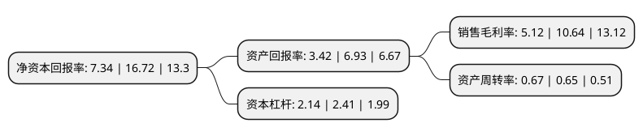

> 本页面由自动化程序生成于 2022年5月20日 01:33
> 内容可能存在错误，如有bug请提交issue至：https://github.com/Eroleice/doc-pi/issues
{.is-warning}

# 上市公司基本情况

## 基本资料

常州腾龙汽车零部件股份有限公司（以下简称“腾龙股份”）成立于2005年05月26日，常州市。于2015年03月20日在上交所主板上市。

腾龙股份注册资本35,057.093万元，主营业务为汽车热交换系统管路产品的研发，生产和销售。主要产品包括汽车空调管路，热交换系统连接硬管及热交换系统附件，用于汽车热交换系统相关组件的连接。以下是详细信息：

- 公司名称: 常州腾龙汽车零部件股份有限公司
- 股票代码: 603158.SH
- 所在地: 江苏 - 常州市
- 成立日期: 2005年05月26日
- 注册资本: 35,057.093万元
- 法定代表人: 蒋学真
- 主营业务: 主营业务为汽车热交换系统管路产品的研发，生产和销售主要产品包括汽车空调管路，热交换系统连接硬管及热交换系统附件，用于汽车热交换系统相关组件的连接
- 公司官网: www.cztl.com
- 公司介绍: 公司是一家从事汽车零部件产品研发、制造及销售的业内知名企业，公司专注于汽车热交换系统管路产品尤其是汽车空调管路及其附件的开发和制造，同时亦已积极进入和拓展轻合金材料、EGR产品、汽车用传感器等节能环保类汽车零部件产品领域，凭借多年的技术积累和领先业界的产品、工艺和服务，腾龙股份已成为中国乘用车热交换系统管路行业的领先者，是国内外多家汽车主机厂和系统制造商的重要供应商之一。公司拥有达到国际先进水平的全套生产设备和试验检测设备，产品进入国际主要汽车公司的零部件全球采购体系，公司产品直接或间接配套于宝马、奔驰、大众、福特、通用、雪铁龙、标致、本田等国际主流品牌汽车及长城、奇瑞、通用五菱、吉利、上汽、长安、比亚迪等国内主要车企，公司在武汉、天津、柳州、芜湖、重庆等地均设有制造工厂，产品出口北美、南美、欧洲、日本、东南亚等地。公司已通过ISO/TS16949质量管理体系认证和ISO14001环境管理体系认证，是江苏省高新技术企业，公司多次荣膺神龙汽车、法雷奥、贝洱等“优秀供应商”荣誉，公司品牌获得“江苏省著名商标”称号。

## 股东及高管情况

上市公司第一大股东为腾龙科技集团有限公司，持股95,548,740股，占比27.26%，**疑似为**上市公司实际控制人。

截至2022年03月31日，上市公司的前十大股东中，共有5名自然人股东，3名机构股东，2个产品账户，其中5%以上大股东共有2名。上市公司前十大股东明细如下：

> 未能通过持股比例判定出上市公司实际控制人（持股30%以上）
> 可能存在通过间接持股、联合持股、协议控制等方式拥有实际控制权的主体，具体请参考上市公司定期公告！
{.is-warning}

> 截至2022年03月31日，上市公司前十大股东信息如下：

| 股东名称 | 持股数量（股） | 持股比例 |
| --- | --- | --- |
| 腾龙科技集团有限公司 | 95,548,740 | 27.26% |
| 蒋依琳 | 47,365,080 | 13.51% |
| 钟萱 | 10,877,580 | 3.1% |
| 王柳芳 | 6,974,960 | 1.99% |
| 中国工商银行股份有限公司-华夏磐利一年定期开放混合型证券投资基金 | 4,901,960 | 1.4% |
| 吕强 | 4,084,967 | 1.17% |
| 湖南轻盐创业投资管理有限公司-轻盐智选20号私募证券投资基金 | 2,614,379 | 0.75% |
| 深圳前海嘉翔资产管理有限公司 | 2,537,724 | 0.72% |
| 江苏现代资产投资管理顾问有限公司 | 2,479,323 | 0.71% |
| 朱蔓林 | 2,000,950 | 0.57% |

## 利润表分析

上市公司2021年总收入为22.06亿元，净利润为1.13亿元，实现盈利。

## 杜邦分析

> 数据列示周期：2021年 | 2020年 | 2019年
{.is-info}

上市公司的净资产收益率在近一年有所下降，下降幅度为-56.1%，其变化情况分解如下：
- 上市公司的销售毛利率在近一年下降了-51.88%，可能是生产效率的下降、商品原材料价格上涨或商品价格的下跌所致。
- 上市公司的资产周转率在近一年上升了3.08%，可能是源自于更快的销售回款或库存管理效果提升。
- 上市公司的财务杠杆比率在近一年下降了-11.2%，可能是减少负债降低财务费用。

