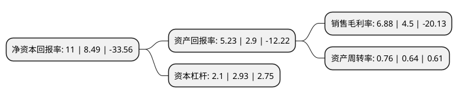

> 本页面由自动化程序生成于 2022年5月20日 01:33
> 内容可能存在错误，如有bug请提交issue至：https://github.com/Eroleice/doc-pi/issues
{.is-warning}

# 上市公司基本情况

## 基本资料

宁波圣龙汽车动力系统股份有限公司（以下简称“圣龙股份”）成立于2007年04月17日，宁波市。于2017年03月28日在上交所主板上市。

圣龙股份注册资本23,641.188万元，公司主要从事汽车动力总成领域零部件的研发，生产和销售，主要产品为发动机油泵，凸轮轴，变速箱油泵，分动箱油泵等动力总成零部件，产品主要为汽车主机厂提供配套。以下是详细信息：

- 公司名称: 宁波圣龙汽车动力系统股份有限公司
- 股票代码: 603178.SH
- 所在地: 浙江 - 宁波市
- 成立日期: 2007年04月17日
- 注册资本: 23,641.188万元
- 法定代表人: 罗玉龙
- 主营业务: 公司主要从事汽车动力总成领域零部件的研发，生产和销售，主要产品为发动机油泵，凸轮轴，变速箱油泵，分动箱油泵等动力总成零部件，产品主要为汽车主机厂提供配套
- 公司官网: slpt.sheng-long.com
- 公司介绍: 公司是专业生产汽车零部件的国家高新技术企业，设有省级的汽车发动机油泵研发中心，是浙江省专利示范企业、浙江省技术创新企业、国家汽车零部件出口基地。公司的主要产品包括发动机油泵、自动变速器油泵、凸轮轴、铝压铸件。国内主要客户包括：上海通用，长安福特马自达，上汽通用五菱，武汉神龙，江铃汽车，保定长城，庆铃汽车，北汽福田等，国外客户有福特、宝马、博格华纳、通用、东发、水星。公司从国外引进了先进的加工中心、蓝蒂斯磨床、精密数控机床等先进的加工设备；ADCOLE、三座标以及国内先进的多台油泵测试台等高精度的检测设备；并建有计量室、理化试验室等部门，保证能提供符合及超过客户期望的服务和产品。公司已通过ISI9001和TS16949质量体系以及ISO14001环境体系的认证，同时也是机械安全生产标准化国家二级的达标单位。

## 股东及高管情况

上市公司第一大股东为宁波圣龙(集团)有限公司，持股128,727,390股，占比54.45%，为上市公司实际控制人。

截至2022年03月31日，上市公司的前十大股东中，共有3名自然人股东，4名机构股东，3个产品账户，其中5%以上大股东共有1名。上市公司前十大股东明细如下：

> 截至2022年03月31日，上市公司前十大股东信息如下：

| 股东名称 | 持股数量（股） | 持股比例 |
| --- | --- | --- |
| 宁波圣龙(集团)有限公司 | 128,727,390 | 54.45% |
| 宁波禹舜商贸有限公司 | 10,294,100 | 4.35% |
| 宁波圣达尔投资合伙企业(有限合伙) | 8,000,000 | 3.38% |
| 罗力成 | 5,147,100 | 2.18% |
| 西藏瑞华资本管理有限公司 | 4,073,482 | 1.72% |
| 陈雅卿 | 3,860,300 | 1.63% |
| 招商银行股份有限公司-汇添富策略增长两年封闭运作灵活配置混合型证券投资基金 | 2,287,044 | 0.97% |
| 中国建设银行股份有限公司-万家科创主题3年封闭运作灵活配置混合型证券投资基金 | 1,664,200 | 0.7% |
| 柴静蓉 | 1,601,144 | 0.68% |
| 中国建设银行股份有限公司-博时主题行业混合型证券投资基金(LOF) | 1,198,083 | 0.51% |

## 利润表分析

上市公司2021年总收入为14.97亿元，净利润为1.03亿元，实现盈利。

## 杜邦分析

> 数据列示周期：2021年 | 2020年 | 2019年
{.is-info}

上市公司的净资产收益率在近一年有所上升，上升幅度为29.56%，其变化情况分解如下：
- 上市公司的销售毛利率在近一年上升了52.89%，可能是生产效率的提升、商品原材料价格下跌或商品价格的上涨所致。
- 上市公司的资产周转率在近一年上升了18.75%，可能是源自于更快的销售回款或库存管理效果提升。
- 上市公司的财务杠杆比率在近一年下降了-28.33%，可能是减少负债降低财务费用。

