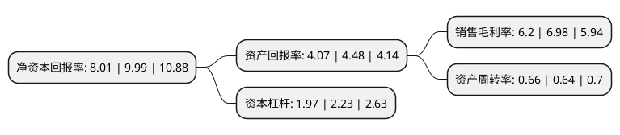

> 本页面由自动化程序生成于 2022年5月20日 01:33
> 内容可能存在错误，如有bug请提交issue至：https://github.com/Eroleice/doc-pi/issues
{.is-warning}

# 上市公司基本情况

## 基本资料

江苏新泉汽车饰件股份有限公司（以下简称“新泉股份”）成立于2001年04月28日，镇江市。于2017年03月17日在上交所主板上市。

新泉股份注册资本37,484.767万元，主营业务为提供汽车饰件整体解决方案。主要产品为汽车饰件产品，包括仪表板总成，顶置文件柜总成，门内护板总成，立柱护板总成，流水槽盖板总成和保险杠总成等。以下是详细信息：

- 公司名称: 江苏新泉汽车饰件股份有限公司
- 股票代码: 603179.SH
- 所在地: 江苏 - 镇江市
- 成立日期: 2001年04月28日
- 注册资本: 37,484.767万元
- 法定代表人: 唐志华
- 主营业务: 主营业务为提供汽车饰件整体解决方案主要产品为汽车饰件产品，包括仪表板总成，顶置文件柜总成，门内护板总成，立柱护板总成，流水槽盖板总成和保险杠总成等
- 公司官网: www.xinquan.cn
- 公司介绍: 公司专业从事汽车内、外饰件系统零部件及模具的设计、制造及销售；自营和代理各类商品及技术的进出口业务。公司是全国百家优秀汽车零部件供应商之一，是众多汽车品牌的一级配套商，与合资广菲克、上海大众、一汽大众，自主上海汽车、吉利汽车、奇瑞汽车、宝沃汽车及北汽等乘用车配套；和一汽解放、东风、福田戴姆勒、中国重汽、陕重汽等大中型商用车汽车企业也建立了长期稳定的合作关系。　　公司恪守“追求卓越、超越期望”的质量方针，竭力为客户提供优质的产品和服务。2002年通过QS9000认证，2005通过TSl6949认证，2010年通过国家环境体系ISO14000认证，2009年新泉实验室通过国家CNAS认证。

## 股东及高管情况

上市公司第一大股东为江苏新泉志和投资有限公司，持股97,810,440股，占比26.09%，**疑似为**上市公司实际控制人。

截至2022年03月31日，上市公司的前十大股东中，共有3名自然人股东，2名机构股东，5个产品账户，其中5%以上大股东共有2名。上市公司前十大股东明细如下：

> 未能通过持股比例判定出上市公司实际控制人（持股30%以上）
> 可能存在通过间接持股、联合持股、协议控制等方式拥有实际控制权的主体，具体请参考上市公司定期公告！
{.is-warning}

> 截至2022年03月31日，上市公司前十大股东信息如下：

| 股东名称 | 持股数量（股） | 持股比例 |
| --- | --- | --- |
| 江苏新泉志和投资有限公司 | 97,810,440 | 26.09% |
| 唐志华 | 41,544,200 | 11.08% |
| 上海浦东发展银行股份有限公司-易方达裕祥回报债券型证券投资基金 | 10,989,004 | 2.93% |
| 中国农业银行股份有限公司-国泰智能汽车股票型证券投资基金 | 10,961,794 | 2.92% |
| 江苏新泉汽车饰件股份有限公司-第二期员工持股计划 | 8,607,700 | 2.3% |
| 唐美华 | 6,964,400 | 1.86% |
| 华夏人寿保险股份有限公司-自有资金 | 4,980,291 | 1.33% |
| 中国工商银行股份有限公司-易方达安心回馈混合型证券投资基金 | 4,287,703 | 1.14% |
| 中国工商银行股份有限公司-嘉实智能汽车股票型证券投资基金 | 4,255,382 | 1.14% |
| 陈志军 | 4,050,000 | 1.08% |

## 利润表分析

上市公司2021年总收入为46.12亿元，净利润为2.86亿元，实现盈利。

## 杜邦分析

> 数据列示周期：2021年 | 2020年 | 2019年
{.is-info}

上市公司的净资产收益率在近一年有所下降，下降幅度为-19.82%，其变化情况分解如下：
- 上市公司的销售毛利率在近一年下降了-11.17%，可能是生产效率的下降、商品原材料价格上涨或商品价格的下跌所致。
- 上市公司的资产周转率在近一年上升了3.13%，可能是源自于更快的销售回款或库存管理效果提升。
- 上市公司的财务杠杆比率在近一年下降了-11.66%，可能是减少负债降低财务费用。

