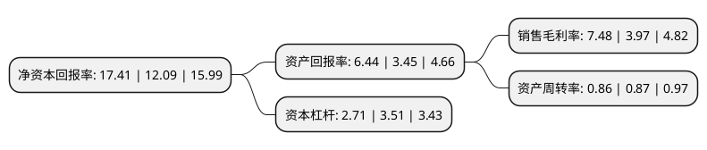

> 本页面由自动化程序生成于 2022年5月20日 01:33
> 内容可能存在错误，如有bug请提交issue至：https://github.com/Eroleice/doc-pi/issues
{.is-warning}

# 上市公司基本情况

## 基本资料

上海保隆汽车科技股份有限公司（以下简称“保隆科技”）成立于1997年05月20日，上海市。于2017年05月19日在上交所主板上市。

保隆科技注册资本20,780.591万元，公司主要从事汽车零部件产品的研发，生产和销售，主要产品有排气系统管件，气门嘴，汽车轮胎压力监测系统(TPMS)，平衡块，传感器，汽车结构件。公司主要产品是在汽车上的应用。以下是详细信息：

- 公司名称: 上海保隆汽车科技股份有限公司
- 股票代码: 603197.SH
- 所在地: 上海 - 上海市
- 成立日期: 1997年05月20日
- 注册资本: 20,780.591万元
- 法定代表人: 陈洪凌
- 主营业务: 公司主要从事汽车零部件产品的研发，生产和销售，主要产品有排气系统管件，气门嘴，汽车轮胎压力监测系统(TPMS)，平衡块，传感器，汽车结构件公司主要产品是在汽车上的应用
- 公司官网: www.baolong.biz
- 公司介绍: 公司于1997年创立于上海松江，是一家集研发、制造、销售于一体的汽车零部件公司，现拥有上海松江、安徽宁国、美国北卡等三个生产基地，并在加拿大、德国、波兰、中国香港等地建有分支机构。保隆立足于汽车工业，核心产品有汽车电子类的轮胎压力监测系统、压力传感器、光雨量传感器、360环视系统等；汽车轻量化结构件类的仪表梁、扭力梁、副车架等；通用部件类的气门嘴、平衡块、排气尾管、空气弹簧等。公司建立了严格的质量控制体制，是福特(Q1)、大众(A级)、通用(优秀)等跨国汽车厂的杰出供应商，先后通过了ISO/TS16949、ISO14001、OHSAS18001等体系认证；保隆科技多次承担国家级火炬计划、国家创新基金项目、省级火炬计划和重点新产品项目等。公司获得“国家级知识产权优势企业”和“高新技术企业”等称号；公司技术中心被认定为国家企业技术中心。

## 股东及高管情况

上市公司第一大股东为陈洪凌，持股38,612,626股，占比18.58%，**疑似为**上市公司实际控制人。

截至2022年03月31日，上市公司的前十大股东中，共有5名自然人股东，4个产品账户，1个海外主体，其中5%以上大股东共有3名。上市公司前十大股东明细如下：

> 未能通过持股比例判定出上市公司实际控制人（持股30%以上）
> 可能存在通过间接持股、联合持股、协议控制等方式拥有实际控制权的主体，具体请参考上市公司定期公告！
{.is-warning}

> 截至2022年03月31日，上市公司前十大股东信息如下：

| 股东名称 | 持股数量（股） | 持股比例 |
| --- | --- | --- |
| 陈洪凌 | 38,612,626 | 18.58% |
| 张祖秋 | 20,773,630 | 10% |
| 香港中央结算有限公司(陆股通) | 20,230,552 | 9.74% |
| 国投招商投资管理有限公司-先进制造产业投资基金二期(有限合伙) | 9,049,773 | 4.35% |
| 上海浦东发展银行股份有限公司-景顺长城新能源产业股票型证券投资基金 | 6,560,585 | 3.16% |
| 冯美来 | 3,592,662 | 1.73% |
| 中国建设银行股份有限公司-景顺长城环保优势股票型证券投资基金 | 3,343,238 | 1.61% |
| 陈洪泉 | 3,005,813 | 1.45% |
| 宋瑾 | 2,800,000 | 1.35% |
| 中国银行股份有限公司-景顺长城优选混合型证券投资基金 | 2,666,008 | 1.28% |

## 杜邦分析

> 数据列示周期：2021年 | 2020年 | 2019年
{.is-info}

上市公司的净资产收益率在近一年有所上升，上升幅度为44%，其变化情况分解如下：
- 上市公司的销售毛利率在近一年上升了88.41%，可能是生产效率的提升、商品原材料价格下跌或商品价格的上涨所致。
- 上市公司的资产周转率在近一年下降了-1.15%，可能是源自于更慢的销售回款或库存管理效果下降。
- 上市公司的财务杠杆比率在近一年下降了-22.79%，可能是减少负债降低财务费用。

