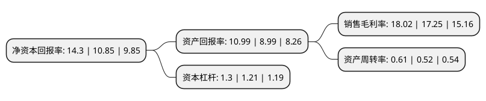

> 本页面由自动化程序生成于 2022年5月20日 01:33
> 内容可能存在错误，如有bug请提交issue至：https://github.com/Eroleice/doc-pi/issues
{.is-warning}

# 上市公司基本情况

## 基本资料

浙江仙通橡塑股份有限公司（以下简称“浙江仙通”）成立于1996年11月25日，台州市。于2016年12月30日在上交所主板上市。

浙江仙通注册资本27,072万元，主营业务:一直从事汽车密封条等汽车零部件的研发，设计，生产和销售。主要产品:汽车密封条，主要包括前车门框密封条，门上密封条，背门框密封条，车门外水切，风挡外饰胶条，三角窗玻璃密封条，行李箱密封条，天窗密封条，车顶饰条，车门玻璃导槽等。以下是详细信息：

- 公司名称: 浙江仙通橡塑股份有限公司
- 股票代码: 603239.SH
- 所在地: 浙江 - 台州市
- 成立日期: 1996年11月25日
- 注册资本: 27,072万元
- 法定代表人: 李起富
- 主营业务: 主营业务:一直从事汽车密封条等汽车零部件的研发，设计，生产和销售主要产品:汽车密封条，主要包括前车门框密封条，门上密封条，背门框密封条，车门外水切，风挡外饰胶条，三角窗玻璃密封条，行李箱密封条，天窗密封条，车顶饰条，车门玻璃导槽等
- 公司官网: www.zjxtgf.cn
- 公司介绍: 公司为国内主要的汽车密封条生产企业之一，汽车密封条的生产和销售规模处于行业前列。公司拥有高新技术企业、省级企业技术中心、省级高新技术企业研究开发中心、浙江省科技型中小企业等荣誉。通过多年的专注发展，公司已成功成为中国本土汽车密封条行业第一梯队的成员。一方面，公司与上海汽车、一汽、吉利、奇瑞、长安等本土优秀汽车整车厂继续维持长期稳定的合作关系；另一方面，公司还成功开拓了主要由外资厂商占据的合资汽车整车市场，成为了上海通用、上汽通用五菱的一级供应商，以及丰田、本田、日产、奔驰、现代起亚等品牌的二级供应商。

## 股东及高管情况

上市公司第一大股东为李起富，持股127,800,000股，占比47.21%，为上市公司实际控制人。

截至2022年03月31日，上市公司的前十大股东中，共有8名自然人股东，2个产品账户，其中5%以上大股东共有3名。上市公司前十大股东明细如下：

> 截至2022年03月31日，上市公司前十大股东信息如下：

| 股东名称 | 持股数量（股） | 持股比例 |
| --- | --- | --- |
| 李起富 | 127,800,000 | 47.21% |
| 金桂云 | 34,200,000 | 12.63% |
| 邵学军 | 18,000,000 | 6.65% |
| 青岛伟晟投资管理股份有限公司-伟晟新坐标五号私募证券投资基金 | 1,789,300 | 0.66% |
| 上海季胜投资管理有限公司-季胜中玺伍号私募证券投资基金 | 1,717,267 | 0.63% |
| 凌花 | 1,036,819 | 0.38% |
| 屠伟敏 | 822,600 | 0.3% |
| 占家建 | 648,800 | 0.24% |
| 屠华敏 | 647,400 | 0.24% |
| 陶鹏宇 | 627,300 | 0.23% |

## 利润表分析

上市公司2021年总收入为7.87亿元，净利润为1.41亿元，实现盈利。

## 杜邦分析

> 数据列示周期：2021年 | 2020年 | 2019年
{.is-info}

上市公司的净资产收益率在近一年有所上升，上升幅度为31.8%，其变化情况分解如下：
- 上市公司的销售毛利率在近一年上升了4.46%，可能是生产效率的提升、商品原材料价格下跌或商品价格的上涨所致。
- 上市公司的资产周转率在近一年上升了17.31%，可能是源自于更快的销售回款或库存管理效果提升。
- 上市公司的财务杠杆比率在近一年上升了7.44%，可能是增加负债扩大生产规模。

