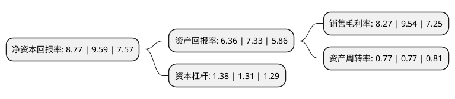

> 本页面由自动化程序生成于 2022年5月20日 01:33
> 内容可能存在错误，如有bug请提交issue至：https://github.com/Eroleice/doc-pi/issues
{.is-warning}

# 上市公司基本情况

## 基本资料

宁波天龙电子股份有限公司（以下简称“天龙股份”）成立于2000年07月03日，宁波市。于2017年01月10日在上交所主板上市。

天龙股份注册资本19,888.675万元，主要产品:公司生产的塑料零件按用途分为:汽车类塑料零件，电工电器类塑料零件和消费电子类塑料零件。主营业务:本公司主要从事各类精密模具开发和制造以及精密塑料零件的生产和销售，以下是详细信息：

- 公司名称: 宁波天龙电子股份有限公司
- 股票代码: 603266.SH
- 所在地: 浙江 - 宁波市
- 成立日期: 2000年07月03日
- 注册资本: 19,888.675万元
- 法定代表人: 胡建立
- 主营业务: 主要产品:公司生产的塑料零件按用途分为:汽车类塑料零件，电工电器类塑料零件和消费电子类塑料零件主营业务:本公司主要从事各类精密模具开发和制造以及精密塑料零件的生产和销售，
- 公司官网: www.ptianlong.com
- 公司介绍: 公司是一家专业设计生产制造精密模具及产品注塑的股份公司。公司一直专注于精密模具设计开发、精密产品注塑等领域，凭借多年与众多国际知名跨国公司的紧密合作，持续关注行业发展趋势，优化配置公司资源。公司在塑料零件制造业相关的注塑生产设备具有较强的通用性，公司凭借系统化模具开发能力和精密注塑工艺，能够生产出众多应用领域的精密塑料零件。公司拥有技术领先的实验设备，如2.2米大风洞,静音室、噪音及振动频谱仪，超速试验机(1万转以上)和MUCell微发泡技术等。公司产品种类多样，包括汽车类(汽车风扇和护风圈、齿轮和齿轮箱、仪表盘、组合开关塑件、汽车执行电机中相关塑料件等)、消费电子类(如手机、数码相机模型与保护壳等)、电工电器类等塑料零部件。目前，包括施耐德、博泽集团、博世、天合、凸版印刷、库柏、东洋电装、大陆汽车、合宝、爱普生、法雷奥、贝洱、德尔福等客户均已给予合格供应商认证。

## 股东及高管情况

上市公司第一大股东为浙江安泰控股集团有限公司，持股96,167,400股，占比48.35%，为上市公司实际控制人。

截至2022年05月05日，上市公司的前十大股东中，共有7名自然人股东，3名机构股东，其中5%以上大股东共有5名。上市公司前十大股东明细如下：

> 截至2022年05月05日，上市公司前十大股东信息如下：

| 股东名称 | 持股数量（股） | 持股比例 |
| --- | --- | --- |
| 浙江安泰控股集团有限公司 | 96,167,400 | 48.35% |
| 张益华 | 21,489,660 | 10.8% |
| 张益华 | 21,489,660 | 10.8% |
| 宁波均瑞投资合伙企业(有限合伙) | 11,760,000 | 5.91% |
| 宁波均瑞投资合伙企业(有限合伙) | 11,760,000 | 5.91% |
| 张海东 | 2,759,500 | 1.39% |
| 沈朝晖 | 1,281,000 | 0.64% |
| 陈明 | 1,029,000 | 0.52% |
| 于忠灿 | 726,000 | 0.37% |
| 虞建锋 | 725,500 | 0.36% |

## 利润表分析

上市公司2021年总收入为11.84亿元，净利润为0.97亿元，实现盈利。

## 杜邦分析

> 数据列示周期：2021年 | 2020年 | 2019年
{.is-info}

上市公司的净资产收益率在近一年有所下降，下降幅度为-8.55%，其变化情况分解如下：
- 上市公司的销售毛利率在近一年下降了-13.31%，可能是生产效率的下降、商品原材料价格上涨或商品价格的下跌所致。
- 上市公司的资产周转率在近一年下降了0%，可能是源自于更慢的销售回款或库存管理效果下降。
- 上市公司的财务杠杆比率在近一年上升了5.34%，可能是增加负债扩大生产规模。

