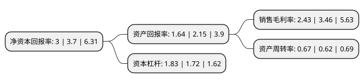

> 本页面由自动化程序生成于 2022年5月20日 01:33
> 内容可能存在错误，如有bug请提交issue至：https://github.com/Eroleice/doc-pi/issues
{.is-warning}

# 上市公司基本情况

## 基本资料

江苏日盈电子股份有限公司（以下简称“日盈电子”）成立于1998年08月12日，常州市。于2017年06月27日在上交所主板上市。

日盈电子注册资本8,912.6万元，主营业务:主要从事汽车洗涤系统产品，汽车精密注塑件及小线束，汽车电子传感器等汽车零部件及摩托车线束等摩托车零部件的研发，生产和销售。主要产品:汽车洗涤系统产品，汽车电子传感器类产品，线束产品，精密注塑件产品。以下是详细信息：

- 公司名称: 江苏日盈电子股份有限公司
- 股票代码: 603286.SH
- 所在地: 江苏 - 常州市
- 成立日期: 1998年08月12日
- 注册资本: 8,912.6万元
- 法定代表人: 是蓉珠
- 主营业务: 主营业务:主要从事汽车洗涤系统产品，汽车精密注塑件及小线束，汽车电子传感器等汽车零部件及摩托车线束等摩托车零部件的研发，生产和销售主要产品:汽车洗涤系统产品，汽车电子传感器类产品，线束产品，精密注塑件产品
- 公司官网: www.riyingcorp.com
- 公司介绍: 公司主要从事汽车洗涤系统产品、汽车精密注塑件及小线束、汽车电子传感器等汽车零部件及摩托车线束等摩托车零部件的研发、生产和销售。公司十分重视新产品的研发，已建成江苏省车用洗涤系统工程技术研究中心，并在常州、上海设立了研发中心。公司现已通过质量管理体系IATF16949、环境管理体系ISO14001:2015、GB/T24001-2016的认证，公司入列国家高新技术企业、江苏省管理创新优秀企业、知识产权管理体系认证合格企业，获得了“企业信用(合同)”AAA等级证书。公司客户覆盖了大众、通用、奥迪、沃尔沃、长安、麦格纳、科世达、安波福、SMP、铃木、雅马哈、本田等国内外知名品牌。

## 股东及高管情况

上市公司第一大股东为是蓉珠，持股21,175,000股，占比23.76%，**疑似为**上市公司实际控制人。

截至2022年03月31日，上市公司的前十大股东中，共有4名自然人股东，2名机构股东，4个产品账户，其中5%以上大股东共有2名。上市公司前十大股东明细如下：

> 未能通过持股比例判定出上市公司实际控制人（持股30%以上）
> 可能存在通过间接持股、联合持股、协议控制等方式拥有实际控制权的主体，具体请参考上市公司定期公告！
{.is-warning}

> 截至2022年03月31日，上市公司前十大股东信息如下：

| 股东名称 | 持股数量（股） | 持股比例 |
| --- | --- | --- |
| 是蓉珠 | 21,175,000 | 23.76% |
| 陆鹏 | 17,500,000 | 19.64% |
| 韩亚伟 | 4,403,680 | 4.94% |
| 中国工商银行股份有限公司-东方主题精选混合型证券投资基金 | 3,000,000 | 3.37% |
| 嘉兴鼎峰成长股权投资合伙企业(有限合伙) | 2,888,800 | 3.24% |
| 江苏日桓投资有限公司 | 2,550,000 | 2.86% |
| 中国工商银行股份有限公司-博时科创主题3年封闭运作灵活配置混合型证券投资基金 | 1,351,000 | 1.52% |
| 唐继安 | 872,700 | 0.98% |
| 兴业银行股份有限公司-东方鑫享价值成长一年持有期混合型证券投资基金 | 547,900 | 0.61% |
| 中国建设银行股份有限公司-东方创新科技混合型证券投资基金 | 540,500 | 0.61% |

## 利润表分析

上市公司2021年总收入为5.81亿元，净利润为0.14亿元，实现盈利。

## 杜邦分析

> 数据列示周期：2021年 | 2020年 | 2019年
{.is-info}

上市公司的净资产收益率在近一年有所下降，下降幅度为-18.92%，其变化情况分解如下：
- 上市公司的销售毛利率在近一年下降了-29.77%，可能是生产效率的下降、商品原材料价格上涨或商品价格的下跌所致。
- 上市公司的资产周转率在近一年上升了8.06%，可能是源自于更快的销售回款或库存管理效果提升。
- 上市公司的财务杠杆比率在近一年上升了6.4%，可能是增加负债扩大生产规模。

