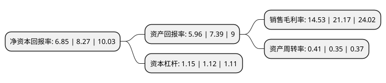

> 本页面由自动化程序生成于 2022年5月20日 01:33
> 内容可能存在错误，如有bug请提交issue至：https://github.com/Eroleice/doc-pi/issues
{.is-warning}

# 上市公司基本情况

## 基本资料

华懋(厦门)新材料科技股份有限公司（以下简称“华懋科技”）成立于2002年05月16日，厦门市。于2014年09月26日在上交所主板上市。

华懋科技注册资本30,701.971万元，公司是国内主要的汽车安全气囊核心部件供应商，主要产品为安全气囊布和安全气袋。以下是详细信息：

- 公司名称: 华懋(厦门)新材料科技股份有限公司
- 股票代码: 603306.SH
- 所在地: 福建 - 厦门市
- 成立日期: 2002年05月16日
- 注册资本: 30,701.971万元
- 法定代表人: 袁晋清
- 主营业务: 公司是国内主要的汽车安全气囊核心部件供应商，主要产品为安全气囊布和安全气袋
- 公司官网: www.hmtnew.com
- 公司介绍: 公司是一家专注于汽车安全领域的系统部件提供商，产品线覆盖汽车安全气囊布、安全气囊袋等被动安全系统部件。公司以产品质量为基石，立足于研发、生产技术的前沿领域，依靠拥有雄厚的研发力量、先进的生产工艺、严格的生产管控及质量检测体系，在下游客户中树立了良好的品牌形象和企业声誉，推动了产品在各类终端车型中的广泛运用，为汽车驾乘人员的生命安全提供可靠保障。公司已顺利通过TS16949质量管理体系、ISO14001环境管理体系及OHSAS18001职业健康安全管理体系的认证和复审，并建立一系列旨在以顾客为中心，持续改进的高效管理体系，贯彻落实“客户首选的供应商，供应商首选的客户”。

## 股东及高管情况

上市公司第一大股东为东阳华盛企业管理合伙企业(有限合伙)，持股49,228,260股，占比16.03%，**疑似为**上市公司实际控制人。

截至2022年04月27日，上市公司的前十大股东中，共有5名自然人股东，3名机构股东，1个产品账户，1个海外主体，其中5%以上大股东共有3名。上市公司前十大股东明细如下：

> 未能通过持股比例判定出上市公司实际控制人（持股30%以上）
> 可能存在通过间接持股、联合持股、协议控制等方式拥有实际控制权的主体，具体请参考上市公司定期公告！
{.is-warning}

> 截至2022年04月27日，上市公司前十大股东信息如下：

| 股东名称 | 持股数量（股） | 持股比例 |
| --- | --- | --- |
| 东阳华盛企业管理合伙企业(有限合伙) | 49,228,260 | 16.03% |
| 宁波新点基石投资管理合伙企业(有限合伙) | 27,956,790 | 9.11% |
| 张初全 | 24,609,700 | 8.02% |
| 东阳懋盛企业管理咨询有限责任公司 | 14,332,500 | 4.67% |
| KINGSWAY INTERNATIONAL LIMITED | 7,982,100 | 2.6% |
| 罗会 | 3,844,350 | 1.25% |
| 中国建设银行股份有限公司-东方红启东三年持有期混合型证券投资基金 | 3,785,020 | 1.23% |
| 胡敏 | 3,702,960 | 1.21% |
| 潘瑞莲 | 3,321,970 | 1.08% |
| 陈凤尾 | 3,070,200 | 1% |

## 利润表分析

上市公司2021年总收入为12.05亿元，净利润为1.75亿元，实现盈利。

## 杜邦分析

> 数据列示周期：2021年 | 2020年 | 2019年
{.is-info}

上市公司的净资产收益率在近一年有所下降，下降幅度为-17.17%，其变化情况分解如下：
- 上市公司的销售毛利率在近一年下降了-31.37%，可能是生产效率的下降、商品原材料价格上涨或商品价格的下跌所致。
- 上市公司的资产周转率在近一年上升了17.14%，可能是源自于更快的销售回款或库存管理效果提升。
- 上市公司的财务杠杆比率在近一年上升了2.68%，可能是增加负债扩大生产规模。

