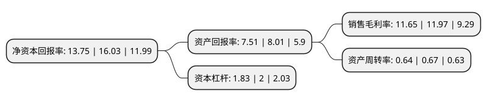

> 本页面由自动化程序生成于 2022年5月20日 01:33
> 内容可能存在错误，如有bug请提交issue至：https://github.com/Eroleice/doc-pi/issues
{.is-warning}

# 上市公司基本情况

## 基本资料

湖南机油泵股份有限公司（以下简称“湘油泵”）成立于1994年07月04日，衡阳市。于2016年11月30日在上交所主板上市。

湘油泵注册资本16,060.985万元，主要产品:机油泵，发动机水泵，输油泵等零部件，产品主要应用于中重型卡车，客车，乘用车，工程机械，发电机组，船舶动力等领域;主营业务:发动机(或内燃机)系统的关键及重要零部件-泵类产品的研发，制造和销售。以下是详细信息：

- 公司名称: 湖南机油泵股份有限公司
- 股票代码: 603319.SH
- 所在地: 湖南 - 衡阳市
- 成立日期: 1994年07月04日
- 注册资本: 16,060.985万元
- 法定代表人: 许仲秋
- 主营业务: 主要产品:机油泵，发动机水泵，输油泵等零部件，产品主要应用于中重型卡车，客车，乘用车，工程机械，发电机组，船舶动力等领域;主营业务:发动机(或内燃机)系统的关键及重要零部件-泵类产品的研发，制造和销售
- 公司官网: www.hnjyb.com
- 公司介绍: 公司是一家节能与新能源汽车零部件制造企业，产品主要为机油泵、变速箱液压泵、冷却水泵、燃油泵、变速箱阀板五大系列，其它子公司产品为齿轮、减速机、电磁阀、电子真空泵、自动变速箱阀体总成、汽车变速箱壳体、发动机铝铸件、新能源电机壳、新能源控制器壳体、新能源空调压缩机壳体、机油泵壳体等铝铸件以及汽车零部件自动化生产线装备等。公司是中国内燃机工业协会副会长单位、中国内燃机零部件行业十大品牌、排头兵企业、国家标准制定单位、高新技术企业。此外，公司还设有国家认定企业技术中心，湖南车用机油泵工程技术中心，湖南省电动泵工程实验室，机械工业车用油泵工程研究中心，是国家技术创新示范企业，湖南省智能制造示范企业。

## 股东及高管情况

上市公司第一大股东为许仲秋，持股31,387,105股，占比19.54%，**疑似为**上市公司实际控制人。

截至2022年03月31日，上市公司的前十大股东中，共有6名自然人股东，1名机构股东，3个产品账户，其中5%以上大股东共有2名。上市公司前十大股东明细如下：

> 未能通过持股比例判定出上市公司实际控制人（持股30%以上）
> 可能存在通过间接持股、联合持股、协议控制等方式拥有实际控制权的主体，具体请参考上市公司定期公告！
{.is-warning}

> 截至2022年03月31日，上市公司前十大股东信息如下：

| 股东名称 | 持股数量（股） | 持股比例 |
| --- | --- | --- |
| 许仲秋 | 31,387,105 | 19.54% |
| 许文慧 | 12,409,643 | 7.73% |
| 国泰基金-交通银行-国泰基金博远20号集合资产管理计划 | 3,175,604 | 1.98% |
| 中国建设银行股份有限公司-信达澳银新能源产业股票型证券投资基金 | 2,772,823 | 1.73% |
| 周勇 | 2,713,726 | 1.69% |
| 袁春华 | 2,619,899 | 1.63% |
| 王雄 | 2,434,389 | 1.52% |
| 国泰基金-上海银行-国泰基金格物2号集合资产管理计划 | 2,296,794 | 1.43% |
| 上海国际信托有限公司 | 1,770,960 | 1.1% |
| 王静 | 1,653,596 | 1.03% |

## 利润表分析

上市公司2021年总收入为16.21亿元，净利润为1.88亿元，实现盈利。

## 杜邦分析

> 数据列示周期：2021年 | 2020年 | 2019年
{.is-info}

上市公司的净资产收益率在近一年有所下降，下降幅度为-14.22%，其变化情况分解如下：
- 上市公司的销售毛利率在近一年下降了-2.67%，可能是生产效率的下降、商品原材料价格上涨或商品价格的下跌所致。
- 上市公司的资产周转率在近一年下降了-4.48%，可能是源自于更慢的销售回款或库存管理效果下降。
- 上市公司的财务杠杆比率在近一年下降了-8.5%，可能是减少负债降低财务费用。

