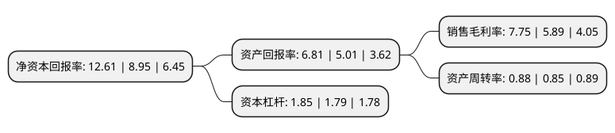

> 本页面由自动化程序生成于 2022年5月20日 01:33
> 内容可能存在错误，如有bug请提交issue至：https://github.com/Eroleice/doc-pi/issues
{.is-warning}

# 上市公司基本情况

## 基本资料

华达汽车科技股份有限公司（以下简称“华达科技”）成立于2002年11月25日，泰州市。于2017年01月25日在上交所主板上市。

华达科技注册资本43,904万元，主营业务为乘用车冲压焊接总成件，发动机管类件及相关模具的开发，生产与销售，目前主要为国内各大整车商提供汽车车身部件，发动机总成管类件等冲压及焊接产品。以下是详细信息：

- 公司名称: 华达汽车科技股份有限公司
- 股票代码: 603358.SH
- 所在地: 江苏 - 泰州市
- 成立日期: 2002年11月25日
- 注册资本: 43,904万元
- 法定代表人: 陈竞宏
- 主营业务: 主营业务为乘用车冲压焊接总成件，发动机管类件及相关模具的开发，生产与销售，目前主要为国内各大整车商提供汽车车身部件，发动机总成管类件等冲压及焊接产品
- 公司官网: www.hdqckj.com
- 公司介绍: 公司的主营业务为乘用车冲压焊接总成件、发动机管类件及相关模具的开发、生产与销售，目前主要为国内各大整车商提供汽车车身部件、发动机总成管类件等冲压及焊接产品。公司产品广泛运用于近百种乘用车型(含改款在内)，产品涵盖发动机整车隔热件、发动机管类件、纵横梁等品种，同时具备模具设计制造能力，是国内乘用车冲压及焊接总成零部件产品较为丰富的公司之一。公司加快围绕轿车“高强度、轻量化”实施“新能源、新工艺、新材料”项目研究,形成自主核心技术，达到与轿车整车厂同步开发、设计和模块化供货能力；全面实施“智能制造”，总部、分部建立机器人自动冲压生产线和机器人焊接生产线，实现单一轿车零部件向总件和模块化供货转型，促进企业提质扩产实现由“量的提升”转变为“质的跨越”，增强了企业核心竞争力，荣获A级配套供应商，被各大客户认定为国内最具发展潜力的轿车总成件制造基地。

## 股东及高管情况

上市公司第一大股东为陈竟宏，持股229,397,410股，占比52.25%，为上市公司实际控制人。

截至2022年03月31日，上市公司的前十大股东中，共有6名自然人股东，2名机构股东，2个产品账户，其中5%以上大股东共有3名。上市公司前十大股东明细如下：

> 截至2022年03月31日，上市公司前十大股东信息如下：

| 股东名称 | 持股数量（股） | 持股比例 |
| --- | --- | --- |
| 陈竟宏 | 229,397,410 | 52.25% |
| 葛江宏 | 30,695,689 | 6.99% |
| 刘丹群 | 24,610,387 | 5.61% |
| 朱世民 | 11,202,341 | 2.55% |
| 陕西省国际信托股份有限公司-陕国投·财富93号单一资金信托 | 8,080,000 | 1.84% |
| 上海呈瑞投资管理有限公司-呈瑞正乾41号私募证券投资基金 | 5,720,354 | 1.3% |
| 隆鑫通用动力股份有限公司 | 4,538,393 | 1.03% |
| 上海呈瑞投资管理有限公司-呈瑞稳进一号私募证券投资基金 | 3,733,800 | 0.85% |
| 潘杏珍 | 3,231,600 | 0.74% |
| 黄逊才 | 2,865,900 | 0.65% |

## 利润表分析

上市公司2021年总收入为47.16亿元，净利润为3.65亿元，实现盈利。

## 杜邦分析

> 数据列示周期：2021年 | 2020年 | 2019年
{.is-info}

上市公司的净资产收益率在近一年有所上升，上升幅度为40.89%，其变化情况分解如下：
- 上市公司的销售毛利率在近一年上升了31.58%，可能是生产效率的提升、商品原材料价格下跌或商品价格的上涨所致。
- 上市公司的资产周转率在近一年上升了3.53%，可能是源自于更快的销售回款或库存管理效果提升。
- 上市公司的财务杠杆比率在近一年上升了3.35%，可能是增加负债扩大生产规模。

