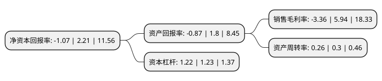

> 本页面由自动化程序生成于 2022年5月20日 01:34
> 内容可能存在错误，如有bug请提交issue至：https://github.com/Eroleice/doc-pi/issues
{.is-warning}

# 上市公司基本情况

## 基本资料

广州通达汽车电气股份有限公司（以下简称“通达电气”）成立于1994年01月11日，广州市。于2019年11月25日在上交所主板上市。

通达电气注册资本35,168.698万元，车载智能终端综合信息管理系统及配套汽车电气产品研发，生产，销售以下是详细信息：

- 公司名称: 广州通达汽车电气股份有限公司
- 股票代码: 603390.SH
- 所在地: 广东 - 广州市
- 成立日期: 1994年01月11日
- 注册资本: 35,168.698万元
- 法定代表人: 陈丽娜
- 主营业务: 车载智能终端综合信息管理系统及配套汽车电气产品研发，生产，销售
- 公司官网: www.tongda.cc
- 公司介绍: 公司自成立以来，始终专注于车载智能终端综合信息管理系统及配套汽车电气产品研发、生产、销售，并围绕平台打造车辆智能系统系列、公交多媒体信息发布系统产品、车载部件产品系列、新能源汽车电机与热管理系统系列四大系列产品。公司主要经营范围：汽车零部件及配件制造(不含汽车发动机制造);汽车零配件批发;汽车零配件零售;电子、通信与自动控制技术研究、开发;电子元件及组件制造;电子元器件批发;电子元器件零售;保险箱、柜、库门及钱箱的制造;五金产品批发;金属制品批发;金属压力容器制造;金属包装容器制造;货物进出口(专营专控商品除外);技术进出口;五金零售;日用器皿及日用杂货批发;软件服务;软件零售;软件开发;广告业;信息系统集成服务，致力于成为国内车载电气领域最具竞争力的企业之一。

## 股东及高管情况

上市公司第一大股东为邢映彪，持股117,363,840股，占比33.37%，为上市公司实际控制人。

截至2022年03月31日，上市公司的前十大股东中，共有8名自然人股东，2名机构股东，其中5%以上大股东共有2名。上市公司前十大股东明细如下：

> 截至2022年03月31日，上市公司前十大股东信息如下：

| 股东名称 | 持股数量（股） | 持股比例 |
| --- | --- | --- |
| 邢映彪 | 117,363,840 | 33.37% |
| 陈丽娜 | 102,407,760 | 29.12% |
| 广东粤科纵横融通创业投资合伙企业(有限合伙) | 3,000,000 | 0.85% |
| 王培森 | 1,524,360 | 0.43% |
| 杭州广沣启沃股权投资合伙企业(有限合伙) | 1,500,000 | 0.43% |
| 何俊华 | 1,434,720 | 0.41% |
| 梁小芹 | 1,407,200 | 0.4% |
| 林智 | 1,357,760 | 0.39% |
| 傅华波 | 1,196,160 | 0.34% |
| 吴锋 | 1,126,560 | 0.32% |

## 利润表分析

上市公司2021年总收入为5.4亿元，净利润为-0.19亿元，**未实现盈利**。

## 杜邦分析

> 数据列示周期：2021年 | 2020年 | 2019年
{.is-info}

上市公司的净资产收益率在近一年有所下降，下降幅度为-148.42%，其变化情况分解如下：
- 上市公司的销售毛利率在近一年下降了-156.57%，可能是生产效率的下降、商品原材料价格上涨或商品价格的下跌所致。
- 上市公司的资产周转率在近一年下降了-13.33%，可能是源自于更慢的销售回款或库存管理效果下降。
- 上市公司的财务杠杆比率在近一年下降了-0.81%，可能是减少负债降低财务费用。

