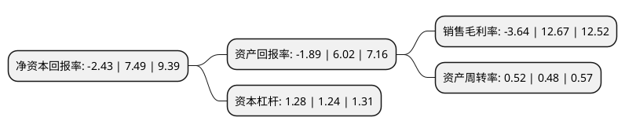

> 本页面由自动化程序生成于 2022年5月20日 01:34
> 内容可能存在错误，如有bug请提交issue至：https://github.com/Eroleice/doc-pi/issues
{.is-warning}

# 上市公司基本情况

## 基本资料

山东金麒麟股份有限公司（以下简称“金麒麟”）成立于1999年08月10日，德州市。于2017年04月06日在上交所主板上市。

金麒麟注册资本20,345.87万元，公司主要从事摩擦材料及制动产品的研发，生产和销售，报告期内公司的产品主要应用于汽车制动部件，主要产品为汽车刹车片(也称制动片或制动衬片)。以下是详细信息：

- 公司名称: 山东金麒麟股份有限公司
- 股票代码: 603586.SH
- 所在地: 山东 - 德州市
- 成立日期: 1999年08月10日
- 注册资本: 20,345.87万元
- 法定代表人: 孙鹏
- 主营业务: 公司主要从事摩擦材料及制动产品的研发，生产和销售，报告期内公司的产品主要应用于汽车制动部件，主要产品为汽车刹车片(也称制动片或制动衬片)
- 公司官网: www.chinabrake.com
- 公司介绍: 公司是以制动摩擦材料及其制品为主导产品的高新技术企业。曾荣获国家汽车零部件出口基地企业、中国汽车零部件制动器衬片行业龙头企业、中国摩擦材料行业领军企业、中国摩擦密封材料行业科技创新先进单位、中国汽配行业十大知名企业、中国专利山东明星企业、山东省优秀民营科技企业、山东省知识产权示范企业等数百项荣誉称号。公司始终坚持顾客至上、诚信敬业、持续改进、追求卓越的质量方针，通过了IATF16949质量管理体系认证、ISO9001质量管理体系认证、ISO14001环境管理体系认证和OHSAS18001职业健康安全管理体系，公司销往欧洲的产品符合ECER90标准，有5,500多个型号刹车片、刹车盘产品取得E-Mark认证，质量管理体系及产品质量达国际先进水平。

## 股东及高管情况

上市公司第一大股东为山东金麒麟投资管理有限公司，持股90,672,757股，占比44.57%，为上市公司实际控制人。

截至2022年03月31日，上市公司的前十大股东中，共有5名自然人股东，4名机构股东，1个产品账户，其中5%以上大股东共有2名。上市公司前十大股东明细如下：

> 截至2022年03月31日，上市公司前十大股东信息如下：

| 股东名称 | 持股数量（股） | 持股比例 |
| --- | --- | --- |
| 山东金麒麟投资管理有限公司 | 90,672,757 | 44.57% |
| 孙忠义 | 19,300,062 | 9.49% |
| 乐陵金凤投资管理有限公司 | 7,012,698 | 3.45% |
| 国盛华兴投资有限公司 | 6,300,000 | 3.1% |
| 山东鑫沐投资有限公司 | 4,691,400 | 2.31% |
| 黄河三角洲产业投资基金管理有限公司 | 4,100,000 | 2.02% |
| 孙洪杰 | 1,821,353 | 0.9% |
| 王春雨 | 1,558,153 | 0.77% |
| 孙玉英 | 1,263,653 | 0.62% |
| 杨光 | 1,128,411 | 0.55% |

## 利润表分析

上市公司2021年总收入为13.93亿元，净利润为-0.51亿元，**未实现盈利**。

## 杜邦分析

> 数据列示周期：2021年 | 2020年 | 2019年
{.is-info}

上市公司的净资产收益率在近一年有所下降，下降幅度为-132.44%，其变化情况分解如下：
- 上市公司的销售毛利率在近一年下降了-128.73%，可能是生产效率的下降、商品原材料价格上涨或商品价格的下跌所致。
- 上市公司的资产周转率在近一年上升了8.33%，可能是源自于更快的销售回款或库存管理效果提升。
- 上市公司的财务杠杆比率在近一年上升了3.23%，可能是增加负债扩大生产规模。

