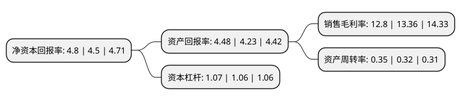

> 本页面由自动化程序生成于 2022年5月20日 01:34
> 内容可能存在错误，如有bug请提交issue至：https://github.com/Eroleice/doc-pi/issues
{.is-warning}

# 上市公司基本情况

## 基本资料

常州朗博密封科技股份有限公司（以下简称“朗博科技”）成立于2005年02月05日，常州市。于2017年12月29日在上交所主板上市。

朗博科技注册资本10,600万元，汽车用橡胶零部件的研发，生产和销售，主要产品包括车用O型圈，轴封，轮毂组件等产品，产品主要用于汽车空调系统。以下是详细信息：

- 公司名称: 常州朗博密封科技股份有限公司
- 股票代码: 603655.SH
- 所在地: 江苏 - 常州市
- 成立日期: 2005年02月05日
- 注册资本: 10,600万元
- 法定代表人: 王曙光
- 主营业务: 汽车用橡胶零部件的研发，生产和销售，主要产品包括车用O型圈，轴封，轮毂组件等产品，产品主要用于汽车空调系统
- 公司官网: www.jmp-seal.com
- 公司介绍: 公司是一家以橡胶密封件和橡胶制品的生产销售为主体的高新技术企业，主要产品有车用O型圈及垫圈、轮毂组件、油封、轴封等产品，产品主要用于汽车空调、动力、制动等核心系统。公司生产规模和综合实力在细分行业中处于领先地位，主要客户为华域三电、南京奥特佳、重庆建设等国内知名汽车空调用压缩机及空调系统生产企业。公司凭借先进的技术开发水平、优良的产品质量和成本竞争优势，与主要客户形成了良好的长期合作关系，成为了国内主要汽车空调压缩机轴用密封圈和O型圈供应商。公司具有专业的产品研发检测中心，并采用国际先进的技术，引进专业的技术人才，自主研发与消化吸收再创新相结合，形成了较强的研发实力，在汽车用橡胶密封件领域里达到国际先进水平，生产规模和综合实力在同行业中处于领先地位。公司被评为江苏省橡塑密封与减震工程技术中心。

## 股东及高管情况

上市公司第一大股东为戚建国，持股45,000,000股，占比42.45%，为上市公司实际控制人。

截至2022年03月31日，上市公司的前十大股东中，共有9名自然人股东，1名机构股东，其中5%以上大股东共有4名。上市公司前十大股东明细如下：

> 截至2022年03月31日，上市公司前十大股东信息如下：

| 股东名称 | 持股数量（股） | 持股比例 |
| --- | --- | --- |
| 戚建国 | 45,000,000 | 42.45% |
| 范小凤 | 12,000,000 | 11.32% |
| 常州市金坛君泰投资咨询有限公司 | 8,000,000 | 7.55% |
| 戚淦超 | 6,700,000 | 6.32% |
| 敬瑞华 | 980,000 | 0.92% |
| 杨怀旭 | 630,000 | 0.59% |
| 罗勇 | 493,000 | 0.47% |
| 董自力 | 310,000 | 0.29% |
| 齐晓东 | 297,200 | 0.28% |
| 李继梅 | 247,700 | 0.23% |

## 利润表分析

上市公司2021年总收入为1.93亿元，净利润为0.24亿元，实现盈利。

## 杜邦分析

> 数据列示周期：2021年 | 2020年 | 2019年
{.is-info}

上市公司的净资产收益率在近一年有所上升，上升幅度为6.67%，其变化情况分解如下：
- 上市公司的销售毛利率在近一年下降了-4.19%，可能是生产效率的下降、商品原材料价格上涨或商品价格的下跌所致。
- 上市公司的资产周转率在近一年上升了9.38%，可能是源自于更快的销售回款或库存管理效果提升。
- 上市公司的财务杠杆比率在近一年上升了0.94%，可能是增加负债扩大生产规模。

