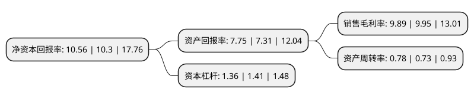

> 本页面由自动化程序生成于 2022年5月20日 01:35
> 内容可能存在错误，如有bug请提交issue至：https://github.com/Eroleice/doc-pi/issues
{.is-warning}

# 上市公司基本情况

## 基本资料

上海岱美汽车内饰件股份有限公司（以下简称“岱美股份”）成立于2001年02月20日，上海市。于2017年07月28日在上交所主板上市。

岱美股份注册资本72,441.551万元，公司主营业务为汽车零部件的研发，生产和销售，主要产品包括遮阳板，头枕，顶棚中央控制器和座椅等。以下是详细信息：

- 公司名称: 上海岱美汽车内饰件股份有限公司
- 股票代码: 603730.SH
- 所在地: 上海 - 上海市
- 成立日期: 2001年02月20日
- 注册资本: 72,441.551万元
- 法定代表人: 姜银台
- 主营业务: 公司主营业务为汽车零部件的研发，生产和销售，主要产品包括遮阳板，头枕，顶棚中央控制器和座椅等
- 公司官网: www.daimay.com
- 公司介绍: 公司主要从事乘用车零部件的研发、生产、销售及售后服务，是集设计、开发、生产、销售、服务于一体的专业汽车零部件制造企业。公司在上海、浙江、天津、黑龙江、山东等地均投资建设有生产基地，并在美国、德国、韩国等地设立有境外服务支持平台。公司已成功实现与整车厂商技术开发的同步化、配套产品的标准化以及售后服务的一体化，在全球汽车产业链中的地位得到不断提升。同时，公司在头枕及顶棚中央控制器产品领域亦具有突出的行业竞争力，下游客户包括通用、福特、克莱斯勒、大众、标致雪铁龙等全球知名整车厂商。凭借突出的产品质量与成本控制能力以及完善的服务支持体系，公司赢得全球主要整车厂商的信任和市场认证，已打入全球汽车零部件供应链体系的产品包括遮阳板、座椅及头枕、转向盘和顶棚中央控制器等。公司曾连续三年荣获通用全球优秀供应商称号，是首批获此荣誉的中国本土零部件供应商，此外亦先后通过大众全球A级供应商、克莱斯勒战略供应商、福特全球Q1供应商等国外整车厂商的资格认证。

## 股东及高管情况

上市公司第一大股东为浙江舟山岱美投资有限公司，持股408,368,788股，占比56.37%，为上市公司实际控制人。

截至2022年03月31日，上市公司的前十大股东中，共有2名自然人股东，1名机构股东，7个产品账户，其中5%以上大股东共有3名。上市公司前十大股东明细如下：

> 截至2022年03月31日，上市公司前十大股东信息如下：

| 股东名称 | 持股数量（股） | 持股比例 |
| --- | --- | --- |
| 浙江舟山岱美投资有限公司 | 408,368,788 | 56.37% |
| 姜银台 | 105,908,701 | 14.62% |
| 姜明 | 66,634,315 | 9.2% |
| 上海浦东发展银行股份有限公司-易方达裕祥回报债券型证券投资基金 | 8,690,072 | 1.2% |
| 中国工商银行-广发稳健增长证券投资基金 | 7,600,300 | 1.05% |
| 中国工商银行股份有限公司-广发价值增长混合型证券投资基金 | 6,023,900 | 0.83% |
| 上海浦东发展银行股份有限公司-易方达瑞程灵活配置混合型证券投资基金 | 5,662,096 | 0.78% |
| 中国银行股份有限公司-广发优企精选灵活配置混合型证券投资基金 | 5,143,999 | 0.71% |
| 中国工商银行股份有限公司-易方达安心回馈混合型证券投资基金 | 4,662,625 | 0.64% |
| 上海富善投资有限公司-富善投资安享尊享11号私募证券投资基金 | 4,280,000 | 0.59% |

## 利润表分析

上市公司2021年总收入为42.08亿元，净利润为4.16亿元，实现盈利。

## 杜邦分析

> 数据列示周期：2021年 | 2020年 | 2019年
{.is-info}

上市公司的净资产收益率在近一年有所上升，上升幅度为2.52%，其变化情况分解如下：
- 上市公司的销售毛利率在近一年下降了-0.6%，可能是生产效率的下降、商品原材料价格上涨或商品价格的下跌所致。
- 上市公司的资产周转率在近一年上升了6.85%，可能是源自于更快的销售回款或库存管理效果提升。
- 上市公司的财务杠杆比率在近一年下降了-3.55%，可能是减少负债降低财务费用。

