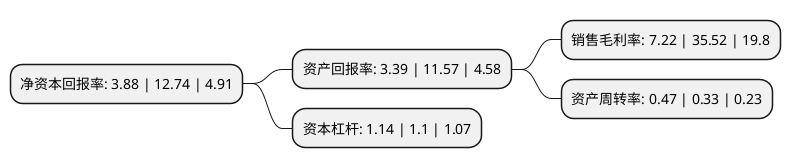

> 本页面由自动化程序生成于 2022年5月20日 01:35
> 内容可能存在错误，如有bug请提交issue至：https://github.com/Eroleice/doc-pi/issues
{.is-warning}

# 上市公司基本情况

## 基本资料

重庆秦安机电股份有限公司（以下简称“秦安股份”）成立于1995年09月05日，重庆市。于2017年05月17日在上交所主板上市。

秦安股份注册资本43,879.705万元，国内具有一定规模水平的汽车发动机核心零部件专业生产企业，主要从事汽车发动机核心零部件——气缸体，气缸盖，曲轴等产品的研发，生产与销售。本公司以其中的3C件，即气缸体，气缸盖和曲轴为主要产品。以下是详细信息：

- 公司名称: 重庆秦安机电股份有限公司
- 股票代码: 603758.SH
- 所在地: 重庆 - 重庆市
- 成立日期: 1995年09月05日
- 注册资本: 43,879.705万元
- 法定代表人: YUANMING TANG
- 主营业务: 国内具有一定规模水平的汽车发动机核心零部件专业生产企业，主要从事汽车发动机核心零部件——气缸体，气缸盖，曲轴等产品的研发，生产与销售本公司以其中的3C件，即气缸体，气缸盖和曲轴为主要产品
- 公司官网: www.qamemc.com
- 公司介绍: 公司是从事汽车发动机动力系统核心零部件和变速器关键零部件生产配套的专业厂家，是集铸造和机加一体化的汽车零部件制造企业。公司主要产品为汽车发动机气缸盖、气缸体(铸铁/铸铝)、曲轴及变速器箱体/壳体等；并且已经开始涉足复杂结构件。公司拥有一支强大的专业团队，形成了在汽车发动机动力系统和传动系统细分领域年产量上百万件规模的铸造和机加一体化集成生产基地。经过多年的发展，公司积累了丰富的行业实践经验，具备较强的开发能力和制造能力；并以其优良的产品、稳健的质量业绩、优质的服务和具有竞争力的成本，成为业界汽车制造厂商值得信赖的合作伙伴；并与客户共谋发展在激烈的市场竞争中实现互利共赢。随着公司成功登陆A股资本市场，公司启动了“再造升级”计划，在现有业务板块发展增长的同时，布局介入新能源板块；公司新能源事业部(研究院、工艺部)和美国分公司(汽车新技术北美研究院)将担纲新能源项目的实施。

## 股东及高管情况

上市公司第一大股东为YUANMING TANG，持股287,998,169股，占比65.63%，为上市公司实际控制人。

截至2022年03月31日，上市公司的前十大股东中，共有6名自然人股东，3名机构股东，1个海外主体，其中5%以上大股东共有1名。上市公司前十大股东明细如下：

> 截至2022年03月31日，上市公司前十大股东信息如下：

| 股东名称 | 持股数量（股） | 持股比例 |
| --- | --- | --- |
| YUANMING TANG | 287,998,169 | 65.63% |
| 上海祥禾泓安股权投资合伙企业(有限合伙) | 7,552,200 | 1.72% |
| 唐梓长 | 6,850,000 | 1.56% |
| 上海泓成创业投资合伙企业(有限合伙) | 5,113,200 | 1.17% |
| 上海祥禾涌安股权投资合伙企业(有限合伙) | 4,884,616 | 1.11% |
| 张于书 | 3,948,597 | 0.9% |
| 张华鸣 | 3,600,000 | 0.82% |
| 唐亚东 | 3,305,300 | 0.75% |
| 罗小川 | 2,450,000 | 0.56% |
| 杨力 | 2,398,700 | 0.55% |

## 利润表分析

上市公司2021年总收入为14.19亿元，净利润为1.02亿元，实现盈利。

## 杜邦分析

> 数据列示周期：2021年 | 2020年 | 2019年
{.is-info}

上市公司的净资产收益率在近一年有所下降，下降幅度为-69.54%，其变化情况分解如下：
- 上市公司的销售毛利率在近一年下降了-79.67%，可能是生产效率的下降、商品原材料价格上涨或商品价格的下跌所致。
- 上市公司的资产周转率在近一年上升了42.42%，可能是源自于更快的销售回款或库存管理效果提升。
- 上市公司的财务杠杆比率在近一年上升了3.64%，可能是增加负债扩大生产规模。

