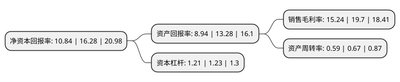

> 本页面由自动化程序生成于 2022年5月20日 01:35
> 内容可能存在错误，如有bug请提交issue至：https://github.com/Eroleice/doc-pi/issues
{.is-warning}

# 上市公司基本情况

## 基本资料

科博达技术股份有限公司（以下简称“科博达”）成立于2003年09月12日，上海市。于2019年10月15日在上交所主板上市。

科博达注册资本40,010万元，专注于汽车照明控制系统，电机控制系统，能源管理系统和车载电器与电子等汽车电子相关产品的研发，生产和销售，拥有主光源控制器，辅助光源控制器，氛围灯控制器，中小型电机控制系统，机电一体化，DC/DC转换模块，DC/AC逆变器，电磁阀等多类产品。以下是详细信息：

- 公司名称: 科博达技术股份有限公司
- 股票代码: 603786.SH
- 所在地: 上海 - 上海市
- 成立日期: 2003年09月12日
- 注册资本: 40,010万元
- 法定代表人: 柯桂华
- 主营业务: 专注于汽车照明控制系统，电机控制系统，能源管理系统和车载电器与电子等汽车电子相关产品的研发，生产和销售，拥有主光源控制器，辅助光源控制器，氛围灯控制器，中小型电机控制系统，机电一体化，DC/DC转换模块，DC/AC逆变器，电磁阀等多类产品
- 公司官网: www.keboda.com
- 公司介绍: 公司是汽车智能、节能电子部件的系统方案提供商，立足全球汽车产业平台并全面参与全球高端市场的竞争，专注汽车电子及相关产品在智能领域的技术创新与产业化，致力成为全球汽车电子高端产业链中富于创新和竞争力的卓越企业，公司是少数几家进入国际知名整车厂商全球配套体系，同步开发汽车电子部件的中国本土公司。公司终端用户主要包括大众集团(包括其下属子公司奥迪公司、保时捷汽车、宾利汽车和兰博基尼汽车)、戴姆勒、捷豹路虎、一汽集团及上汽大众等数十家全球知名整车厂商，且部分新产品已进入福特汽车、宝马汽车、雷诺汽车的供应商体系，在全球汽车电子尤其是汽车照明电子领域中享有较高的知名度。

## 股东及高管情况

上市公司第一大股东为科博达投资控股有限公司，持股239,449,043股，占比59.85%，为上市公司实际控制人。

截至2022年03月31日，上市公司的前十大股东中，共有3名自然人股东，6名机构股东，1个产品账户，其中5%以上大股东共有3名。上市公司前十大股东明细如下：

> 截至2022年03月31日，上市公司前十大股东信息如下：

| 股东名称 | 持股数量（股） | 持股比例 |
| --- | --- | --- |
| 科博达投资控股有限公司 | 239,449,043 | 59.85% |
| 柯桂华 | 25,655,234 | 6.41% |
| 嘉兴富捷投资合伙企业(有限合伙) | 25,270,619 | 6.32% |
| 嘉兴赢日投资合伙企业(有限合伙) | 12,984,919 | 3.25% |
| 嘉兴鼎韬投资合伙企业(有限合伙) | 12,984,919 | 3.25% |
| 柯炳华 | 12,827,633 | 3.21% |
| 柯磊 | 12,827,633 | 3.21% |
| 杭州玉辉投资管理合伙企业(有限合伙) | 6,000,000 | 1.5% |
| 上海复星惟实一期股权投资基金合伙企业(有限合伙) | 5,700,000 | 1.42% |
| 上海汉世纪投资管理有限公司-上海张江汉世纪股权投资合伙企业(有限合伙) | 4,651,200 | 1.16% |

## 利润表分析

上市公司2021年总收入为28.06亿元，净利润为4.27亿元，实现盈利。

## 杜邦分析

> 数据列示周期：2021年 | 2020年 | 2019年
{.is-info}

上市公司的净资产收益率在近一年有所下降，下降幅度为-33.42%，其变化情况分解如下：
- 上市公司的销售毛利率在近一年下降了-22.64%，可能是生产效率的下降、商品原材料价格上涨或商品价格的下跌所致。
- 上市公司的资产周转率在近一年下降了-11.94%，可能是源自于更慢的销售回款或库存管理效果下降。
- 上市公司的财务杠杆比率在近一年下降了-1.63%，可能是减少负债降低财务费用。

