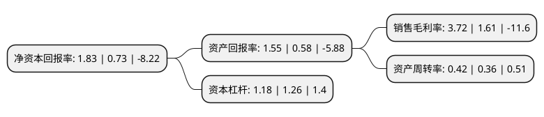

> 本页面由自动化程序生成于 2022年5月20日 01:36
> 内容可能存在错误，如有bug请提交issue至：https://github.com/Eroleice/doc-pi/issues
{.is-warning}

# 上市公司基本情况

## 基本资料

苏州金鸿顺汽车部件股份有限公司（以下简称“金鸿顺”）成立于2003年09月23日，苏州市。于2017年10月23日在上交所主板上市。

金鸿顺注册资本12,800万元，主营业务为汽车车身和底盘冲压零部件及其相关模具的开发，生产与销售。主要产品包括汽车零部件和模具，其中汽车零部件包括汽车车身零部件和底盘零部件。以下是详细信息：

- 公司名称: 苏州金鸿顺汽车部件股份有限公司
- 股票代码: 603922.SH
- 所在地: 江苏 - 苏州市
- 成立日期: 2003年09月23日
- 注册资本: 12,800万元
- 法定代表人: 洪建沧
- 主营业务: 主营业务为汽车车身和底盘冲压零部件及其相关模具的开发，生产与销售主要产品包括汽车零部件和模具，其中汽车零部件包括汽车车身零部件和底盘零部件
- 公司官网: www.jinhs.com
- 公司介绍: 公司是一家中外合资股份制企业。公司主要从事汽车零部件的冲压、焊接、ED、涂装加工；同时，公司还从事高强度零件的工装设计、制造和加工，主要应用于汽车零部件。公司拥有一流的开发设计系统和经验丰富的技术精英团队，且聘请中国台湾高级工程师做技术指导。公司为高新技术企业，在汽车模具设计和开发上积累了较为丰厚的经验，并采用目前国际最先进的CAE有限元分析技术(仿真模拟技术)来研制高强度和超高强度模具、高精度多工位级进模。公司主要客户有上汽大众、上汽汽车、上汽通用、广汽菲克、东风裕隆汽车、大陆汽车、英国CVG、德国BENTELER、加拿大COSMA、法国Feurecia、福建东南汽车有限公司等。

## 股东及高管情况

上市公司第一大股东为海南众德科技有限公司，持股38,387,200股，占比29.99%，**疑似为**上市公司实际控制人。

截至2022年04月07日，上市公司的前十大股东中，共有5名自然人股东，4名机构股东，1个海外主体，其中5%以上大股东共有3名。上市公司前十大股东明细如下：

> 未能通过持股比例判定出上市公司实际控制人（持股30%以上）
> 可能存在通过间接持股、联合持股、协议控制等方式拥有实际控制权的主体，具体请参考上市公司定期公告！
{.is-warning}

> 截至2022年04月07日，上市公司前十大股东信息如下：

| 股东名称 | 持股数量（股） | 持股比例 |
| --- | --- | --- |
| 海南众德科技有限公司 | 38,387,200 | 29.99% |
| 高德投資有限公司 | 24,702,555 | 19.3% |
| GOLD CRANE GROUP LIMITED | 23,742,829 | 18.55% |
| 张家港众成投资管理企业(有限合伙) | 3,284,743 | 2.57% |
| 张家港力同投资管理企业(有限合伙) | 1,406,617 | 1.1% |
| 刘春 | 901,600 | 0.7% |
| 赵峰 | 867,800 | 0.68% |
| 田鹏 | 722,400 | 0.56% |
| 徐峰 | 657,500 | 0.51% |
| 陈柳 | 546,400 | 0.43% |

## 利润表分析

上市公司2021年总收入为5.15亿元，净利润为0.19亿元，实现盈利。

## 杜邦分析

> 数据列示周期：2021年 | 2020年 | 2019年
{.is-info}

上市公司的净资产收益率在近一年有所上升，上升幅度为150.68%，其变化情况分解如下：
- 上市公司的销售毛利率在近一年上升了131.06%，可能是生产效率的提升、商品原材料价格下跌或商品价格的上涨所致。
- 上市公司的资产周转率在近一年上升了16.67%，可能是源自于更快的销售回款或库存管理效果提升。
- 上市公司的财务杠杆比率在近一年下降了-6.35%，可能是减少负债降低财务费用。

