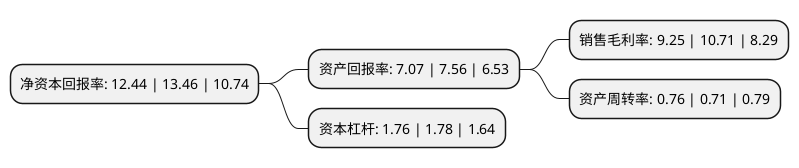

> 本页面由自动化程序生成于 2022年5月20日 01:36
> 内容可能存在错误，如有bug请提交issue至：https://github.com/Eroleice/doc-pi/issues
{.is-warning}

# 上市公司基本情况

## 基本资料

浙江铁流离合器股份有限公司（以下简称“铁流股份”）成立于2009年11月26日，杭州市。于2017年05月10日在上交所主板上市。

铁流股份注册资本17,656.349万元，主要产品:干摩擦式汽车离合器总成，包括盖总成，从动盘总成。主营业务:汽车离合器的研发，生产和销售。以下是详细信息：

- 公司名称: 浙江铁流离合器股份有限公司
- 股票代码: 603926.SH
- 所在地: 浙江 - 杭州市
- 成立日期: 2009年11月26日
- 注册资本: 17,656.349万元
- 法定代表人: 国宁
- 主营业务: 主要产品:干摩擦式汽车离合器总成，包括盖总成，从动盘总成主营业务:汽车离合器的研发，生产和销售
- 公司官网: www.chinaclutch.com
- 公司介绍: 公司是国内领先的汽车离合器生产企业。公司专注于离合器制造，致力于为客户提供高性能、创新型的汽车传动系统产品。产品覆盖90%以上乘用车及商用车型，旗下拥有“铁流”、“德萨”、“WESTLAKE”三大品牌，产品远销美洲、欧洲、亚洲、非洲、中东等多个国家和地区。公司及产品先后获得浙江名牌产品、国家免检产品、中国汽车零部件百强企业、余杭区政府质量奖等一系列荣誉。作为国家火炬计划重点高新技术企业以及浙江省企业术中心，公司还拥有行业内被CNAS评为国家认可实验室的离合器检测中心。2018年，公司全资子公司盖格控股有限公司取得Geiger公司100%股权，公司新增高精密金属零部件业务。

## 股东及高管情况

上市公司第一大股东为杭州德萨实业集团有限公司，持股66,124,494股，占比37.45%，为上市公司实际控制人。

截至2022年03月31日，上市公司的前十大股东中，共有7名自然人股东，1名机构股东，2个产品账户，其中5%以上大股东共有2名。上市公司前十大股东明细如下：

> 截至2022年03月31日，上市公司前十大股东信息如下：

| 股东名称 | 持股数量（股） | 持股比例 |
| --- | --- | --- |
| 杭州德萨实业集团有限公司 | 66,124,494 | 37.45% |
| 张智林 | 9,841,037 | 5.57% |
| 张婷 | 8,711,412 | 4.93% |
| 顾俊捷 | 6,196,967 | 3.51% |
| 天算量化(北京)资本管理有限公司-天算稳健成长1号私募证券投资基金 | 4,293,500 | 2.43% |
| 北京银行股份有限公司-广发盛锦混合型证券投资基金 | 3,136,894 | 1.78% |
| 国宁 | 3,064,663 | 1.74% |
| 沈永生 | 2,972,144 | 1.68% |
| 潘伟忠 | 2,704,140 | 1.53% |
| 张克明 | 2,059,366 | 1.17% |

## 利润表分析

上市公司2021年总收入为18.78亿元，净利润为1.73亿元，实现盈利。

## 杜邦分析

> 数据列示周期：2021年 | 2020年 | 2019年
{.is-info}

上市公司的净资产收益率在近一年有所下降，下降幅度为-7.58%，其变化情况分解如下：
- 上市公司的销售毛利率在近一年下降了-13.63%，可能是生产效率的下降、商品原材料价格上涨或商品价格的下跌所致。
- 上市公司的资产周转率在近一年上升了7.04%，可能是源自于更快的销售回款或库存管理效果提升。
- 上市公司的财务杠杆比率在近一年下降了-1.12%，可能是减少负债降低财务费用。

