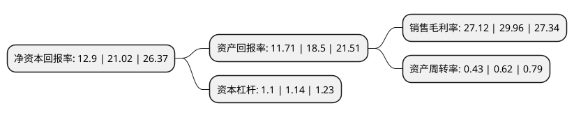

> 本页面由自动化程序生成于 2022年5月20日 01:36
> 内容可能存在错误，如有bug请提交issue至：https://github.com/Eroleice/doc-pi/issues
{.is-warning}

# 上市公司基本情况

## 基本资料

雪龙集团股份有限公司（以下简称“雪龙集团”）成立于2002年02月04日，宁波市。于2020年03月10日在上交所主板上市。

雪龙集团注册资本20,980.61万元，公司主要从事汽车发动机冷却风扇总成，离合器风扇集成系统及汽车轻量化塑料件的研发，生产和销售，自设立以来主营业务没有发生重大变化。公司发动机冷却系统产品包括发动机冷却风扇总成及离合器风扇集成系统;汽车轻量化塑料件包括汽车轻量化吹塑系列产品及其他注塑产品等。以下是详细信息：

- 公司名称: 雪龙集团股份有限公司
- 股票代码: 603949.SH
- 所在地: 浙江 - 宁波市
- 成立日期: 2002年02月04日
- 注册资本: 20,980.61万元
- 法定代表人: 贺财霖
- 主营业务: 公司主要从事汽车发动机冷却风扇总成，离合器风扇集成系统及汽车轻量化塑料件的研发，生产和销售，自设立以来主营业务没有发生重大变化公司发动机冷却系统产品包括发动机冷却风扇总成及离合器风扇集成系统;汽车轻量化塑料件包括汽车轻量化吹塑系列产品及其他注塑产品等
- 公司官网: www.xuelong.net.cn
- 公司介绍: 公司是国内最大的商用车塑料冷却风扇生产基地，被认定为国家级高新技术企业，中国名牌产品，主要从事汽车风扇系列的材料研究开发和风扇总成产品的制造，主要产品有汽车风扇总成及与之相配套的风扇硅油离合器总成、风扇电磁离合器总成、风扇电控离合器总成及各种吹塑件汽车风道、管道等3000多个品种。产品涵盖大型、中型、轻型卡车，客车、工程车、轿车等多种车型，与国内一汽、东风等147家商用车、客车、发动机企业及国外卡特彼勒、沃尔沃、依维柯、久保田等世界五百强企业建立配套关系，其中商用车塑料冷却风扇占国内市场40%以上配套份额，位居全国第一。

## 股东及高管情况

上市公司第一大股东为香港绿源控股有限公司，持股41,848,100股，占比19.95%，**疑似为**上市公司实际控制人。

截至2022年03月31日，上市公司的前十大股东中，共有7名自然人股东，3名机构股东，其中5%以上大股东共有5名。上市公司前十大股东明细如下：

> 未能通过持股比例判定出上市公司实际控制人（持股30%以上）
> 可能存在通过间接持股、联合持股、协议控制等方式拥有实际控制权的主体，具体请参考上市公司定期公告！
{.is-warning}

> 截至2022年03月31日，上市公司前十大股东信息如下：

| 股东名称 | 持股数量（股） | 持股比例 |
| --- | --- | --- |
| 香港绿源控股有限公司 | 41,848,100 | 19.95% |
| 宁波维尔赛投资控股有限公司 | 31,471,440 | 15% |
| 贺财霖 | 27,820,660 | 13.26% |
| 贺频艳 | 24,170,020 | 11.52% |
| 贺群艳 | 24,170,020 | 11.52% |
| 宁波梅山保税港区联展投资管理合伙企业(有限合伙) | 7,867,860 | 3.75% |
| 黄洁 | 1,121,400 | 0.53% |
| 赵启杨 | 952,600 | 0.45% |
| 顾兼宾 | 887,140 | 0.42% |
| 庄景华 | 867,300 | 0.41% |

## 利润表分析

上市公司2021年总收入为4.72亿元，净利润为1.28亿元，实现盈利。

## 杜邦分析

> 数据列示周期：2021年 | 2020年 | 2019年
{.is-info}

上市公司的净资产收益率在近一年有所下降，下降幅度为-38.63%，其变化情况分解如下：
- 上市公司的销售毛利率在近一年下降了-9.48%，可能是生产效率的下降、商品原材料价格上涨或商品价格的下跌所致。
- 上市公司的资产周转率在近一年下降了-30.65%，可能是源自于更慢的销售回款或库存管理效果下降。
- 上市公司的财务杠杆比率在近一年下降了-3.51%，可能是减少负债降低财务费用。

