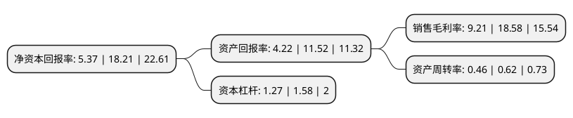

> 本页面由自动化程序生成于 2022年5月20日 01:36
> 内容可能存在错误，如有bug请提交issue至：https://github.com/Eroleice/doc-pi/issues
{.is-warning}

# 上市公司基本情况

## 基本资料

上海克来机电自动化工程股份有限公司（以下简称“克来机电”）成立于2003年05月30日，上海市。于2017年03月14日在上交所主板上市。

克来机电注册资本26,094.45万元，主要产品:柔性自动化生产线与工业机器人系统。主要业务:现代机电智能装备，工业机器人系统集成的研究，开发，制造。以下是详细信息：

- 公司名称: 上海克来机电自动化工程股份有限公司
- 股票代码: 603960.SH
- 所在地: 上海 - 上海市
- 成立日期: 2003年05月30日
- 注册资本: 26,094.45万元
- 法定代表人: 谈士力
- 主营业务: 主要产品:柔性自动化生产线与工业机器人系统现代机电智能装备，工业机器人系统集成的研究，开发，制造
- 公司官网: www.sh-kelai.com
- 公司介绍: 公司是柔性自动化装备与工业机器人系统应用供应商，致力于非标智能装备、工业机器人系统集成的研究、开发、制造，产品广泛应用于汽车、电子、轻工、机械等行业。公司产品可分为柔性自动化生产线与工业机器人系统应用两大类，主要应用在汽车电子、汽车内饰等领域；从设备功能上看，产品涵盖装配线、检测线、焊接线、喷涂线、折弯线等各类非标智能装备。随着业务经验与研发技术的积累，公司在数字化系统集成创新、柔性自动化生产线工装夹具的参数化与模块化设计、电驱动系统的精确分析计算与实验、快速成型与模拟仿真等环节理解力不断加深，在汽车领域做深、做强的基础上，凭借市场美誉度着手新的市场开拓。公司先后成为上海市小巨人培育企业和上海市高新技术企业，研发团队曾多次获上海市科技进步二等奖及三等奖，同时是上海市工业机器人协会的会员单位，上海市机器人学会副理事长单位。

## 股东及高管情况

上市公司第一大股东为谈士力，持股57,098,945股，占比21.88%，**疑似为**上市公司实际控制人。

截至2022年03月31日，上市公司的前十大股东中，共有6名自然人股东，3个产品账户，1个海外主体，其中5%以上大股东共有3名。上市公司前十大股东明细如下：

> 未能通过持股比例判定出上市公司实际控制人（持股30%以上）
> 可能存在通过间接持股、联合持股、协议控制等方式拥有实际控制权的主体，具体请参考上市公司定期公告！
{.is-warning}

> 截至2022年03月31日，上市公司前十大股东信息如下：

| 股东名称 | 持股数量（股） | 持股比例 |
| --- | --- | --- |
| 谈士力 | 57,098,945 | 21.88% |
| 陈久康 | 41,824,464 | 16.03% |
| 香港中央结算有限公司(陆股通) | 15,381,621 | 5.89% |
| 全国社保基金四零六组合 | 11,690,938 | 4.48% |
| 王阳明 | 4,552,284 | 1.74% |
| 施罗德投资管理(香港)有限公司-施罗德环球基金系列大中华(交易所) | 3,576,230 | 1.37% |
| 交通银行股份有限公司-汇丰晋信智造先锋股票型证券投资基金 | 3,541,013 | 1.36% |
| 沈俊杰 | 3,335,985 | 1.28% |
| 何永义 | 3,013,149 | 1.15% |
| 苏建良 | 2,754,127 | 1.06% |

## 利润表分析

上市公司2021年总收入为5.6亿元，净利润为0.51亿元，实现盈利。

## 杜邦分析

> 数据列示周期：2021年 | 2020年 | 2019年
{.is-info}

上市公司的净资产收益率在近一年有所下降，下降幅度为-70.51%，其变化情况分解如下：
- 上市公司的销售毛利率在近一年下降了-50.43%，可能是生产效率的下降、商品原材料价格上涨或商品价格的下跌所致。
- 上市公司的资产周转率在近一年下降了-25.81%，可能是源自于更慢的销售回款或库存管理效果下降。
- 上市公司的财务杠杆比率在近一年下降了-19.62%，可能是减少负债降低财务费用。

