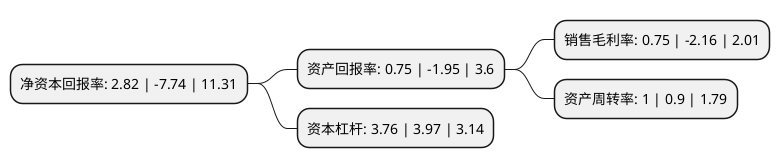

> 本页面由自动化程序生成于 2022年5月20日 01:36
> 内容可能存在错误，如有bug请提交issue至：https://github.com/Eroleice/doc-pi/issues
{.is-warning}

# 上市公司基本情况

## 基本资料

宁波继峰汽车零部件股份有限公司（以下简称“继峰股份”）成立于2003年07月11日，宁波市。于2015年03月02日在上交所主板上市。

继峰股份注册资本111,912.399万元，乘用车座椅零部件的研发，生产与销售，主营产品包括乘用车座椅头枕，头枕支杆，座椅扶手。以下是详细信息：

- 公司名称: 宁波继峰汽车零部件股份有限公司
- 股票代码: 603997.SH
- 所在地: 浙江 - 宁波市
- 成立日期: 2003年07月11日
- 注册资本: 111,912.399万元
- 法定代表人: 王义平
- 主营业务: 乘用车座椅零部件的研发，生产与销售，主营产品包括乘用车座椅头枕，头枕支杆，座椅扶手
- 公司官网: www.nb-jf.com
- 公司介绍: 继峰股份始创于1996年，是一家专业从事汽车内饰件及其系统，以及道路车辆、非道路车辆悬挂驾驶座椅和乘客座椅的开发、生产和销售的全球性汽车零部件供应商。2015年公司在上交所上市交易(股票代码：603997)。2019年公司收购德国百年汽车内饰巨头格拉默，通过企业创新升级，实现全球化的战略布局。公司产品涵盖乘用车和商用车两大领域。在乘用车领域，公司可提供乘用车座椅、座椅头枕、座椅扶手、中控系统、内饰部件、操作系统及创新性的热塑解决方案；在商用车领域，公司是商用车座椅系统行业标准的制定者，也是行业技术的领导者，可提供卡车座椅、非道路车辆座椅部件、火车及公共汽车座椅部件、游艇座椅部件、航空座椅部件等。公司建立了覆盖全球的生产和营销网络，在全球20个国家拥有近70家控股子公司。同时，公司在收购格拉默之后，研发和创新能力获得了质的飞跃，目前，公司已拥有开发经验丰富的研发设计团队，其中大部分是来自国外的高端技术人才，在全球建有中国、印度、美国、墨西哥、巴西、比利时、德国、捷克、土耳其等多个研发中心。公司持续在座舱内饰件领域上做深做强，构建有竞争力的技术储备和国际运营能力，并结合汽车行业电动化、智能化的快速发展及驾驶者和乘客对于座舱舒适度需求的提升，积极升级和扩展车内功能，拓展业务中远期发展空间，为提升座舱内部的舒适性体验提供核心价值。

## 股东及高管情况

上市公司第一大股东为宁波继弘控股集团有限公司，持股291,591,597股，占比26.06%，**疑似为**上市公司实际控制人。

截至2022年05月05日，上市公司的前十大股东中，共有3名机构股东，6个产品账户，1个海外主体，其中5%以上大股东共有3名。上市公司前十大股东明细如下：

> 未能通过持股比例判定出上市公司实际控制人（持股30%以上）
> 可能存在通过间接持股、联合持股、协议控制等方式拥有实际控制权的主体，具体请参考上市公司定期公告！
{.is-warning}

> 截至2022年05月05日，上市公司前十大股东信息如下：

| 股东名称 | 持股数量（股） | 持股比例 |
| --- | --- | --- |
| 宁波继弘控股集团有限公司 | 291,591,597 | 26.06% |
| 东证融通投资管理有限公司-宁波东证继涵投资合伙企业(有限合伙) | 227,404,479 | 20.32% |
| Wing Sing International Co., Ltd. | 146,880,000 | 13.12% |
| 中国农业银行股份有限公司-国泰智能汽车股票型证券投资基金 | 26,690,152 | 2.38% |
| 上海浦东发展银行股份有限公司-易方达裕祥回报债券型证券投资基金 | 19,711,911 | 1.76% |
| 中国银行股份有限公司-易方达供给改革灵活配置混合型证券投资基金 | 17,791,410 | 1.59% |
| 上海并购股权投资基金合伙企业(有限合伙) | 17,526,820 | 1.57% |
| 中国银行股份有限公司-国泰智能装备股票型证券投资基金 | 15,332,182 | 1.37% |
| 中国工商银行股份有限公司-广发价值增长混合型证券投资基金 | 12,871,300 | 1.15% |
| 华夏人寿保险股份有限公司-自有资金 | 12,506,950 | 1.12% |

## 利润表分析

上市公司2021年总收入为168.31亿元，净利润为1.25亿元，实现盈利。

## 杜邦分析

> 数据列示周期：2021年 | 2020年 | 2019年
{.is-info}

上市公司的净资产收益率在近一年有所下降，下降幅度为-136.43%，其变化情况分解如下：
- 上市公司的销售毛利率在近一年下降了-134.72%，可能是生产效率的下降、商品原材料价格上涨或商品价格的下跌所致。
- 上市公司的资产周转率在近一年上升了11.11%，可能是源自于更快的销售回款或库存管理效果提升。
- 上市公司的财务杠杆比率在近一年下降了-5.29%，可能是减少负债降低财务费用。

