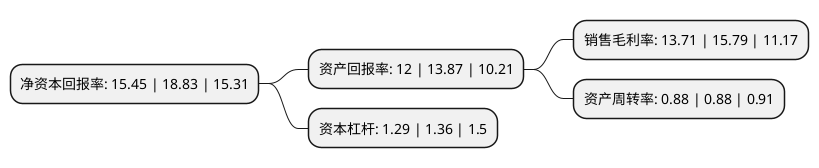

> 本页面由自动化程序生成于 2022年5月20日 01:36
> 内容可能存在错误，如有bug请提交issue至：https://github.com/Eroleice/doc-pi/issues
{.is-warning}

# 上市公司基本情况

## 基本资料

合兴汽车电子股份有限公司（以下简称“合兴股份”）成立于2006年11月14日，温州市。于2021年01月19日在上交所主板上市。

合兴股份注册资本40,413.65万元，主要从事汽车电子，消费电子产品的研发，生产和销售。以下是详细信息：

- 公司名称: 合兴汽车电子股份有限公司
- 股票代码: 605005.SH
- 所在地: 浙江 - 温州市
- 成立日期: 2006年11月14日
- 注册资本: 40,413.65万元
- 法定代表人: 陈文葆
- 主营业务: 主要从事汽车电子，消费电子产品的研发，生产和销售
- 公司官网: www.cwb.com.cn
- 公司介绍: 目前，公司国内研发总部设立于浙江，海外研发中心设立于德国，生产基地分别位于浙江和江苏两地。凭借深厚的产业技术积淀、高端精密模具以及智能自动化产线的设计制造能力、一流的实验检测分析能力，公司已与博世、联合电子、博格华纳、大陆、安波福等汽车零部件企业建立了长期合作关系，汽车电子业务在与国际行业巨头的合作中不断成长，综合实力已具备国际市场竞争力。公司消费电子业务充分依托汽车电子业务的研发积累，凭借出色的产品质量和稳定的产品性能，致力于为下游产品提供高效的连接解决方案。公司始终专注于汽车电子产业的发展。近年来，公司顺应汽车产业的发展趋势，通过与下游客户开展深度同步开发合作，积极开发新能源汽车和智能驾驶相关汽车零部件产品，部分产品已进入大众汽车MEB电动车平台供应链体系。随着新能源汽车的快速发展和智能驾驶技术的日益成熟，全球汽车电子产业的市场规模亦不断扩大。未来公司将不断提高自身系统集成能力，积极融入全球汽车电子系统的创新发展，致力于成为全球汽车电子产业的顶级供应商。

## 股东及高管情况

上市公司第一大股东为合兴集团有限公司，持股306,765,000股，占比75.91%，为上市公司实际控制人。

截至2022年03月31日，上市公司的前十大股东中，共有8名自然人股东，2名机构股东，其中5%以上大股东共有2名。上市公司前十大股东明细如下：

> 截至2022年03月31日，上市公司前十大股东信息如下：

| 股东名称 | 持股数量（股） | 持股比例 |
| --- | --- | --- |
| 合兴集团有限公司 | 306,765,000 | 75.91% |
| 陈文葆 | 33,601,594 | 8.31% |
| 陈文义 | 5,578,905 | 1.38% |
| 胡春勇 | 3,849,434 | 0.95% |
| 陈文乐 | 2,165,400 | 0.54% |
| 蔡庆明 | 1,824,050 | 0.45% |
| 周槊 | 1,066,160 | 0.26% |
| 甬兴证券有限公司 | 980,060 | 0.24% |
| 陈锡友 | 974,430 | 0.24% |
| 陈式寅 | 827,025 | 0.2% |

## 利润表分析

上市公司2021年总收入为14.22亿元，净利润为1.95亿元，实现盈利。

## 杜邦分析

> 数据列示周期：2021年 | 2020年 | 2019年
{.is-info}

上市公司的净资产收益率在近一年有所下降，下降幅度为-17.95%，其变化情况分解如下：
- 上市公司的销售毛利率在近一年下降了-13.17%，可能是生产效率的下降、商品原材料价格上涨或商品价格的下跌所致。
- 上市公司的资产周转率在近一年下降了0%，可能是源自于更慢的销售回款或库存管理效果下降。
- 上市公司的财务杠杆比率在近一年下降了-5.15%，可能是减少负债降低财务费用。

