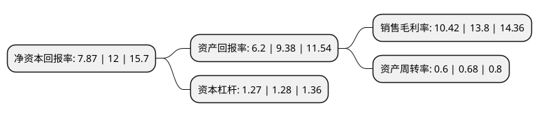

> 本页面由自动化程序生成于 2022年5月20日 01:36
> 内容可能存在错误，如有bug请提交issue至：https://github.com/Eroleice/doc-pi/issues
{.is-warning}

# 上市公司基本情况

## 基本资料

浙江长华汽车零部件股份有限公司（以下简称“长华股份”）成立于1993年11月11日，宁波市。于2020年09月29日在上交所主板上市。

长华股份注册资本41,668万元，主营业务:汽车金属零部件的研发，生产，销售，逐步形成了以紧固件，冲焊件为核心的两大产品体系。以下是详细信息：

- 公司名称: 浙江长华汽车零部件股份有限公司
- 股票代码: 605018.SH
- 所在地: 浙江 - 宁波市
- 成立日期: 1993年11月11日
- 注册资本: 41,668万元
- 法定代表人: 王长土
- 主营业务: 主营业务:汽车金属零部件的研发，生产，销售，逐步形成了以紧固件，冲焊件为核心的两大产品体系
- 公司官网: www.zjchanghua.com
- 公司介绍: 公司主要从事汽车金属零部件研发、生产、销售，具备较强的配套开发、生产制造能力，经过数十年发展，逐步形成了以紧固件、冲焊件为核心的两大产品体系，并作为一级供应商向国内主要乘用车制造商供应汽车零部件产品，与东风本田、一汽-大众、上汽通用、上汽大众、广汽本田、东风日产、日产中国、长安福特、广汽三菱等国内主要合资品牌以及长城汽车、上汽集团、奇瑞汽车、江铃汽车等国内自主品牌建立了稳定的合作关系，实现了业务的稳步发展。在与众多国内一线整车厂的长期合作中，公司不断吸收先进技术和管理经验，在管理水平、研发能力、制造工艺、质量检测等方面取得了长足的进步，特别是在研发能力方面，公司不断加大研发投入，形成了多项研发成果，产品配套能力不断提高。作为国家高新技术企业，公司积极参与紧固件国家标准的起草制定，2015年公司研发中心通过浙江省企业技术中心认定，2017年通过宁波市企业研究院认定。随着未来汽车核心零部件国产化率不断提高，公司强大的研发能力、先进的制造水平和丰富的管理经验为公司产品门类的拓展和市场份额的进一步扩大奠定了坚实基础。

## 股东及高管情况

上市公司第一大股东为王长土，持股226,800,000股，占比48.41%，为上市公司实际控制人。

截至2022年03月31日，上市公司的前十大股东中，共有4名自然人股东，3名机构股东，2个产品账户，1个海外主体，其中5%以上大股东共有3名。上市公司前十大股东明细如下：

> 截至2022年03月31日，上市公司前十大股东信息如下：

| 股东名称 | 持股数量（股） | 持股比例 |
| --- | --- | --- |
| 王长土 | 226,800,000 | 48.41% |
| 王庆 | 97,200,000 | 20.75% |
| 宁波长宏股权投资合伙企业(有限合伙) | 36,000,000 | 7.68% |
| 宁波久尔投资合伙企业(有限合伙) | 15,000,000 | 3.2% |
| 杭州瀚昭企业管理咨询合伙企业(有限合伙) | 3,340,149 | 0.71% |
| UBS   AG | 2,949,656 | 0.63% |
| 中国光大银行股份有限公司-华夏磐益一年定期开放混合型证券投资基金 | 2,406,271 | 0.51% |
| 华夏基金-邮储银行-华夏基金秋实混合策略1号集合资产管理计划 | 2,385,821 | 0.51% |
| 周容 | 2,385,821 | 0.51% |
| 李柱根 | 2,281,540 | 0.49% |

## 利润表分析

上市公司2021年总收入为14.96亿元，净利润为1.55亿元，实现盈利。

## 杜邦分析

> 数据列示周期：2021年 | 2020年 | 2019年
{.is-info}

上市公司的净资产收益率在近一年有所下降，下降幅度为-34.42%，其变化情况分解如下：
- 上市公司的销售毛利率在近一年下降了-24.49%，可能是生产效率的下降、商品原材料价格上涨或商品价格的下跌所致。
- 上市公司的资产周转率在近一年下降了-11.76%，可能是源自于更慢的销售回款或库存管理效果下降。
- 上市公司的财务杠杆比率在近一年下降了-0.78%，可能是减少负债降低财务费用。

