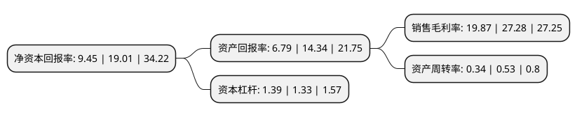

> 本页面由自动化程序生成于 2022年5月20日 01:36
> 内容可能存在错误，如有bug请提交issue至：https://github.com/Eroleice/doc-pi/issues
{.is-warning}

# 上市公司基本情况

## 基本资料

明新旭腾新材料股份有限公司（以下简称“明新旭腾”）成立于2005年12月07日，嘉兴市。于2020年11月23日在上交所主板上市。

明新旭腾注册资本16,660万元，主要产品为汽车内饰皮革，专注于汽车革研发，清洁生产和销售以下是详细信息：

- 公司名称: 明新旭腾新材料股份有限公司
- 股票代码: 605068.SH
- 所在地: 浙江 - 嘉兴市
- 成立日期: 2005年12月07日
- 注册资本: 16,660万元
- 法定代表人: 庄君新
- 主营业务: 主要产品为汽车内饰皮革，专注于汽车革研发，清洁生产和销售
- 公司官网: www.mingxinleather.com
- 公司介绍: 公司是一家专注于汽车革研发、清洁生产和销售的高新技术企业。公司自设立以来一直专注于汽车革业务，经过不断的技术研究、新品开发和市场拓展，采用绿色制革技术，生产出一系列符合安全环保要求且舒适美观的汽车内饰用天然皮革，形成了从材料研究、工艺开发、清洁生产到销售推广和终端应用的汽车革一体化业务体系。截目前，公司已进入美国Chrysler、德国大众、法国PSA等国际主流车厂和一汽大众、上汽通用、上汽大众、神龙汽车、上汽通用五菱、广汽菲亚特、吉利、长城、长安、宝沃、比亚迪、奇瑞、一汽轿车、广汽等国内主流整车制造企业供应商体系，并与麦格纳(墨西哥)、富维安道拓、延锋安道拓、国利真皮饰件、吉中汽车内饰、李尔、奥托立夫、延锋百利得等国内外知名汽车一级零部件供应商保持长期合作，为整车制造商及其配套企业供应高品质的汽车内饰真皮。公司已成功为T-ROC(德国大众)、RT Minivan(美国Chrysler)、宝来、速腾、奥迪Q3、奥迪Q5L、探岳、探歌、传祺、高尔夫嘉旅、帝豪、博越、VV5(长城)、秦(比亚迪)、昂科拉、科帕奇等国内外多款主流车型批量供货，并已成为上述主流整车制造企业多款新车型定点供应商。

## 股东及高管情况

上市公司第一大股东为庄君新，持股42,049,000股，占比25.2395%，**疑似为**上市公司实际控制人。

截至2022年04月25日，上市公司的前十大股东中，共有4名自然人股东，5名机构股东，1个产品账户，其中5%以上大股东共有8名。上市公司前十大股东明细如下：

> 未能通过持股比例判定出上市公司实际控制人（持股30%以上）
> 可能存在通过间接持股、联合持股、协议控制等方式拥有实际控制权的主体，具体请参考上市公司定期公告！
{.is-warning}

> 截至2022年04月25日，上市公司前十大股东信息如下：

| 股东名称 | 持股数量（股） | 持股比例 |
| --- | --- | --- |
| 庄君新 | 42,049,000 | 25.2395% |
| 庄君新 | 42,025,000 | 25.2251% |
| 庄君新 | 42,025,000 | 25.23% |
| 庄严 | 28,000,000 | 16.81% |
| 浙江明新资产管理有限公司 | 25,000,000 | 15.01% |
| 浙江明新资产管理有限公司 | 25,000,000 | 15.01% |
| 浙江德创企业管理有限公司 | 9,500,000 | 5.7% |
| 浙江德创企业管理有限公司 | 9,500,000 | 5.7% |
| 嘉兴旭腾投资管理合伙企业(有限合伙) | 5,000,000 | 3% |
| 兴业银行股份有限公司-天弘永利债券型证券投资基金 | 1,111,500 | 0.67% |

## 利润表分析

上市公司2021年总收入为8.2亿元，净利润为1.63亿元，实现盈利。

## 杜邦分析

> 数据列示周期：2021年 | 2020年 | 2019年
{.is-info}

上市公司的净资产收益率在近一年有所下降，下降幅度为-50.29%，其变化情况分解如下：
- 上市公司的销售毛利率在近一年下降了-27.16%，可能是生产效率的下降、商品原材料价格上涨或商品价格的下跌所致。
- 上市公司的资产周转率在近一年下降了-35.85%，可能是源自于更慢的销售回款或库存管理效果下降。
- 上市公司的财务杠杆比率在近一年上升了4.51%，可能是增加负债扩大生产规模。

