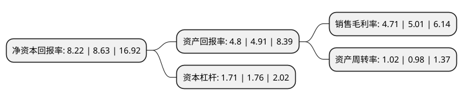

> 本页面由自动化程序生成于 2022年5月20日 01:36
> 内容可能存在错误，如有bug请提交issue至：https://github.com/Eroleice/doc-pi/issues
{.is-warning}

# 上市公司基本情况

## 基本资料

温州市冠盛汽车零部件集团股份有限公司（以下简称“冠盛股份”）成立于1999年04月13日，温州市。于2020年08月17日在上交所主板上市。

冠盛股份注册资本16,581.5万元，主要从事汽车传动系统零部件的研发，生产和销售，主要产品包括了万向节，传动轴总成和轮毂单元。以下是详细信息：

- 公司名称: 温州市冠盛汽车零部件集团股份有限公司
- 股票代码: 605088.SH
- 所在地: 浙江 - 温州市
- 成立日期: 1999年04月13日
- 注册资本: 16,581.5万元
- 法定代表人: 周家儒
- 主营业务: 主要从事汽车传动系统零部件的研发，生产和销售，主要产品包括了万向节，传动轴总成和轮毂单元
- 公司官网: www.gsp.cn
- 公司介绍: 公司是国内少数能够满足客户“一站式”采购需求的汽车传动系统零部件生产厂商之一。主要从事汽车传动系统零部件的研发、生产和销售，主要产品包括了传动轴、万向节和轮毂。公司主要是为国外汽车售后市场提供适配的传动系统零部件产品和相关服务，并已具备传动轴总成整体解决方案的制造和综合服务能力，以及整车配套能力。公司过了TS16949、ISO14001、OHSAS18001、ISO10012等体系认证。产品覆盖美国、日本、欧洲、韩国及中国五大车系千余个规格品种。公司还获得“AA类海关管理企业”、“全国实施‘走出去’战略企业”、“浙江著名商标”、“浙江省名牌产品”、“浙江出口名牌”、“浙江省知名商号”、“浙江省专利示范企业”、“浙江省创新型示范企业”等荣誉称号。

## 股东及高管情况

上市公司第一大股东为周家儒，持股52,144,000股，占比31.45%，为上市公司实际控制人。

截至2022年03月31日，上市公司的前十大股东中，共有6名自然人股东，1名机构股东，1个产品账户，2个海外主体，其中5%以上大股东共有3名。上市公司前十大股东明细如下：

> 截至2022年03月31日，上市公司前十大股东信息如下：

| 股东名称 | 持股数量（股） | 持股比例 |
| --- | --- | --- |
| 周家儒 | 52,144,000 | 31.45% |
| ALPHA HOLDING   VENTURES LIMITED | 19,200,000 | 11.58% |
| NEW FORTUNE   INTERNATIONAL GROUP LTD. | 12,180,000 | 7.35% |
| 浙江银万斯特投资管理有限公司-银万紫云6号私募证券投资基金 | 6,637,400 | 4% |
| 赵东升 | 3,120,000 | 1.88% |
| 石勇进 | 2,828,700 | 1.71% |
| 潘战兴 | 1,430,700 | 0.86% |
| 上海斐君投资管理中心(有限合伙)-上海斐君铂晟投资管理合伙企业(有限合伙) | 1,388,548 | 0.84% |
| 向友恒 | 1,200,000 | 0.72% |
| 周崇龙 | 1,200,000 | 0.72% |

## 利润表分析

上市公司2021年总收入为24.87亿元，净利润为1.17亿元，实现盈利。

## 杜邦分析

> 数据列示周期：2021年 | 2020年 | 2019年
{.is-info}

上市公司的净资产收益率在近一年有所下降，下降幅度为-4.75%，其变化情况分解如下：
- 上市公司的销售毛利率在近一年下降了-5.99%，可能是生产效率的下降、商品原材料价格上涨或商品价格的下跌所致。
- 上市公司的资产周转率在近一年上升了4.08%，可能是源自于更快的销售回款或库存管理效果提升。
- 上市公司的财务杠杆比率在近一年下降了-2.84%，可能是减少负债降低财务费用。

