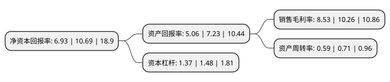

> 本页面由自动化程序生成于 2022年5月20日 01:36
> 内容可能存在错误，如有bug请提交issue至：https://github.com/Eroleice/doc-pi/issues
{.is-warning}

# 上市公司基本情况

## 基本资料

上海沿浦金属制品股份有限公司（以下简称“上海沿浦”）成立于1999年04月19日，上海市。于2020年09月15日在上交所主板上市。

上海沿浦注册资本8,000万元，公司主要生产汽车零部件中的金属构件，产品包括汽车座椅骨架总成(含座椅滑轨)，精密冲压件，注塑零部件及模具检具。主要从事各类汽车座椅骨架总成，座椅滑轨总成及汽车座椅，安全带，闭锁等系统冲压件，注塑零部件的研发，生产和销售。以下是详细信息：

- 公司名称: 上海沿浦金属制品股份有限公司
- 股票代码: 605128.SH
- 所在地: 上海 - 上海市
- 成立日期: 1999年04月19日
- 注册资本: 8,000万元
- 法定代表人: 周建清
- 主营业务: 公司主要生产汽车零部件中的金属构件，产品包括汽车座椅骨架总成(含座椅滑轨)，精密冲压件，注塑零部件及模具检具主要从事各类汽车座椅骨架总成，座椅滑轨总成及汽车座椅，安全带，闭锁等系统冲压件，注塑零部件的研发，生产和销售
- 公司官网: www.shyanpu.com
- 公司介绍: 公司系汽车座椅零部件的供应商，拥有较为完整的汽车座椅总成产品，是汽车座椅骨架、座椅功能件和金属、塑料成型的汽车零部件制造商。发行人主要从事各类汽车座椅骨架总成、座椅滑轨总成及汽车座椅、安全带、闭锁等系统冲压、注塑零部件的研发、生产和销售、模具的研发和生产，发行人具备优秀的产品研发、模具设计、机器人焊接、金属冲压加工成型、塑料注塑成型和生产工艺设计优化能力。公司与中国李尔、东风李尔集团、麦格纳、延锋百利得、泰极爱思等国内外知名汽车零部件厂商建立了良好的合作关系，是东风李尔集团、麦格纳集团最重要的战略供应商之一。公司产品配套多个汽车品牌，包括东风风神、天籁、杰德、别克、雪佛兰、帕萨特、朗逸、途观、福特、英菲尼迪、标致、雪铁龙、雷诺、江铃、纳智捷、东风天龙等多个汽车品牌。

## 股东及高管情况

上市公司第一大股东为周建清，持股30,715,000股，占比38.39%，为上市公司实际控制人。

截至2022年03月31日，上市公司的前十大股东中，共有5名自然人股东，3名机构股东，2个产品账户，其中5%以上大股东共有2名。上市公司前十大股东明细如下：

> 截至2022年03月31日，上市公司前十大股东信息如下：

| 股东名称 | 持股数量（股） | 持股比例 |
| --- | --- | --- |
| 周建清 | 30,715,000 | 38.39% |
| 张思成 | 7,575,000 | 9.47% |
| 钱勇 | 3,500,000 | 4.38% |
| 芜湖卓辉盛景投资管理中心(有限合伙)-宁波卓辉荣瑞股权投资合伙企业(有限合伙) | 2,350,000 | 2.94% |
| 秦艳芳 | 2,062,500 | 2.58% |
| 杭州启悦投资管理合伙企业(有限合伙) | 1,900,900 | 2.38% |
| 曲水华简企业管理合伙企业(有限合伙) | 1,200,000 | 1.5% |
| 湖州国赞投资管理合伙企业(有限合伙)-国赞价值5号私募证券投资基金 | 1,177,625 | 1.47% |
| 王晓锋 | 885,000 | 1.11% |
| 上海咏明资产管理有限公司-咏明创享1号证券投资基金 | 680,000 | 0.85% |

## 利润表分析

上市公司2021年总收入为8.26亿元，净利润为0.7亿元，实现盈利。

## 杜邦分析

> 数据列示周期：2021年 | 2020年 | 2019年
{.is-info}

上市公司的净资产收益率在近一年有所下降，下降幅度为-35.17%，其变化情况分解如下：
- 上市公司的销售毛利率在近一年下降了-16.86%，可能是生产效率的下降、商品原材料价格上涨或商品价格的下跌所致。
- 上市公司的资产周转率在近一年下降了-16.9%，可能是源自于更慢的销售回款或库存管理效果下降。
- 上市公司的财务杠杆比率在近一年下降了-7.43%，可能是减少负债降低财务费用。

