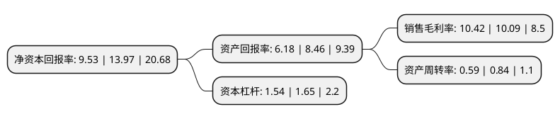

> 本页面由自动化程序生成于 2022年5月20日 01:36
> 内容可能存在错误，如有bug请提交issue至：https://github.com/Eroleice/doc-pi/issues
{.is-warning}

# 上市公司基本情况

## 基本资料

西上海汽车服务股份有限公司（以下简称“西上海”）成立于2002年07月15日，上海市。于2020年12月15日在上交所主板上市。

西上海注册资本13,334万元，主营业务:主要从事汽车物流及汽车零部件制造，销售业务，公司的汽车零部件制造业务的主要产品为包覆件和涂装件。以下是详细信息：

- 公司名称: 西上海汽车服务股份有限公司
- 股票代码: 605151.SH
- 所在地: 上海 - 上海市
- 成立日期: 2002年07月15日
- 注册资本: 13,334万元
- 法定代表人: 朱燕阳
- 主营业务: 主营业务:主要从事汽车物流及汽车零部件制造，销售业务，公司的汽车零部件制造业务的主要产品为包覆件和涂装件
- 公司官网: www.wsasc.com.cn
- 公司介绍: 公司是一家专业从事汽车物流服务，零部件仓储的汽车服务供应商,公司的汽车物流业务主要包括整车仓储及运营服务、汽车零部件仓储及运营服务、零部件运输服务和整车运输服务。公司的汽车零部件制造业务的主要产品为包覆件和涂装件。公司所提供的服务或产品主要直接或间接覆盖的汽车品牌有上汽大众、上汽通用、上汽汽车、上汽通用五菱、广汽本田、广汽菲克、广汽三菱、东风日产、东风汽车、一汽大众、吉利汽车、奇瑞汽车、江淮汽车、长安汽车等,公司已具有综合竞争优势，并在国内知名整车制造企业中建立了良好的品牌形象。

## 股东及高管情况

上市公司第一大股东为曹抗美，持股25,142,590股，占比18.86%，**疑似为**上市公司实际控制人。

截至2022年03月31日，上市公司的前十大股东中，共有8名自然人股东，2名机构股东，其中5%以上大股东共有5名。上市公司前十大股东明细如下：

> 未能通过持股比例判定出上市公司实际控制人（持股30%以上）
> 可能存在通过间接持股、联合持股、协议控制等方式拥有实际控制权的主体，具体请参考上市公司定期公告！
{.is-warning}

> 截至2022年03月31日，上市公司前十大股东信息如下：

| 股东名称 | 持股数量（股） | 持股比例 |
| --- | --- | --- |
| 曹抗美 | 25,142,590 | 18.86% |
| 上海汇嘉创业投资有限公司 | 16,682,960 | 12.51% |
| 上海安亭实业发展有限公司 | 11,306,610 | 8.48% |
| 吴建良 | 9,777,650 | 7.33% |
| 朱燕阳 | 7,602,910 | 5.7% |
| 江华 | 5,587,280 | 4.19% |
| 戴华淼 | 5,587,280 | 4.19% |
| 陈德兴 | 5,587,280 | 4.19% |
| 卜晓明 | 5,587,280 | 4.19% |
| 宋建明 | 2,793,640 | 2.1% |

## 利润表分析

上市公司2021年总收入为10.7亿元，净利润为1.11亿元，实现盈利。

## 杜邦分析

> 数据列示周期：2021年 | 2020年 | 2019年
{.is-info}

上市公司的净资产收益率在近一年有所下降，下降幅度为-31.78%，其变化情况分解如下：
- 上市公司的销售毛利率在近一年上升了3.27%，可能是生产效率的提升、商品原材料价格下跌或商品价格的上涨所致。
- 上市公司的资产周转率在近一年下降了-29.76%，可能是源自于更慢的销售回款或库存管理效果下降。
- 上市公司的财务杠杆比率在近一年下降了-6.67%，可能是减少负债降低财务费用。

