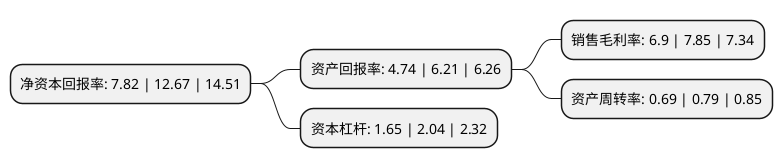

> 本页面由自动化程序生成于 2022年5月20日 01:37
> 内容可能存在错误，如有bug请提交issue至：https://github.com/Eroleice/doc-pi/issues
{.is-warning}

# 上市公司基本情况

## 基本资料

神通科技集团股份有限公司（以下简称“神通科技”）成立于2005年03月04日，宁波市。于2021年01月20日在上交所主板上市。

神通科技注册资本42,455万元，汽车非金属部件及模具的研发，生产和销售，主要产品包括汽车动力系统部件，饰件系统部件和模具类产品等。其中，动力系统部件包括进气系统，润滑系统，正时系统等产品，饰件系统部件包括门护板类，仪表板类，车身饰件等产品。以下是详细信息：

- 公司名称: 神通科技集团股份有限公司
- 股票代码: 605228.SH
- 所在地: 浙江 - 宁波市
- 成立日期: 2005年03月04日
- 注册资本: 42,455万元
- 法定代表人: 方立锋
- 主营业务: 汽车非金属部件及模具的研发，生产和销售，主要产品包括汽车动力系统部件，饰件系统部件和模具类产品等其中，动力系统部件包括进气系统，润滑系统，正时系统等产品，饰件系统部件包括门护板类，仪表板类，车身饰件等产品
- 公司官网: www.shentong-china.com
- 公司介绍: 公司是经宁波市科学技术局、宁波市财政局、宁波市国家税务局、浙江省宁波市地方税务局联合认定的高新技术企业，建有浙江省科学技术厅认定的省级高新技术企业研究开发中心，并被中国模具工业协会评为“中国精密注塑模具重点骨干企业”。公司具备产品与整车厂同步开发和自主开发能力，并已在核心技术领域形成多项自主知识产权。凭借持续的研发投入、稳定的产品质量和优质的售后服务，公司目前已发展成为上汽通用、一汽-大众、上汽通用五菱、上汽大众、广汽集团、吉利沃尔沃、奇瑞捷豹路虎、东风公司、长城汽车等知名整车厂的一级供应商以及延峰汽车饰件、佛吉亚、李尔、恩坦华等国内外知名汽车零部件企业的合格供应商，并先后荣获客户“突出贡献奖”、“优秀协同表现奖”、“开发贡献奖”等荣誉。

## 股东及高管情况

上市公司第一大股东为宁波神通投资有限公司，持股194,397,178股，占比45.79%，为上市公司实际控制人。

截至2022年03月31日，上市公司的前十大股东中，共有4名自然人股东，6名机构股东，其中5%以上大股东共有4名。上市公司前十大股东明细如下：

> 截至2022年03月31日，上市公司前十大股东信息如下：

| 股东名称 | 持股数量（股） | 持股比例 |
| --- | --- | --- |
| 宁波神通投资有限公司 | 194,397,178 | 45.79% |
| 宁波必恒投资合伙企业(有限合伙) | 64,590,323 | 15.21% |
| 香港昱立实业有限公司 | 38,987,191 | 9.18% |
| 宁波神通仁华投资合伙企业(有限合伙) | 24,976,923 | 5.88% |
| 宁波燕创惠然创业投资合伙企业(有限合伙) | 12,277,777 | 2.89% |
| 宁波首科燕园康泰创业投资合伙企业(有限合伙) | 3,022,223 | 0.71% |
| 蒋红娣 | 1,363,985 | 0.32% |
| 王伯逸 | 1,050,000 | 0.25% |
| 朱春亚 | 1,000,000 | 0.24% |
| 黄永坚 | 891,286 | 0.21% |

## 利润表分析

上市公司2021年总收入为13.78亿元，净利润为0.95亿元，实现盈利。

## 杜邦分析

> 数据列示周期：2021年 | 2020年 | 2019年
{.is-info}

上市公司的净资产收益率在近一年有所下降，下降幅度为-38.28%，其变化情况分解如下：
- 上市公司的销售毛利率在近一年下降了-12.1%，可能是生产效率的下降、商品原材料价格上涨或商品价格的下跌所致。
- 上市公司的资产周转率在近一年下降了-12.66%，可能是源自于更慢的销售回款或库存管理效果下降。
- 上市公司的财务杠杆比率在近一年下降了-19.12%，可能是减少负债降低财务费用。

