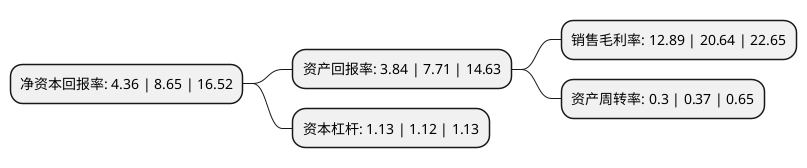

> 本页面由自动化程序生成于 2022年5月20日 01:37
> 内容可能存在错误，如有bug请提交issue至：https://github.com/Eroleice/doc-pi/issues
{.is-warning}

# 上市公司基本情况

## 基本资料

宁波市天普橡胶科技股份有限公司（以下简称“天普股份”）成立于2009年11月13日，宁波市。于2020年08月25日在上交所主板上市。

天普股份注册资本13,408万元，主要从事汽车用高分子材料流体管路系统和密封系统零件及总成的研发，生产及销售，为汽车整车厂商及其一级供应商提供橡胶软管及总成产品。以下是详细信息：

- 公司名称: 宁波市天普橡胶科技股份有限公司
- 股票代码: 605255.SH
- 所在地: 浙江 - 宁波市
- 成立日期: 2009年11月13日
- 注册资本: 13,408万元
- 法定代表人: 尤建义
- 主营业务: 主要从事汽车用高分子材料流体管路系统和密封系统零件及总成的研发，生产及销售，为汽车整车厂商及其一级供应商提供橡胶软管及总成产品
- 公司官网: www.tipgroupm.com
- 公司介绍: 公司是一家跨地区集团化生产型国家高新技术企业，公司主要业务为车用高分子材料流体管路系统和密封系统零件及总成等橡胶零部件系列产品的研发、生产和销售，核心业务是采用高分子材料加工应用技术为各大汽车整车制造厂商提供配套汽车橡胶软管产品，主要产品为汽车发动机附件系统软管及总成、汽车燃油系统软管及总成、汽车空调系统软管及总成以及模压制品等。公司已在全球拥有多家优质的客户资源，并保持了长期稳定的客户关系，打下了良好的市场基础及品牌形象。公司主要客户有日产投资、东风日产、日本仓敷、江铃汽车、英瑞杰、邦迪等，凭借良好的产品质量和售后服务多次得到客户的好评，获得客户年度0PPM供应商、优秀供应商、合格供应商等称号。

## 股东及高管情况

上市公司第一大股东为浙江天普控股有限公司，持股75,360,000股，占比56.21%，为上市公司实际控制人。

截至2022年03月31日，上市公司的前十大股东中，共有7名自然人股东，3名机构股东，其中5%以上大股东共有3名。上市公司前十大股东明细如下：

> 截至2022年03月31日，上市公司前十大股东信息如下：

| 股东名称 | 持股数量（股） | 持股比例 |
| --- | --- | --- |
| 浙江天普控股有限公司 | 75,360,000 | 56.21% |
| 尤建义 | 12,000,000 | 8.95% |
| 宁波市天昕贸易有限公司 | 8,640,000 | 6.44% |
| 宁波市普恩投资管理合伙企业(有限合伙) | 4,560,000 | 3.4% |
| 周晨 | 1,827,700 | 1.36% |
| 李欣 | 1,748,691 | 1.3% |
| 金兴旺 | 1,271,400 | 0.95% |
| 周信钢 | 745,300 | 0.56% |
| 王正 | 540,000 | 0.4% |
| 季洪燕 | 502,400 | 0.37% |

## 利润表分析

上市公司2021年总收入为3.06亿元，净利润为0.39亿元，实现盈利。

## 杜邦分析

> 数据列示周期：2021年 | 2020年 | 2019年
{.is-info}

上市公司的净资产收益率在近一年有所下降，下降幅度为-49.6%，其变化情况分解如下：
- 上市公司的销售毛利率在近一年下降了-37.55%，可能是生产效率的下降、商品原材料价格上涨或商品价格的下跌所致。
- 上市公司的资产周转率在近一年下降了-18.92%，可能是源自于更慢的销售回款或库存管理效果下降。
- 上市公司的财务杠杆比率在近一年上升了0.89%，可能是增加负债扩大生产规模。

