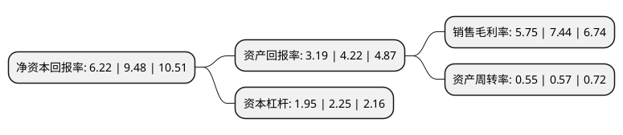

> 本页面由自动化程序生成于 2022年5月20日 01:37
> 内容可能存在错误，如有bug请提交issue至：https://github.com/Eroleice/doc-pi/issues
{.is-warning}

# 上市公司基本情况

## 基本资料

无锡市振华汽车部件股份有限公司（以下简称“无锡振华”）成立于1989年09月21日，无锡市。于2021年06月07日在上交所主板上市。

无锡振华注册资本20,000万元，主营业务为汽车冲压及焊接零部件和相关模具的开发，生产和销售，公司主要产品为汽车冲压及焊接零部件，冲压模具。以下是详细信息：

- 公司名称: 无锡市振华汽车部件股份有限公司
- 股票代码: 605319.SH
- 所在地: 江苏 - 无锡市
- 成立日期: 1989年09月21日
- 注册资本: 20,000万元
- 法定代表人: 钱犇
- 主营业务: 主营业务为汽车冲压及焊接零部件和相关模具的开发，生产和销售，公司主要产品为汽车冲压及焊接零部件，冲压模具
- 公司官网: www.wxzhenhua.com.cn
- 公司介绍: 公司前身振华有限成立于2006年6月8日。2018年3月5日，经公司创立大会暨第一次股东大会审议通过，公司由有限责任公司整体变更为股份有限公司。2018年3月15日，公司在江苏省无锡市行政审批局依法办理了工商注册登记。公司主营业务为汽车冲压及焊接零部件和相关模具的开发、生产和销售，产品主要应用于乘用车领域。公司及时把握乘用车国产化发展机遇，主动寻求与整车制造商的深度合作。经过多年的发展，公司在汽车冲压零部件、总成焊接生产、模具开发等方面掌握了丰富的技术，具备了较强的市场竞争力。近年来公司分别获得上汽乘用车“2017年度最佳供应商”和“2018年度优秀供应商”、上汽通用“装备提升奖”和“2018年度技术创新奖”、上汽大通“卓越供应商”、“优秀供应商”等客户奖项。

## 股东及高管情况

上市公司第一大股东为无锡君润投资合伙企业(有限合伙)，持股68,830,000股，占比34.42%，为上市公司实际控制人。

截至2022年03月31日，上市公司的前十大股东中，共有4名自然人股东，3名机构股东，3个产品账户，其中5%以上大股东共有4名。上市公司前十大股东明细如下：

> 截至2022年03月31日，上市公司前十大股东信息如下：

| 股东名称 | 持股数量（股） | 持股比例 |
| --- | --- | --- |
| 无锡君润投资合伙企业(有限合伙) | 68,830,000 | 34.42% |
| 钱犇 | 33,527,000 | 16.76% |
| 无锡瑾沣裕投资合伙企业(有限合伙) | 20,000,000 | 10% |
| 钱金祥 | 18,053,000 | 9.03% |
| 无锡康盛投资合伙企业(有限合伙) | 9,590,000 | 4.8% |
| 毛荀林 | 900,004 | 0.45% |
| 王维 | 504,800 | 0.25% |
| 天虫资本管理有限公司-天虫蝉翼3号私募证券投资基金 | 500,000 | 0.25% |
| 天虫资本管理有限公司-天虫天赢远见1号私募证券投资基金 | 450,000 | 0.23% |
| 常州睿格资产管理有限公司-睿格大中华优质成长私募证券投资基金 | 421,800 | 0.21% |

## 利润表分析

上市公司2021年总收入为15.81亿元，净利润为0.9亿元，实现盈利。

## 杜邦分析

> 数据列示周期：2021年 | 2020年 | 2019年
{.is-info}

上市公司的净资产收益率在近一年有所下降，下降幅度为-34.39%，其变化情况分解如下：
- 上市公司的销售毛利率在近一年下降了-22.72%，可能是生产效率的下降、商品原材料价格上涨或商品价格的下跌所致。
- 上市公司的资产周转率在近一年下降了-3.51%，可能是源自于更慢的销售回款或库存管理效果下降。
- 上市公司的财务杠杆比率在近一年下降了-13.33%，可能是减少负债降低财务费用。

