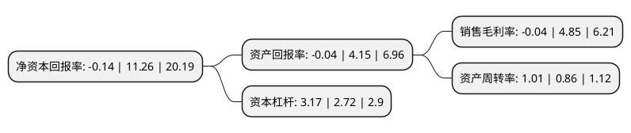

> 本页面由自动化程序生成于 2022年5月20日 01:37
> 内容可能存在错误，如有bug请提交issue至：https://github.com/Eroleice/doc-pi/issues
{.is-warning}

# 上市公司基本情况

## 基本资料

昆山沪光汽车电器股份有限公司（以下简称“沪光股份”）成立于1997年03月31日，苏州市。于2020年08月18日在上交所主板上市。

沪光股份注册资本40,100万元，主要从事汽车线束的研发，制造及销售，主要产品包括成套线束，发动机线束及其他线束，产品涵盖整车客户定制化线束，新能源汽车高压线束，仪表板线束，发动机线束，车身线束，门线束，顶棚线束及尾部线束等。以下是详细信息：

- 公司名称: 昆山沪光汽车电器股份有限公司
- 股票代码: 605333.SH
- 所在地: 江苏 - 苏州市
- 成立日期: 1997年03月31日
- 注册资本: 40,100万元
- 法定代表人: 成三荣
- 主营业务: 主要从事汽车线束的研发，制造及销售，主要产品包括成套线束，发动机线束及其他线束，产品涵盖整车客户定制化线束，新能源汽车高压线束，仪表板线束，发动机线束，车身线束，门线束，顶棚线束及尾部线束等
- 公司官网: www.kshg.com
- 公司介绍: 公司是是中国民营资本汽车线束生产企业，主要从事汽车线束的研发、制造及销售，主要产品包括成套线束、发动机线束及其他线束，产品涵盖整车客户定制化线束、新能源汽车高压线束、仪表板线束、发动机线束、车身线束、门线束、顶棚线束及尾部线束等。汽车线束是汽车电路的网络主体，是为汽车各种电器与电子设备提供电能和电信号的电子控制系统。公司的线束产品主要应用在整车制造领域，下游客户主要为汽车整车制造商。公司在新能源汽车业务领域逐步取得行业领先优势。公司是上汽大众众多供应商中优质的线束配套方，多年获得上汽大众年度优秀供应商称号，公司新能源业务已经得到国际高端汽车整车厂商的广泛认可，在业内拥有较高知名度。

## 股东及高管情况

上市公司第一大股东为成三荣，持股262,000,000股，占比65.34%，为上市公司实际控制人。

截至2022年03月31日，上市公司的前十大股东中，共有5名自然人股东，3名机构股东，2个产品账户，其中5%以上大股东共有2名。上市公司前十大股东明细如下：

> 截至2022年03月31日，上市公司前十大股东信息如下：

| 股东名称 | 持股数量（股） | 持股比例 |
| --- | --- | --- |
| 成三荣 | 262,000,000 | 65.34% |
| 金成成 | 65,500,000 | 16.33% |
| 昆山德添企业管理中心(有限合伙) | 6,516,000 | 1.62% |
| 昆山德泰企业管理中心(有限合伙) | 6,063,500 | 1.51% |
| 昆山源海企业管理中心(有限合伙) | 5,484,500 | 1.37% |
| 中国银行股份有限公司-易方达供给改革灵活配置混合型证券投资基金 | 5,020,070 | 1.25% |
| 成锋 | 3,500,000 | 0.87% |
| 成国华 | 3,100,000 | 0.77% |
| 成磊 | 2,630,000 | 0.66% |
| 中国建设银行股份有限公司-易方达新丝路灵活配置混合型证券投资基金 | 1,803,500 | 0.45% |

## 杜邦分析

> 数据列示周期：2021年 | 2020年 | 2019年
{.is-info}

上市公司的净资产收益率在近一年有所下降，下降幅度为-101.24%，其变化情况分解如下：
- 上市公司的销售毛利率在近一年下降了-100.82%，可能是生产效率的下降、商品原材料价格上涨或商品价格的下跌所致。
- 上市公司的资产周转率在近一年上升了17.44%，可能是源自于更快的销售回款或库存管理效果提升。
- 上市公司的财务杠杆比率在近一年上升了16.54%，可能是增加负债扩大生产规模。

