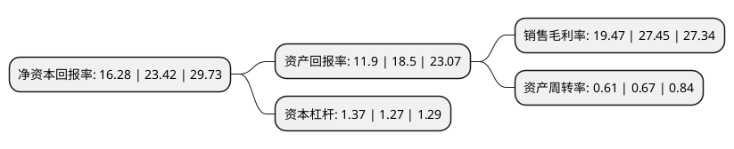

> 本页面由自动化程序生成于 2022年5月20日 01:38
> 内容可能存在错误，如有bug请提交issue至：https://github.com/Eroleice/doc-pi/issues
{.is-warning}

# 上市公司基本情况

## 基本资料

深圳市道通科技股份有限公司（以下简称“道通科技”）成立于2004年09月28日，深圳市。于2020年02月13日在上交所科创板上市。

道通科技注册资本45,094.663万元，公司专注于汽车智能诊断，检测分析系统及汽车电子零部件的研发，生产，销售和服务，公司主要产品包括汽车综合诊断产品，TPMS系列产品，ADAS系列产品和其他产品以及在各类产品中提供汽车智能维修云服务。以下是详细信息：

- 公司名称: 深圳市道通科技股份有限公司
- 股票代码: 688208.SH
- 所在地: 广东 - 深圳市
- 成立日期: 2004年09月28日
- 注册资本: 45,094.663万元
- 法定代表人: 李红京
- 主营业务: 公司专注于汽车智能诊断，检测分析系统及汽车电子零部件的研发，生产，销售和服务，公司主要产品包括汽车综合诊断产品，TPMS系列产品，ADAS系列产品和其他产品以及在各类产品中提供汽车智能维修云服务
- 公司官网: www.auteltech.cn
- 公司介绍: 公司专注于汽车智能诊断、检测分析系统及汽车电子零部件的研发、生产、销售和服务，产品主销美国、德国、英国、澳大利亚等50多个国家和地区，是全球领先的汽车智能诊断、检测和TPMS(胎压监测系统)产品及服务综合方案提供商之一。公司在全球汽车智能诊断、检测领域深耕十多年，通过紧密跟踪汽车发展趋势和持续进行产品创新，目前已构建了包括汽车综合诊断产品、针对汽车胎压监测系统的TPMS系列和针对汽车智能辅助驾驶系统的ADAS系列在内的三大产品线。从汽车综合诊断产品开始，公司持续迭代、推出纵向与横向产品，先后发展出TPMS系列、ADAS系列等专业化产品，并延伸出智能化的汽车电子零部件(如胎压传感器)的业务，同时基于多年积累的诊断维修数据与案例，开始提供一体化的智能维修云服务。

## 股东及高管情况

上市公司第一大股东为李红京，持股173,091,606股，占比38.38%，为上市公司实际控制人。

截至2022年04月18日，上市公司的前十大股东中，共有2名自然人股东，4名机构股东，3个产品账户，1个海外主体，其中5%以上大股东共有1名。上市公司前十大股东明细如下：

> 截至2022年04月18日，上市公司前十大股东信息如下：

| 股东名称 | 持股数量（股） | 持股比例 |
| --- | --- | --- |
| 李红京 | 173,091,606 | 38.38% |
| 李宏 | 21,095,000 | 4.68% |
| 深圳南山鸿泰股权投资基金合伙企业(有限合伙) | 16,100,595 | 3.57% |
| 中国建设银行股份有限公司-易方达国防军工混合型证券投资基金 | 11,100,046 | 2.46% |
| 招商银行股份有限公司-华夏上证科创板50成份交易型开放式指数证券投资基金 | 9,075,635 | 2.01% |
| 深圳市达晨创丰股权投资企业(有限合伙) | 8,389,900 | 1.86% |
| 达孜熔岩投资管理有限公司-平潭熔岩新战略股权投资合伙企业(有限合伙) | 7,910,741 | 1.75% |
| 深圳市道合通泰信息咨询企业(有限合伙) | 7,350,000 | 1.63% |
| 铭基国际投资公司-MATTHEWS ASIA FUNDS(US) | 7,216,277 | 1.6% |
| 香港中央结算有限公司(陆股通) | 6,897,788 | 1.53% |

## 利润表分析

上市公司2021年总收入为22.53亿元，净利润为4.38亿元，实现盈利。

## 杜邦分析

> 数据列示周期：2021年 | 2020年 | 2019年
{.is-info}

上市公司的净资产收益率在近一年有所下降，下降幅度为-30.49%，其变化情况分解如下：
- 上市公司的销售毛利率在近一年下降了-29.07%，可能是生产效率的下降、商品原材料价格上涨或商品价格的下跌所致。
- 上市公司的资产周转率在近一年下降了-8.96%，可能是源自于更慢的销售回款或库存管理效果下降。
- 上市公司的财务杠杆比率在近一年上升了7.87%，可能是增加负债扩大生产规模。

