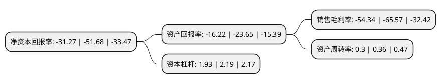

> 本页面由自动化程序生成于 2022年5月20日 01:39
> 内容可能存在错误，如有bug请提交issue至：https://github.com/Eroleice/doc-pi/issues
{.is-warning}

# 上市公司基本情况

## 基本资料

精进电动科技股份有限公司（以下简称“精进电动-UW”）成立于2008年02月25日，北京市。于2021年10月27日在上交所科创板上市。

精进电动-UW注册资本59,022.167万元，从事电驱动系统的研发，生产，销售及服务，已对驱动电机，控制器，传动三大总成自主掌握核心技术和实现完整布局。以下是详细信息：

- 公司名称: 精进电动科技股份有限公司
- 股票代码: 688280.SH
- 所在地: 北京 - 北京市
- 成立日期: 2008年02月25日
- 注册资本: 59,022.167万元
- 法定代表人: 余平
- 主营业务: 从事电驱动系统的研发，生产，销售及服务，已对驱动电机，控制器，传动三大总成自主掌握核心技术和实现完整布局
- 公司官网: www.jjecn.com
- 公司介绍: 公司是新能源汽车电驱动系统国内领军企业之一，从事电驱动系统的研发、生产、销售及服务，已对驱动电机、控制器、传动三大总成自主掌握核心技术和实现完整布局，公司为客户提供电驱动系统的整体技术解决方案，凭借卓越的产品性能、突出的系统级供应能力、领先的研发水平和高效的技术服务，赢得了国内外新能源汽车整车企业客户的信赖，是我国少数能够持续获得全球知名整车企业电驱动系统产品量产订单的新能源汽车核心零部件企业。公司产品受到国际国内客户的广泛认可，与菲亚特克莱斯勒、Karma、上汽集团、吉利集团、广汽集团、小鹏汽车、比亚迪、东风集团、一汽集团、潍柴集团、北汽集团、中通客车、厦门金龙、长安汽车等知名整车企业建立了长期稳定的合作关系，并正在积极推进与美国、欧洲著名整车企业的进一步合作。公司先后获得了菲亚特克莱斯勒授予的北美杰出质量奖(North America Outstanding Quality Award)；精进电动及核心产品2016年-2019年连续四届获得铃轩奖，“中国心”新能源汽车动力系统奖项等多项荣誉。

## 股东及高管情况

上市公司第一大股东为菏泽北翔新能源科技有限公司，持股69,677,522股，占比11.81%，**疑似为**上市公司实际控制人。

截至2022年03月31日，上市公司的前十大股东中，共有6名机构股东，2个产品账户，2个海外主体，其中5%以上大股东共有5名。上市公司前十大股东明细如下：

> 未能通过持股比例判定出上市公司实际控制人（持股30%以上）
> 可能存在通过间接持股、联合持股、协议控制等方式拥有实际控制权的主体，具体请参考上市公司定期公告！
{.is-warning}

> 截至2022年03月31日，上市公司前十大股东信息如下：

| 股东名称 | 持股数量（股） | 持股比例 |
| --- | --- | --- |
| 菏泽北翔新能源科技有限公司 | 69,677,522 | 11.81% |
| 诚辉国际有限公司 | 60,263,177 | 10.21% |
| 中信产业投资基金(香港)投资有限公司 | 40,747,975 | 6.9% |
| 上海超越摩尔股权投资基金合伙企业(有限合伙) | 38,095,239 | 6.45% |
| 上海理成赛鑫投资管理中心(有限合伙) | 33,948,377 | 5.75% |
| 方腾集团有限公司 | 28,655,159 | 4.85% |
| VV Cleantech(HK)Limited | 23,458,808 | 3.97% |
| 一汽股权投资(天津)有限公司 | 19,182,150 | 3.25% |
| 艾里逊变数箱(上海)有限公司 | 19,182,150 | 3.25% |
| CEF EMC Holdings Limited | 19,005,970 | 3.22% |

## 利润表分析

上市公司2021年总收入为7.36亿元，净利润为-4.01亿元，**未实现盈利**。

## 杜邦分析

> 数据列示周期：2021年 | 2020年 | 2019年
{.is-info}

上市公司的净资产收益率在近一年有所下降，下降幅度为-39.49%，其变化情况分解如下：
- 上市公司的销售毛利率在近一年下降了-17.13%，可能是生产效率的下降、商品原材料价格上涨或商品价格的下跌所致。
- 上市公司的资产周转率在近一年下降了-16.67%，可能是源自于更慢的销售回款或库存管理效果下降。
- 上市公司的财务杠杆比率在近一年下降了-11.87%，可能是减少负债降低财务费用。

