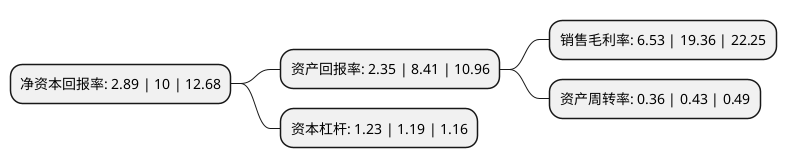

> 本页面由自动化程序生成于 2022年5月20日 01:39
> 内容可能存在错误，如有bug请提交issue至：https://github.com/Eroleice/doc-pi/issues
{.is-warning}

# 上市公司基本情况

## 基本资料

杭州鸿泉物联网技术股份有限公司（以下简称“鸿泉物联”）成立于2009年06月11日，杭州市。于2019年11月06日在上交所科创板上市。

鸿泉物联注册资本10,034.392万元，主要产品包括代表智能化技术路径的高级辅助驾驶系统和代表网联化技术路径的智能增强驾驶系统，人机交互终端，车载联网终端。以下是详细信息：

- 公司名称: 杭州鸿泉物联网技术股份有限公司
- 股票代码: 688288.SH
- 所在地: 浙江 - 杭州市
- 成立日期: 2009年06月11日
- 注册资本: 10,034.392万元
- 法定代表人: 何军强
- 主营业务: 主要产品包括代表智能化技术路径的高级辅助驾驶系统和代表网联化技术路径的智能增强驾驶系统，人机交互终端，车载联网终端
- 公司官网: www.hopechart.com
- 公司介绍: 公司是国内较早从事辅助驾驶研究的企业之一，是智能驾驶领域的开拓者与先行者。主要产品包括代表智能化技术路径的高级辅助驾驶系统和代表网联化技术路径的智能增强驾驶系统，人机交互终端，车载联网终端。公司于2016年收购全资子公司成生科技，业务范围拓展至智慧城市政务管理系统。公司在商用车智能网联领域的研发能力、生产能力、工艺技术、产品质量等方面均具有较强的竞争优势，各类产品在商用车细分市场占有率和技术水平均处于国内领先地位。

## 股东及高管情况

上市公司第一大股东为何军强，持股35,429,100股，占比35.31%，为上市公司实际控制人。

截至2022年03月31日，上市公司的前十大股东中，共有4名自然人股东，6名机构股东，其中5%以上大股东共有2名。上市公司前十大股东明细如下：

> 截至2022年03月31日，上市公司前十大股东信息如下：

| 股东名称 | 持股数量（股） | 持股比例 |
| --- | --- | --- |
| 何军强 | 35,429,100 | 35.31% |
| 北京北大千方科技有限公司 | 9,952,369 | 9.92% |
| 北京千方科技股份有限公司 | 5,000,000 | 4.98% |
| 安吉鸿洱企业管理咨询合伙企业(有限合伙) | 4,123,026 | 4.11% |
| 赵胜贤 | 3,076,365 | 3.07% |
| 上海禺成森企业管理合伙企业(有限合伙) | 2,109,516 | 2.1% |
| 杭州崇福锐鹰创业投资合伙企业(有限合伙) | 2,074,347 | 2.07% |
| 杨富金 | 2,000,200 | 1.99% |
| 安吉鸿吉企业管理咨询合伙企业(有限合伙) | 1,728,588 | 1.72% |
| 杭华 | 1,308,857 | 1.3% |

## 利润表分析

上市公司2021年总收入为4.05亿元，净利润为0.26亿元，实现盈利。

## 杜邦分析

> 数据列示周期：2021年 | 2020年 | 2019年
{.is-info}

上市公司的净资产收益率在近一年有所下降，下降幅度为-71.1%，其变化情况分解如下：
- 上市公司的销售毛利率在近一年下降了-66.27%，可能是生产效率的下降、商品原材料价格上涨或商品价格的下跌所致。
- 上市公司的资产周转率在近一年下降了-16.28%，可能是源自于更慢的销售回款或库存管理效果下降。
- 上市公司的财务杠杆比率在近一年上升了3.36%，可能是增加负债扩大生产规模。

