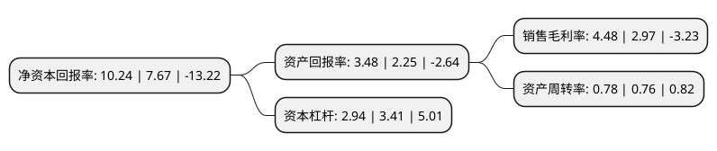

> 本页面由自动化程序生成于 2022年5月20日 01:39
> 内容可能存在错误，如有bug请提交issue至：https://github.com/Eroleice/doc-pi/issues
{.is-warning}

## 股东及高管情况

上市公司第一大股东为吉英存，持股29,471,499股，占比24.56%，**疑似为**上市公司实际控制人。

截至2022年04月19日，上市公司的前十大股东中，共有5名自然人股东，5名机构股东，其中5%以上大股东共有4名。上市公司前十大股东明细如下：

> 未能通过持股比例判定出上市公司实际控制人（持股30%以上）
> 可能存在通过间接持股、联合持股、协议控制等方式拥有实际控制权的主体，具体请参考上市公司定期公告！
{.is-warning}

> 截至2022年04月19日，上市公司前十大股东信息如下：

| 股东名称 | 持股数量（股） | 持股比例 |
| --- | --- | --- |
| 吉英存 | 29,471,499 | 24.56% |
| 曹旭明 | 13,807,449 | 11.51% |
| 崔文革 | 13,027,502 | 10.86% |
| 张秦 | 6,317,734 | 5.26% |
| 中信证券股份有限公司 | 2,934,854 | 2.45% |
| 苏州铧兴志诚创业投资中心(有限合伙) | 2,572,595 | 2.14% |
| 方芳 | 2,366,234 | 1.97% |
| 北京方圆九州投资中心(有限合伙) | 2,344,161 | 1.95% |
| 北京天工山丘投资中心(有限合伙) | 1,935,607 | 1.61% |
| 宁波钛铭投资管理有限公司-天津市永钛海河股权投资合伙企业(有限合伙) | 1,791,111 | 1.49% |

## 利润表分析

上市公司2021年总收入为32.62亿元，净利润为1.46亿元，实现盈利。

## 杜邦分析

> 数据列示周期：2021年 | 2020年 | 2019年
{.is-info}

上市公司的净资产收益率在近一年有所上升，上升幅度为33.51%，其变化情况分解如下：
- 上市公司的销售毛利率在近一年上升了50.84%，可能是生产效率的提升、商品原材料价格下跌或商品价格的上涨所致。
- 上市公司的资产周转率在近一年上升了2.63%，可能是源自于更快的销售回款或库存管理效果提升。
- 上市公司的财务杠杆比率在近一年下降了-13.78%，可能是减少负债降低财务费用。

