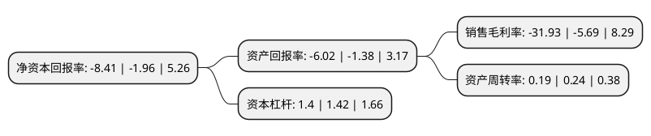

> 本页面由自动化程序生成于 2022年5月20日 01:39
> 内容可能存在错误，如有bug请提交issue至：https://github.com/Eroleice/doc-pi/issues
{.is-warning}

# 上市公司基本情况

## 基本资料

北京亿华通科技股份有限公司（以下简称“亿华通-U”）成立于2012年07月12日，北京市。于2020年08月10日在上交所科创板上市。

亿华通-U注册资本7,135.099万元，燃料电池动力系统及相关技术开发，技术服务以下是详细信息：

- 公司名称: 北京亿华通科技股份有限公司
- 股票代码: 688339.SH
- 所在地: 北京 - 北京市
- 成立日期: 2012年07月12日
- 注册资本: 7,135.099万元
- 法定代表人: 张国强
- 主营业务: 燃料电池动力系统及相关技术开发，技术服务
- 公司官网: www.sinohytec.com
- 公司介绍: 公司是一家专注于氢燃料电池发动机系统研发及产业化的高新技术企业，致力于成为国际领先的氢燃料电池发动机供应商。公司具备自主核心知识产权，率先实现了发动机系统及燃料电池电堆的批量国产化，产品主要应用于客车、物流车等商用车型。公司及下属公司神力科技曾先后承担多项国家高技术研究发展计划(863计划)项目、科技部国家重点研发计划项目以及北京市科委、上海市科委项目等燃料电池领域重大专项课题，历经了中国燃料电池产业从技术研发为主向示范运营和产业化推进的重要转变。公司与国内知名的商用车企业宇通客车、北汽福田、中通客车、苏州金龙以及申龙客车等建立了深入的合作关系，搭载亿华通发动机系统的燃料电池客车先后在北京、张家口、上海、郑州、苏州等地上线运营。

## 股东及高管情况

上市公司第一大股东为张国强，持股13,281,512股，占比18.61%，**疑似为**上市公司实际控制人。

截至2022年03月31日，上市公司的前十大股东中，共有3名自然人股东，5名机构股东，2个产品账户，其中5%以上大股东共有1名。上市公司前十大股东明细如下：

> 未能通过持股比例判定出上市公司实际控制人（持股30%以上）
> 可能存在通过间接持股、联合持股、协议控制等方式拥有实际控制权的主体，具体请参考上市公司定期公告！
{.is-warning}

> 截至2022年03月31日，上市公司前十大股东信息如下：

| 股东名称 | 持股数量（股） | 持股比例 |
| --- | --- | --- |
| 张国强 | 13,281,512 | 18.61% |
| 宇通客车股份有限公司 | 2,799,378 | 3.92% |
| 中国工商银行股份有限公司-诺安成长股票型证券投资基金 | 2,565,043 | 3.59% |
| 东旭光电科技股份有限公司 | 2,564,104 | 3.59% |
| 张禾 | 2,000,000 | 2.8% |
| 北京水木扬帆创业投资中心(有限合伙) | 1,871,500 | 2.62% |
| 北京水木长风股权投资中心(有限合伙) | 1,214,793 | 1.7% |
| 白玮 | 1,041,667 | 1.46% |
| 珠海汉睿投资管理有限责任公司-深圳汉能新经济股权投资基金合伙企业(有限合伙) | 1,041,667 | 1.46% |
| 润物控股有限公司 | 1,041,667 | 1.46% |

## 利润表分析

上市公司2021年总收入为6.29亿元，净利润为-2.01亿元，**未实现盈利**。

## 杜邦分析

> 数据列示周期：2021年 | 2020年 | 2019年
{.is-info}

上市公司的净资产收益率在近一年有所上升，上升幅度为329.08%，其变化情况分解如下：
- 上市公司的销售毛利率在近一年上升了461.16%，可能是生产效率的提升、商品原材料价格下跌或商品价格的上涨所致。
- 上市公司的资产周转率在近一年下降了-20.83%，可能是源自于更慢的销售回款或库存管理效果下降。
- 上市公司的财务杠杆比率在近一年下降了-1.41%，可能是减少负债降低财务费用。

