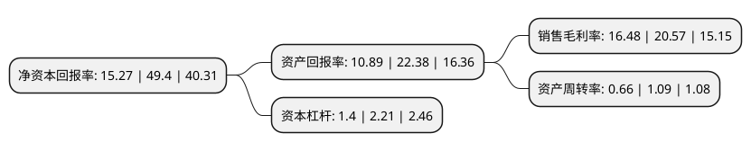

> 本页面由自动化程序生成于 2022年5月20日 01:40
> 内容可能存在错误，如有bug请提交issue至：https://github.com/Eroleice/doc-pi/issues
{.is-warning}

# 上市公司基本情况

## 基本资料

武汉菱电汽车电控系统股份有限公司（以下简称“菱电电控”）成立于2005年01月07日，武汉市。于2021年03月12日在上交所科创板上市。

菱电电控注册资本5,160万元，主营业务包括汽车发动机管理系统，摩托车发动机管理系统，纯电动汽车动力电子控制系统，混合动力汽车动力电子控制系统的研发，生产，销售和技术服务，产品包括汽油车和摩托车的EMS，电动车的MCU，VCU，混合动力汽车的EMS，VCU，MCU和GCU。以下是详细信息：

- 公司名称: 武汉菱电汽车电控系统股份有限公司
- 股票代码: 688667.SH
- 所在地: 湖北 - 武汉市
- 成立日期: 2005年01月07日
- 注册资本: 5,160万元
- 法定代表人: 王和平
- 主营业务: 主营业务包括汽车发动机管理系统，摩托车发动机管理系统，纯电动汽车动力电子控制系统，混合动力汽车动力电子控制系统的研发，生产，销售和技术服务，产品包括汽油车和摩托车的EMS，电动车的MCU，VCU，混合动力汽车的EMS，VCU，MCU和GCU
- 公司官网: www.whldqc.com
- 公司介绍: 公司为汽车动力电子控制系统提供商，主营业务包括汽车发动机管理系统、摩托车发动机管理系统、纯电动汽车动力电子控制系统、混合动力汽车动力电子控制系统的研发、生产、销售和技术服务，产品包括汽油车和摩托车的EMS，电动车的MCU、VCU，混合动力汽车的EMS、VCU、MCU和GCU,汽车发动机管理系统是决定整车的油耗、排放、动力性及驾驶性能的关键因素之一，是发动机系统和整车的核心部件。EMS技术长期以来被德国博世、德国大陆、日本电装、美国德尔福等跨国EMS厂商所垄断，成为制约我国汽车工业自主化的主要瓶颈之一,是国内仅有的两家获得汽油机国六B阶段汽油车排放公告的自主电控企业之一。公司参与和承担了多个国家863科研计划项目、工信部工业强基项目——“涡轮增压、缸内直喷发动机管理系统”、国家重点研发计划——“大气污染成因与控制技术研究”中的“摩托车发动机电控技术开发”课题等。

## 股东及高管情况

上市公司第一大股东为王和平，持股13,397,369股，占比25.96%，**疑似为**上市公司实际控制人。

截至2022年03月31日，上市公司的前十大股东中，共有5名自然人股东，3名机构股东，2个产品账户，其中5%以上大股东共有5名。上市公司前十大股东明细如下：

> 未能通过持股比例判定出上市公司实际控制人（持股30%以上）
> 可能存在通过间接持股、联合持股、协议控制等方式拥有实际控制权的主体，具体请参考上市公司定期公告！
{.is-warning}

> 截至2022年03月31日，上市公司前十大股东信息如下：

| 股东名称 | 持股数量（股） | 持股比例 |
| --- | --- | --- |
| 王和平 | 13,397,369 | 25.96% |
| 龚本和 | 12,313,579 | 23.86% |
| 吴章华 | 3,553,474 | 6.89% |
| 谭纯 | 3,473,684 | 6.73% |
| 宁波梅山保税港区灵控投资合伙企业(有限合伙) | 2,706,000 | 5.24% |
| 北京禹源资产管理有限公司 | 1,080,000 | 2.09% |
| 余俊法 | 615,789 | 1.19% |
| 长江证券创新投资(湖北)有限公司 | 530,363 | 1.03% |
| 北京华锷投资管理有限公司-北京红崖若谷基金管理中心(有限合伙) | 520,000 | 1.01% |
| 兴业银行股份有限公司-天弘永利债券型证券投资基金 | 336,454 | 0.65% |

## 利润表分析

上市公司2021年总收入为8.34亿元，净利润为1.37亿元，实现盈利。

## 杜邦分析

> 数据列示周期：2021年 | 2020年 | 2019年
{.is-info}

上市公司的净资产收益率在近一年有所下降，下降幅度为-69.09%，其变化情况分解如下：
- 上市公司的销售毛利率在近一年下降了-19.88%，可能是生产效率的下降、商品原材料价格上涨或商品价格的下跌所致。
- 上市公司的资产周转率在近一年下降了-39.45%，可能是源自于更慢的销售回款或库存管理效果下降。
- 上市公司的财务杠杆比率在近一年下降了-36.65%，可能是减少负债降低财务费用。

