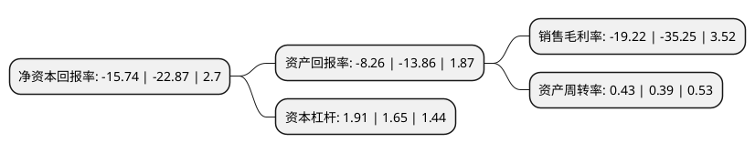

> 本页面由自动化程序生成于 2022年5月20日 01:03
> 内容可能存在错误，如有bug请提交issue至：https://github.com/Eroleice/doc-pi/issues
{.is-warning}

# 上市公司基本情况

## 基本资料

中水集团远洋股份有限公司（以下简称“中水渔业”）成立于1998年01月19日，北京市。于1998年02月12日在深交所主板上市。

中水渔业注册资本31,945.5万元，主要业务:远洋水产品的捕捞，储运，加工，销售和进出口。以下是详细信息：

- 公司名称: 中水集团远洋股份有限公司
- 股票代码: 000798.SZ
- 所在地: 北京 - 北京市
- 成立日期: 1998年01月19日
- 注册资本: 31,945.5万元
- 法定代表人: 宗文峰
- 主营业务: 远洋水产品的捕捞，储运，加工，销售和进出口
- 公司官网: www.cofc.com.cn
- 公司介绍: 公司是由中国农业发展集团有限公司控股的主要从事远洋渔业和国际经贸合作开发的股份制上市企业。公司主要从事远洋捕捞生产和经营,是我国较早开发太平洋、大西洋金枪鱼和南美鱿鱼资源的龙头企业之一,拥有各类远洋渔船近70艘,在大西洋、印度洋、太平洋从事捕捞生产。主要产品有阿根廷鱿鱼、秘鲁鱿鱼、秋刀鱼和金枪鱼及兼捕鱼种等海产品及加工制品。目前,公司在境内外设有十二个分支机构，在北美、南美、南太平洋地区设有五家代表机构及控股公司。此外，公司还开展水产品贸易、船舶修理、渔船渔机和渔需物资进出口等业务。公司依靠良好的资金保障、扎实的主业基础、强大的股东依托，资产规模位居我国远洋渔业企业前列，是目前国内最大的专业金枪鱼捕捞公司及我国三大远洋渔业上市企业之一。

## 股东及高管情况

上市公司第一大股东为中国农业发展集团有限公司，持股81,003,133股，占比25.36%，**疑似为**上市公司实际控制人。

截至2022年03月31日，上市公司的前十大股东中，共有3名自然人股东，7名机构股东，其中5%以上大股东共有3名。上市公司前十大股东明细如下：

> 未能通过持股比例判定出上市公司实际控制人（持股30%以上）
> 可能存在通过间接持股、联合持股、协议控制等方式拥有实际控制权的主体，具体请参考上市公司定期公告！
{.is-warning}

> 截至2022年03月31日，上市公司前十大股东信息如下：

| 股东名称 | 持股数量（股） | 持股比例 |
| --- | --- | --- |
| 中国农业发展集团有限公司 | 81,003,133 | 25.36% |
| 中国水产舟山海洋渔业有限公司 | 65,032,900 | 20.36% |
| 中国华农资产经营有限公司 | 46,054,013 | 14.42% |
| 杜晚春 | 4,535,336 | 1.42% |
| 北京易诊科技发展有限公司 | 4,123,426 | 1.29% |
| 北京小间科技发展有限公司 | 3,533,775 | 1.11% |
| 北京塞纳投资发展有限公司 | 2,873,600 | 0.9% |
| 北京纳木纳尼资产管理有限公司 | 2,378,391 | 0.74% |
| 潘立明 | 2,354,200 | 0.74% |
| 胡光剑 | 2,307,906 | 0.72% |

## 利润表分析

上市公司2021年总收入为4.62亿元，净利润为-0.89亿元，**未实现盈利**。

## 杜邦分析

> 数据列示周期：2021年 | 2020年 | 2019年
{.is-info}

上市公司的净资产收益率在近一年有所下降，下降幅度为-31.18%，其变化情况分解如下：
- 上市公司的销售毛利率在近一年下降了-45.48%，可能是生产效率的下降、商品原材料价格上涨或商品价格的下跌所致。
- 上市公司的资产周转率在近一年上升了10.26%，可能是源自于更快的销售回款或库存管理效果提升。
- 上市公司的财务杠杆比率在近一年上升了15.76%，可能是增加负债扩大生产规模。

