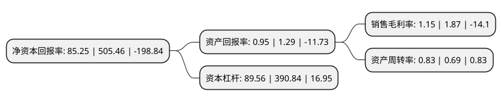

> 本页面由自动化程序生成于 2022年5月20日 01:05
> 内容可能存在错误，如有bug请提交issue至：https://github.com/Eroleice/doc-pi/issues
{.is-warning}

# 上市公司基本情况

## 基本资料

獐子岛集团股份有限公司（以下简称“ST獐子岛”）成立于1992年09月21日，大连市。于2006年09月28日在深交所中小板上市。

ST獐子岛注册资本71,111.219万元，主营业务:海洋水产业以下是详细信息：

- 公司名称: 獐子岛集团股份有限公司
- 股票代码: 002069.SZ
- 所在地: 辽宁 - 大连市
- 成立日期: 1992年09月21日
- 注册资本: 71,111.219万元
- 法定代表人: 唐艳
- 主营业务: 主营业务:海洋水产业
- 公司官网: www.zhangzidao.com
- 公司介绍: 公司始创于1958年，曾先后被誉为“黄海深处的一面红旗”、“海上大寨”、“黄海明珠”、“海底银行”、“海上蓝筹”。历经多年的发展，现已成为在海洋生物技术支撑下，以海珍品种业、海水增养殖、海洋食品为主业，集冷链物流、海洋休闲、渔业装备等相关多元产业为一体的综合型海洋企业。公司是农业产业化国家重点龙头企业、国家高新技术企业、中国首家获得MSC虾夷扇贝渔场认证企业，在大连、山东、福建、韩国、日本、北美等地设立了海珍品增养殖基地、全国现代种业示范场、国家虾夷扇贝良种场、国内一流的育养基地。孕育出产虾夷扇贝、刺参、鲍鱼、海螺、海胆等绿色健康的高品质海珍品，被国家质监总局认定为“国家地理标志保护产品”。

## 股东及高管情况

上市公司第一大股东为大连盐化集团有限公司，持股109,960,000股，占比15.46%，**疑似为**上市公司实际控制人。

截至2022年04月15日，上市公司的前十大股东中，共有4名自然人股东，1名机构股东，1个产品账户，4名其他股东，其中5%以上大股东共有6名。上市公司前十大股东明细如下：

> 未能通过持股比例判定出上市公司实际控制人（持股30%以上）
> 可能存在通过间接持股、联合持股、协议控制等方式拥有实际控制权的主体，具体请参考上市公司定期公告！
{.is-warning}

> 截至2022年04月15日，上市公司前十大股东信息如下：

| 股东名称 | 持股数量（股） | 持股比例 |
| --- | --- | --- |
| 大连盐化集团有限公司 | 109,960,000 | 15.46% |
| 北京吉融元通资产管理有限公司-和岛一号证券投资基金 | 57,162,685 | 8.04% |
| 长海县獐子岛褡裢经济发展中心 | 51,286,800 | 7.21% |
| 长海县獐子岛投资发展中心 | 50,008,900 | 7.03% |
| 长海县獐子岛大耗经济发展中心 | 38,705,645 | 5.443% |
| 长海县獐子岛大耗经济发展中心 | 38,705,645 | 5.44% |
| 吴厚刚 | 16,476,900 | 2.32% |
| 王光坤 | 3,141,800 | 0.44% |
| 杨瑞婷 | 2,720,000 | 0.38% |
| 吴祥智 | 2,320,900 | 0.33% |

## 利润表分析

上市公司2021年总收入为20.82亿元，净利润为0.23亿元，实现盈利。

## 杜邦分析

> 数据列示周期：2021年 | 2020年 | 2019年
{.is-info}

上市公司的净资产收益率在近一年有所下降，下降幅度为-83.13%，其变化情况分解如下：
- 上市公司的销售毛利率在近一年下降了-38.5%，可能是生产效率的下降、商品原材料价格上涨或商品价格的下跌所致。
- 上市公司的资产周转率在近一年上升了20.29%，可能是源自于更快的销售回款或库存管理效果提升。
- 上市公司的财务杠杆比率在近一年下降了-77.09%，可能是减少负债降低财务费用。

