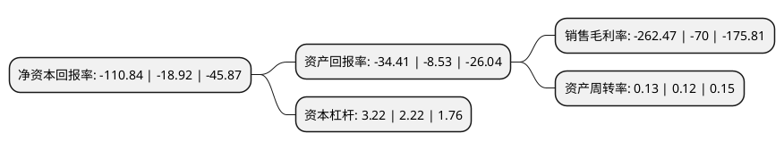

> 本页面由自动化程序生成于 2022年5月20日 01:06
> 内容可能存在错误，如有bug请提交issue至：https://github.com/Eroleice/doc-pi/issues
{.is-warning}

# 上市公司基本情况

## 基本资料

山东东方海洋科技股份有限公司（以下简称“ST东洋”）成立于2001年12月19日，烟台市。于2006年11月28日在深交所中小板上市。

ST东洋注册资本75,635万元，主营业务:海洋水产品加工和海水养殖以下是详细信息：

- 公司名称: 山东东方海洋科技股份有限公司
- 股票代码: 002086.SZ
- 所在地: 山东 - 烟台市
- 成立日期: 2001年12月19日
- 注册资本: 75,635万元
- 法定代表人: 赵玉山
- 主营业务: 主营业务:海洋水产品加工和海水养殖
- 公司官网: www.dfhy.cc
- 公司介绍: 公司主营业务为海洋牧场生态养殖、水产品加工出口及精深加工、大健康产业，保税物流、休闲渔业等。现为国家级高新技术企业、农业产业化国家重点龙头企业。公司积极推行标准化生产与管理，已通过欧盟卫生注册等十多项体系认证。拥有国家海藻与海参工程技术研究中心等多个国家级科研平台，科研设施和创新能力均达到国内甚至国际先进水平。公司始终以科技创新为引领走在全国同行业前列，在海带保种、育种和苗种繁育、海带全基因组测序、海洋牧场建设、海钓旅游服务、大西洋鲑鱼及其它名贵鱼类工业化养殖等方面分别建立了完整的产业体系。水产品加工出口能力始终处于国内前列，加工的几十种水产品已销往世界多个国家和地区；依托丰富的资源优势，研发的海参肽、胶原蛋白肽、海带胶原醇等系列海洋功能性产品，已成为高附加值的利润增长极。积极调整精准医学市场的产业布局，研发的第六代HIV-1试剂和HTLV-I/II试剂的测试技术处于国际领先地位，分别获得美国FDA认证和加拿大卫生部批文，并已提交了PCT专利申请。保税仓储物流中心是经国家海关总署批准的专业化保税物流中心，为大众创新、万众创业提供了新机遇，正全力向“买全球，卖全球”目标迈进。

## 股东及高管情况

上市公司第一大股东为湖南优禾神州股权投资合伙企业(有限合伙)，持股100,000,000股，占比13.22%，**疑似为**上市公司实际控制人。

截至2022年03月31日，上市公司的前十大股东中，共有5名自然人股东，5名机构股东，其中5%以上大股东共有3名。上市公司前十大股东明细如下：

> 未能通过持股比例判定出上市公司实际控制人（持股30%以上）
> 可能存在通过间接持股、联合持股、协议控制等方式拥有实际控制权的主体，具体请参考上市公司定期公告！
{.is-warning}

> 截至2022年03月31日，上市公司前十大股东信息如下：

| 股东名称 | 持股数量（股） | 持股比例 |
| --- | --- | --- |
| 湖南优禾神州股权投资合伙企业(有限合伙) | 100,000,000 | 13.22% |
| 山高(烟台)辰星投资中心(有限合伙) | 68,650,000 | 9.08% |
| 北京盛德玖富资产管理股份有限公司 | 48,000,000 | 6.35% |
| 山东东方海洋集团有限公司 | 34,236,501 | 4.53% |
| 朱春生 | 20,000,000 | 2.64% |
| 烟台华博投资有限公司 | 15,000,000 | 1.98% |
| 李北铎 | 8,000,000 | 1.06% |
| 王艳芳 | 5,142,200 | 0.68% |
| 林文斌 | 4,396,800 | 0.58% |
| 扈文秀 | 4,247,100 | 0.56% |

## 杜邦分析

> 数据列示周期：2021年 | 2020年 | 2019年
{.is-info}

上市公司的净资产收益率在近一年有所上升，上升幅度为485.84%，其变化情况分解如下：
- 上市公司的销售毛利率在近一年上升了274.96%，可能是生产效率的提升、商品原材料价格下跌或商品价格的上涨所致。
- 上市公司的资产周转率在近一年上升了8.33%，可能是源自于更快的销售回款或库存管理效果提升。
- 上市公司的财务杠杆比率在近一年上升了45.05%，可能是增加负债扩大生产规模。

